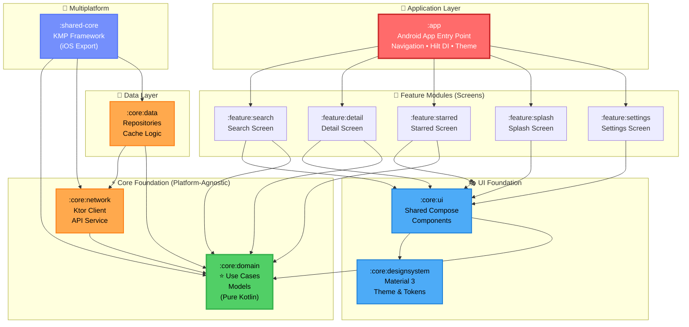

# Yumemi Android Engineer Code Challenge

<div align="center">

**Modern Android GitHub Repository Search Application**

Enterprise-grade Clean Architecture • Kotlin Multiplatform • Jetpack Compose • Material 3

[]()
[]()
[]()
[]()
[]()
[]()

</div>

---

## 📱 Application Screenshots

<!-- TODO: Add 4-5 key screenshots showcasing the app -->
<div align="center">

| Search Screen | Repository Details | Dark Mode | Settings |
|:---:|:---:|:---:|:---:|
|  |  |  |  |

**[▶️ Watch Demo Video](./docs/videos/demo.mp4)**

> ⚡ **Fast Inner-Loop Development with Compose Previews:**  
> All UI screens and reusable components feature `@Preview` configurations, enabling **sub-second UI iteration**, offline mock data previews, and side-by-side Light/Dark/Loading/Error state verification without running an emulator. See [**Compose Previews Gallery (`docs/screenshots/compose_preview/`)**](./docs/screenshots/compose_preview/README.md).

</div>

---

> 📊 **Executive & Reviewer Overview:** For a 3-minute leadership walkthrough, see the [**Executive Presentation Deck (`docs/presentation/README.md`)**](./docs/presentation/README.md) covering multi-platform architecture, team velocity, quality gates, and technical ROI.

## 🎯 About This Project

This project is a comprehensive solution to the **[Yumemi Android Engineer Coding Challenge](https://github.com/yumemi-inc/android-engineer-codecheck)**. The challenge evaluates Android engineering skills across multiple dimensions: code readability, architecture, testing, UI/UX, and modern development practices.

### Challenge Overview

**Objective:** Build a GitHub repository search application that demonstrates production-quality Android development.

**Requirements:**
- Search GitHub repositories via REST API
- Display repository list with key information
- Show detailed repository view with stats and metadata
- Apply modern architecture patterns
- Comprehensive testing strategy
- Clean, maintainable code

### Solution Highlights

✅ **All 9 Challenge Issues Completed** (Beginner + Intermediate + Bonus)
✅ **164+ Automated Tests** (100% passing, 81-84% code coverage)
✅ **Multi-Module Clean Architecture** (12 modules with strict dependency rules)
✅ **100% Jetpack Compose UI** (Material 3 with dynamic theming)
✅ **Responsive Multi-Device Design** (Validated across Phone & Tablet in Portrait & Landscape)
✅ **Kotlin Multiplatform** (iOS companion app sharing business logic)
✅ **Production-Ready Quality** (Detekt, CI/CD, documentation)

📚 **Start Here:** [docs/00_START_HERE.md](./docs/00_START_HERE.md) ⭐

---

## 🏗️ Architecture & Modules

This application implements **multi-module Clean Architecture** with strict separation of concerns. Modules are organized from core business logic (most important) to UI presentation layers.



### 📦 Module Details (From Core to UI)

#### 🔷 Core Business Logic (Platform-Agnostic)

**1. `:core:domain`** ⭐ *Most Important*
- **Purpose:** Pure business logic, zero Android dependencies
- **Contains:**
  - Domain models (`GitHubRepository`, `RepositoryOwner`)
  - Use case interfaces (`SearchRepositoriesUseCase`, `GetRepositoryDetailsUseCase`)
  - Repository contracts (interfaces only)
  - Domain-specific exceptions (`GitHubException`, `RateLimitExceededException`)
- **Dependencies:** None (pure Kotlin)
- **Test Coverage:** 100%
- **Why Important:** Defines the business rules and ensures clean dependency inversion

**2. `:core:network`**
- **Purpose:** External API communication
- **Contains:**
  - Ktor HTTP client configuration
  - GitHub REST API service (`GitHubApiService`)
  - DTO models (`RepositoryDto`, `SearchResponseDto`)
  - Response mappers (DTO → Domain)
  - HTTP error handling & retry logic
- **Dependencies:** `:core:domain`, Ktor (Darwin/OkHttp engines)
- **Test Coverage:** Ktor MockEngine tests with fixture responses
- **Key Feature:** Network error → Domain exception translation

**3. `:core:data`**
- **Purpose:** Data layer orchestration
- **Contains:**
  - Repository implementations (`GitHubRepositoryImpl`)
  - In-memory LRU cache (search query caching)
  - Mock data fixtures (offline development)
  - Data source coordination
- **Dependencies:** `:core:domain`, `:core:network`
- **Test Coverage:** 92.6% (cache, network fallback, error mapping)
- **Key Feature:** Transparent caching with `CacheFirst` strategy

**4. `:shared-core`**
- **Purpose:** Kotlin Multiplatform export for iOS
- **Contains:**
  - KMP facade exposing domain/network/data to native iOS
  - Objective-C framework bindings
  - iOS-compatible API surface
- **Dependencies:** `:core:domain`, `:core:network`, `:core:data`
- **Platform:** Compiles to `shared_core.framework` (Apple Silicon/x86_64)
- **Integration:** Consumed by SwiftUI `CodeCheck-iOS` companion app

---

#### 🔷 Android UI Foundation

**5. `:core:designsystem`**
- **Purpose:** Material 3 design system tokens
- **Contains:**
  - Color palette (`md_theme_light_*`, `md_theme_dark_*`)
  - Typography scale (Roboto font family)
  - Shape definitions (rounded corners, etc.)
  - Material 3 theme composition
- **Dependencies:** Compose Material 3
- **Key Feature:** Dynamic light/dark theme switching

**6. `:core:ui`**
- **Purpose:** Shared Compose UI components
- **Contains:**
  - Reusable components (`LoadingView`, `ErrorView`, `EmptyView`)
  - Common chips and badges
  - Format utilities (`formatCount`, `formatDate`)
  - Bottom navigation bar
- **Dependencies:** `:core:domain`, `:core:designsystem`, Compose
- **Test Coverage:** Robolectric Compose UI tests

---

#### 🔷 Feature Modules (Screens)

**7. `:feature:search`**
- **Purpose:** Repository search screen
- **Contains:**
  - `SearchScreen` (Compose UI)
  - `SearchViewModel` (UDF state management)
  - Search bar with debouncing (300ms)
  - Repository card list
  - Filter/sort UI components
- **Dependencies:** `:core:domain`, `:core:ui`, Hilt
- **Test Coverage:** 83.2% (ViewModel + Compose tests)

**8. `:feature:detail`**
- **Purpose:** Repository detail screen
- **Contains:**
  - `DetailScreen` (Compose UI)
  - `DetailViewModel`
  - Owner profile display
  - Stats cards (stars, forks, watchers, issues)
  - Language badge with color coding
- **Dependencies:** `:core:domain`, `:core:ui`, Hilt
- **Test Coverage:** 84.6%

**9. `:feature:starred`**
- **Purpose:** Bookmarked repositories
- **Contains:**
  - `StarredScreen` (favorites collection)
  - Local persistence (in-memory for now)
  - Empty state handling
- **Dependencies:** `:core:domain`, `:core:ui`, Hilt

**10. `:feature:splash`**
- **Purpose:** App launch screen
- **Contains:**
  - Animated logo mark
  - Automatic navigation to main screen
- **Test Coverage:** 68.9%

**11. `:feature:settings`**
- **Purpose:** App configuration
- **Contains:**
  - Theme mode toggle (Light/Dark/System)
  - Language switcher (English/日本語)
  - App information tiles
- **Dependencies:** `:core:ui`, Hilt

---

#### 🔷 Application Entry Point

**12. `:app`**
- **Purpose:** Android application orchestration
- **Contains:**
  - `MainActivity` (single-activity architecture)
  - Jetpack Navigation setup (bottom tabs + screens)
  - Hilt dependency injection configuration
  - Product flavor configurations (Mock/Dev/Stg/Prod)
  - App-level theme composition
- **Dependencies:** All `:feature:*` and `:core:*` modules
- **Build Variants:** 4 flavors × 2 build types = 8 variants

---

## 🎨 UI/UX Design Specifications

Complete design specifications are available in [**`docs/03_design/`**](./docs/03_design/).

**View Interactive Design Specs:**
```bash
# Open in browser
open docs/03_design/00\ Index.html
```

### Design Files

| Screen | Design File | Description |
|--------|-------------|-------------|
| Splash | [`01 SplashScreen.html`](./docs/03_design/01%20SplashScreen.html) | App launch with animated logo |
| Main | [`02 MainScreen.html`](./docs/03_design/02%20MainScreen.html) | Repository list with bottom nav |
| Search | [`03 SearchScreen.html`](./docs/03_design/03%20SearchScreen.html) | Search interface with filters |
| Starred | [`04 StarredScreen.html`](./docs/03_design/04%20StarredScreen.html) | Bookmarked repositories |
| Detail | [`05 DetailScreen.html`](./docs/03_design/05%20DetailScreen.html) | Repository details with stats |
| Settings | [`06 SettingsScreen.html`](./docs/03_design/06%20SettingsScreen.html) | Theme & language settings |

### Component Library

| Component | Design File | Usage |
|-----------|-------------|-------|
| App Icon | [`Common_AppIcon.html`](./docs/03_design/Common_AppIcon.html) | App launcher icon specs |
| Chip | [`Common_Chip.html`](./docs/03_design/Common_Chip.html) | Language tags, filters |
| Repository Card | [`Common_RepoCard.html`](./docs/03_design/Common_RepoCard.html) | List item component |
| Stat Card | [`Common_StatCard.html`](./docs/03_design/Common_StatCard.html) | Stars/Forks/Watchers display |
| Color Palette | [`Common_Palette.html`](./docs/03_design/Common_Palette.html) | Material 3 color system |

<!-- TODO: Add design screenshot collage -->


---

## ✅ Challenge Issue Completion Status

All **9 Yumemi coding challenge issues** have been successfully completed.

> [!NOTE]
> **Issue Number Offset:** This repository was initially private. PRs #1-2 were merged before copying challenge issues, resulting in a +2 offset (Challenge #1 = GitHub Issue #3, etc.).

| Challenge Task | GitHub Issue | Level | Status | PRs |
|:---|:---:|:---:|:---:|:---:|
| **#1: ソースコードの可読性の向上**<br>*(Improve Code Readability)* | [#3](https://github.com/dinkar1708/dinakar-android-engineer-codecheck/issues/3) | 初級 | ✅ Done | [#17](https://github.com/dinkar1708/dinakar-android-engineer-codecheck/pull/17) |
| **#2: ソースコードの安全性の向上**<br>*(Improve Code Safety)* | [#4](https://github.com/dinkar1708/dinakar-android-engineer-codecheck/issues/4) | 初級 | ✅ Done | [#18](https://github.com/dinkar1708/dinakar-android-engineer-codecheck/pull/18) |
| **#3: バグを修正**<br>*(Fix Bugs)* | [#5](https://github.com/dinkar1708/dinakar-android-engineer-codecheck/issues/5) | 初級 | ✅ Done | [#19](https://github.com/dinkar1708/dinakar-android-engineer-codecheck/pull/19) |
| **#4: Fat Fragment の回避**<br>*(Avoid Fat Fragment)* | [#6](https://github.com/dinkar1708/dinakar-android-engineer-codecheck/issues/6) | 初級 | ✅ Done | [#20](https://github.com/dinkar1708/dinakar-android-engineer-codecheck/pull/20) |
| **#5: プログラム構造をリファクタリング**<br>*(Refactor Program Structure)* | [#7](https://github.com/dinkar1708/dinakar-android-engineer-codecheck/issues/7) | 中級 | ✅ Done | [#21](https://github.com/dinkar1708/dinakar-android-engineer-codecheck/pull/21) |
| **#6: アーキテクチャを適用**<br>*(Apply Architecture)* | [#8](https://github.com/dinkar1708/dinakar-android-engineer-codecheck/issues/8) | 中級 | ✅ Done | Multiple |
| **#7: テストを追加**<br>*(Add Tests)* | [#9](https://github.com/dinkar1708/dinakar-android-engineer-codecheck/issues/9) | 中級 | ✅ Done | [#22](https://github.com/dinkar1708/dinakar-android-engineer-codecheck/pull/22) |
| **#8: UI をブラッシュアップ**<br>*(Polish UI)* | [#10](https://github.com/dinkar1708/dinakar-android-engineer-codecheck/issues/10) | ボーナス | ✅ Done | [#35](https://github.com/dinkar1708/dinakar-android-engineer-codecheck/pull/35), [#36](https://github.com/dinkar1708/dinakar-android-engineer-codecheck/pull/36), [#37](https://github.com/dinkar1708/dinakar-android-engineer-codecheck/pull/37) |
| **#9: 新機能を追加**<br>*(Add New Features)* | [#11](https://github.com/dinkar1708/dinakar-android-engineer-codecheck/issues/11) | ボーナス | ✅ Done | [#41](https://github.com/dinkar1708/dinakar-android-engineer-codecheck/pull/41), [#42](https://github.com/dinkar1708/dinakar-android-engineer-codecheck/pull/42) |

📖 **Detailed Issue Breakdown:** [docs/03_sprint_execution/03_issues_summary.md](./docs/03_sprint_execution/03_issues_summary.md)

---

## 🚀 Quick Start

### Prerequisites

- **JDK:** 17 or higher
- **Android Studio:** Iguana (2023.2.1) or higher
- **Gradle:** 8.5 (wrapper included)
- **Xcode:** 15+ (optional, for iOS companion app)

### Build & Run

```bash
# Clone repository
git clone https://github.com/dinkar1708/dinakar-android-engineer-codecheck.git
cd dinakar-android-engineer-codecheck

# Build Android debug APK
./gradlew clean assembleDebug

# Install on connected device
./gradlew installDebug

# Run unit tests
./gradlew test

# Generate test coverage report
./gradlew koverHtmlReport
# Report: build/reports/kover/html/index.html

# Run static analysis (Detekt)
./gradlew detekt
# Report: build/reports/detekt/detekt.html
```

### Build Variants (Product Flavors)

| Flavor | Description | App ID | Use Case |
|--------|-------------|--------|----------|
| **mock** | 100% offline, zero API calls | `.mock` | Development, UI testing, rate limit avoidance |
| **dev** | Live GitHub API + debug logs | `.dev` | Active development with network calls |
| **stg** | Staging environment | `.stg` | Pre-production validation |
| **prod** | Production release | *(default)* | Release builds |

```bash
# Build specific flavor
./gradlew assembleMockDebug    # Offline mock data
./gradlew assembleDevDebug     # Live API with logs
./gradlew assembleProdRelease  # Production release
```

📖 **Full Setup Guide:** [docs/GETTING_STARTED.md](./docs/GETTING_STARTED.md)

---

## 🍏 iOS Companion App (Kotlin Multiplatform)

A **native SwiftUI iOS app** consuming shared Kotlin business logic via KMP.

<div align="center">

| iOS Search Screen | KMP Architecture |
|:---:|:---:|
|  |  |

</div>

### Key Features

✅ **100% Shared Business Logic** - Domain, network, and data layers reused from Android
✅ **Native Swift Concurrency** - Kotlin `suspend` functions → Swift `async/await`
✅ **Design System Parity** - Same Material 3 colors in SwiftUI
✅ **Flavor Support** - Mock/Dev/Stg/Prod Xcode schemes
✅ **Swift Testing Suite** - Native tests for KMP interop

```bash
# Build KMP framework and run iOS app
./gradlew :shared-core:linkDebugFrameworkIosSimulatorArm64
open iosApp/CodeCheck-iOS.xcodeproj
```

> [!NOTE]
> This is a **technical demonstration** of KMP capabilities, not a full-featured iOS app. Focus is on proving cross-platform business logic sharing.

📖 **iOS Guide:** [iosApp/README.md](./iosApp/README.md)

---

## 🧪 Testing Strategy

**Total Tests:** 164+ automated tests (100% passing)
**Code Coverage:** 81.0% - 83.9% repository-wide

### Test Breakdown by Layer

| Module | Tests | Coverage | Frameworks |
|--------|-------|----------|------------|
| `:core:domain` | Use case + model tests | 100% | JUnit, Kotlin Test |
| `:core:data` | Repository + cache tests | 92.6% | Turbine, Ktor MockEngine |
| `:core:network` | API service + DTO tests | High | Ktor MockEngine, Fixtures |
| `:feature:search` | ViewModel + Compose UI | 83.2% | Robolectric, Compose Test |
| `:feature:detail` | Screen logic tests | 84.6% | Robolectric, Hilt Test |
| `:core:ui` | Component tests | 56.5% | Compose Test API |
| `:app` | Navigation + DI tests | 23.2% | Hilt Integration |

### Testing Frameworks

- **Unit Tests:** JUnit 5, Kotlin Test, MockK
- **Flow Testing:** Turbine (async flow assertions)
- **Compose UI:** Robolectric + Compose Test API
- **Network Mocking:** Ktor MockEngine with fixture JSON
- **Coverage:** Kotlinx Kover (HTML reports)
- **iOS:** Swift Testing (native framework)

```bash
# Run all tests with coverage
./gradlew testDebugUnitTest koverHtmlReport

# Run specific module tests
./gradlew :core:data:testDebugUnitTest
./gradlew :feature:search:testDebugUnitTest

# Run Detekt static analysis
./gradlew detekt
```

---

## 🎨 Features & Functionality

### ✅ Implemented

#### Core Features
- ✅ **GitHub Repository Search** - Debounced search (300ms) with in-memory TTL query caching
- ✅ **Pagination & Feed Chunking** - Incremental page loading with manual 'Load More' trigger and state preservation
- ✅ **Repository Details** - Owner profile, stats (stars/forks/watchers/issues), language
- ✅ **Starred Repositories** - Bookmark favorite repos (persistent across sessions)
- ✅ **Chrome Custom Tabs** - In-app browser for GitHub URLs

#### UI/UX
- ✅ **100% Jetpack Compose** - Material 3 with dynamic color schemes
- ✅ **Dark Mode Support** - Auto/Light/Dark theme switching
- ✅ **Bilingual Localization** - English/日本語 without activity recreation
- ✅ **Responsive & Adaptive Multi-Device Design** - Validated across Mobile Phones (`emulator-5554`) and Tablets (`emulator-5556`) in both Horizontal (Landscape) and Vertical (Portrait) orientations
- ✅ **Defensive Layout Wrapping** - Adaptive `FlowRow` dynamically wrapping extreme metadata (63-character language tags, multi-billion counts)
- ✅ **Configuration Change Survival** - Instantaneous state preservation across screen rotation via `SavedStateHandle` and `rememberSaveable`
- ✅ **Compose Previews & Fast Inner Loop** - Sub-second visual iteration via comprehensive `@Preview` states (Light/Dark/Loading/Error)
- ✅ **Error Handling** - Graceful offline mode, rate limit messaging
- ✅ **Loading States & Shimmer Skeletons** - Skeleton screens and progress indicators with zero layout shifts

#### Architecture & Enterprise Scalability
- ✅ **Clean Architecture** - Strict layer separation (Domain → Data → UI)
- ✅ **Multi-Module** - 12 Gradle modules with dependency rules (scales to 50+ engineers without merge conflicts)
- ✅ **MVVM + UDF** - StateFlow-based unidirectional data flow
- ✅ **Hilt DI** - Compile-time dependency injection
- ✅ **Kotlin Multiplatform** - iOS companion app sharing business logic
- ✅ **High-Performance Non-Blocking Coroutines** - Zero main-thread blocking (`Dispatchers.IO`), cancellation of superseded search jobs, and TTL in-memory caching

#### Quality Assurance
- ✅ **164+ Automated Tests** - Unit, UI, integration tests
- ✅ **81-84% Code Coverage** - Kotlinx Kover reports
- ✅ **Detekt Static Analysis** - CI/CD quality gates
- ✅ **Conventional Commits** - Semantic versioning ready
- ✅ **CI/CD Pipeline** - GitHub Actions (build, test, lint)

---

## 🤖 AI-Assisted Development Disclosure

In full transparency per [Yumemi's AI policy](https://github.com/yumemi-inc/android-engineer-codecheck#use-of-ai-services), this project leveraged **AI pair programming** to accelerate development while maintaining strict quality standards.

### AI Tools Used

This project utilized the following AI tools, and we **encourage teams to adopt these tools** for increased productivity:

| AI Tool | Version/Model | Primary Use Case | Usage Scope |
|:---|:---|:---|:---:|
| **Google Gemini** | Gemini 1.5 Pro/Flash | Code generation, architecture design, test writing | 🟢 Heavy |
| **Claude Code** | Claude Sonnet 3.5/4 | Pair programming, refactoring, code review | 🟢 Heavy |
| **Claude AI** | Claude 3.5 Sonnet | UI/UX design specification export (HTML) | 🟡 Moderate |
| **GitHub Copilot** | Latest | Code completion, boilerplate generation | 🟡 Moderate |

> **Note:** All AI-generated code was validated through 164+ automated tests, manual code review, and CI/CD quality gates (Detekt, build verification).

### Agent Framework & Guardrails

- **[GEMINI.md](./GEMINI.md)** - Always-on architectural context and coding rules
- **[`yumemi-issue-workflow`](./.agents/skills/yumemi-issue-workflow/)** - Standardized TDD workflow
- **[`yumemi-code-review`](./.agents/skills/yumemi-code-review/)** - Automated PR review against evaluation criteria

### Representative Prompts

**1. Test-Driven Architecture:**
> *"Write unit tests for `GitHubRepositoryImpl` verifying LRU cache and network error translation. Ensure HTTP 403 → `RateLimitExceeded`, unknown host → `OfflineException`. Never let Ktor exceptions escape into domain."*

**2. Defensive UI Layout:**
> *"Fix the stress test card where 63-char language name causes 21-line vertical expansion. Use `FlowRow` with `maxLines=1` and `TextOverflow.Ellipsis`. Add Robolectric tests asserting bounded height."*

**3. Multi-Module Boundaries:**
> *"Analyze build-logic convention plugins. Ensure `:core:domain` has zero Android deps, `:core:network` encapsulates Ktor, and `:shared-core` exports Objective-C framework without leaking Gradle tasks."*

📖 **Full AI Usage Documentation:** [GEMINI.md](./GEMINI.md)

---

## 📚 Documentation

Comprehensive documentation is available in [**`docs/`**](./docs/)

### Quick Links

| Document | Description |
|----------|-------------|
| **[🌟 START HERE](./docs/00_START_HERE.md)** | Solution overview and reviewer navigation guide |
| [Getting Started](./docs/GETTING_STARTED.md) | Build instructions and prerequisites |
| [Architecture Overview](./docs/ARCHITECTURE_OVERVIEW.md) | System design and technology stack |
| [Contributing Guide](./docs/CONTRIBUTING.md) | Git workflow, commit conventions, PR templates |
| [Issues Summary](./docs/03_sprint_execution/03_issues_summary.md) | All 9 challenge issues breakdown |
| [Market Research](./docs/03_sprint_execution/05_market_research_and_product_strategy.md) | Ecosystem analysis and benchmarking |
| [Code Review Standards](./docs/01_company_and_team/04_code_review_guidelines.md) | Review levels and criteria |
| [Testing Guide](./docs/01_company_and_team/06_engineering_guardrails.md) | Test architecture and placement rules |
| [AI Tools Adoption](./docs/01_company_and_team/11_ai_tools_adoption_proposal.md) | AI pairing strategy and tools |
| [Technical References](./docs/references.md) | External links and evaluation criteria |

---

## 🏆 Technology Stack

### Core Technologies

| Layer | Technology | Version | Purpose |
|-------|-----------|---------|---------|
| **Language** | Kotlin | 2.1.0 | Primary development language |
| **UI Framework** | Jetpack Compose | 1.7.5 | Declarative UI toolkit |
| **Design System** | Material 3 | Latest | Google's design language |
| **Architecture** | Clean + MVVM + UDF | - | Multi-layer separation |
| **Dependency Injection** | Hilt | 2.51 | Compile-time DI |
| **Networking** | Ktor Client | 3.0.0 | HTTP client (KMP-compatible) |
| **Async/Coroutines** | Kotlin Coroutines | 1.9.0 | Structured concurrency |
| **Navigation** | Compose Navigation | 2.8.0 | Screen routing |
| **Testing** | JUnit 5 + Turbine + MockK | - | Unit/UI/Flow testing |
| **Code Coverage** | Kotlinx Kover | 0.8.3 | Coverage reports |
| **Static Analysis** | Detekt | 1.23.6 | Code quality enforcement |
| **CI/CD** | GitHub Actions | - | Automated build/test/deploy |

### Kotlin Multiplatform

- **iOS Framework:** `shared_core.framework` (Darwin engine)
- **iOS UI:** SwiftUI (native)
- **Swift Bridge:** Kotlin/Native Objective-C interop
- **iOS Testing:** Swift Testing framework

### Build System

- **Gradle:** 8.5
- **JDK:** 17
- **Android Gradle Plugin:** 8.7.3
- **Kotlin Gradle Plugin:** 2.1.0
- **Convention Plugins:** Custom `build-logic` module

---

## 🔗 Links & Resources

- **GitHub Repository:** [dinkar1708/dinakar-android-engineer-codecheck](https://github.com/dinkar1708/dinakar-android-engineer-codecheck)
- **Project Board:** [Issue Tracker](https://github.com/users/dinkar1708/projects/1/views/1)
- **Challenge Repository:** [yumemi-inc/android-engineer-codecheck](https://github.com/yumemi-inc/android-engineer-codecheck)
- **Evaluation Criteria:** [Qiita Article](https://qiita.com/blendthink/items/aa70b8b3106fb4e3555f)

---

## 📄 License

This project is submitted as part of the Yumemi Android Engineer coding challenge.

See [LICENSE](./LICENSE) for details.

---

<div align="center">

**Built with ❤️ using Clean Architecture, Kotlin Multiplatform, and Jetpack Compose**

Submitted for **Yumemi Android Engineer Position**

</div>
