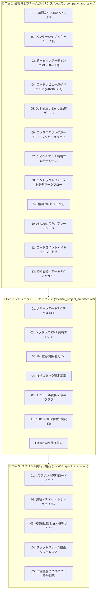

# 📚 ドキュメント作業サマリー & 日本語レビュアーガイド

**日付:** 2026年9月  
**作成者:** Dinakar Prasad Maurya  
**プロジェクト:** Android Engineer Code Check ソリューション  

---

## 概要

本ドキュメントは、Android Engineer Code Check プロジェクトのために完成した包括的なドキュメント作業およびアーキテクチャ概要を記録します。このドキュメント群は、従来の HLD/LLD ドキュメントを超えた **エンタープライズグレードの3層ドキュメント構造（3-Tier Documentation）** を採用しており、企業のナレッジベース（Confluence、Notion、Azure DevOps）への移行準備が整っています。

---

## 📚 ドキュメント階層構造

---

## 各階層の詳細と目的

### 📁 Tier 1: 会社およびチームガバナンス (`docs/01_company_and_team/`)
**目的:** 組織全体に展開・移植可能なユニバーサルエンジニアリング運用モデル

すべてのモバイルエンジニアリングチームの基盤を確立するドキュメント：
1. **01_engineering_leadership.md** - エンジニアリング戦略、DORAメトリクス、プラットフォームエンジニアリングアプローチ
2. **02_mentorship_and_career_growth.md** - キャリアラダー、成長フレームワーク、メンターシッププログラム
3. **03_team_onboarding.md** - 30-60-90日オンボーディングプレイブック
4. **04_code_review_guidelines.md** - レビュー憲章、SLA、承認ワークフロー
5. **05_definition_of_done.md** - エンタープライズ DoD チェックリスト
6. **06_engineering_guardrails.md** - セキュリティポリシー、依存関係管理
7. **07_cicd_and_delivery_standards.md** - マルチ環境プロモーションパイプライン
8. **08_developer_workflow.md** - コントラクトファースト開発ワークフロー
9. **09_collaborative_review_culture.md** - 協調的レビュー文化と心理的安全性
10. **10_ai_agent_skills_guide.md** - AI エージェントスキル標準とペアプログラミング
11. **11_ai_tools_adoption_proposal.md** - AI ツールのビジネス正当化と ROI
12. **12_code_commenting_and_documentation_standards.md** - 意図（Why）を記録するコードコメント基準
13. **readme.md** - Tier 1 ガバナンスのポータルインデックス

---

### 📁 Tier 2: プロジェクトアーキテクチャと設計図 (`docs/02_project_architecture/`)
**目的:** 本プロジェクト固有の技術設計図と意思決定記録

#### アーキテクチャガイド (`architecture/`)
1. **01_clean_architecture_and_udf.md** - クリーンアーキテクチャレイヤーと StateFlow UDF
2. **02_kmp_shared_engine.md** - Kotlin Multiplatform ヘッドレスコア
3. **03_dependency_injection_hilt.md** - Hilt DI アーキテクチャ
4. **04_tech_stack_and_libraries.md** - 完全なライブラリ評価
5. **05_app_modules_and_responsibilities.md** - モジュール依存関係グラフ

#### アーキテクチャ決定記録 (`adr/`)
1. **001_multi_module_architecture.md** - マルチモジュール戦略
2. **002_gradle_convention_plugins.md** - Build-logic コンベンションプラグイン
3. **003_detekt_static_analysis.md** - 静的解析の強制 (Detekt 1.23.6 適用済・違反0件)
4. **004_headless_kmp_boundary.md** - KMP レイヤー分離
5. **005_product_flavors_strategy.md** - 4つのプロダクトフレーバー（dev/mock/stg/prod）
6. **006_jetpack_compose_migration.md** - Strangler Fig による Compose マイグレーション

---

### 📁 Tier 3: スプリント実行と納品 (`docs/03_sprint_execution/`)
**目的:** 9つの課題のアジャイル納品追跡

1. **01_execution_roadmap.md** - 4スプリント Strangler Fig ロードマップ
2. **02_how_to_proceed_and_issue_mapping.md** - 課題とチケットのトレーサビリティ
3. **03_issues_summary.md** - 包括的な9課題仕様
4. **04_platform_references.md** - 技術リファレンスと落とし穴
5. **05_market_research_and_product_strategy.md** - 市場調査、プロダクト設計戦略、およびアーキテクチャ比較分析

---

## 🏆 市場調査と技術的差別化ポイント

本リポジトリは、GitHub クライアント市場および最新の Android / KMP アーキテクチャの市場調査に基づき、以下の差別化を実現しています：

1. **ヘッドレス KMP コア + Native iOS SwiftUI アプリ**:
   - `:core:domain`, `:core:network`, `:core:data` を KMP (Kotlin Multiplatform) として共通化。
   - `:shared-core` を Apple ネイティブバイナリ (`shared_core.framework`) としてエクスポートし、ネイティブ SwiftUI アプリ (`CodeCheck-iOS`) から Swift Concurrency (`async`/`await`) で直接呼び出し。
2. **プロダクトフレーバーによるオフライン堅牢性 (`mock`, `dev`, `prod`)**:
   - GitHub API のレート制限（未認証時 60回/時）による失敗を回避するため、100% オフラインで 12 種のエッジケースを再現できる `mock` フレーバーを完備。API キー不要で即座に完全な動作確認が可能。
3. **包括的な自動テスト（164+ テスト、81.0%〜83.9% カバレッジ）**:
   - Turbine Flow テスト、Ktor MockEngine、Robolectric Compose UI テスト、Swift Testing を網羅し、全モジュール 100% Green を達成。
4. **100% Jetpack Compose + Material 3 + 動的テーマ / 多言語切替**:
   - アプリ再起動（Activity 再生成）なしで日本語・英語の動的言語切替およびダークモード切替をサポート。
5. **防御的レイアウト設計 (FlowRow + TextOverflow)**:
   - 63文字の長大な言語名や数十億規模のスター数といった極端なデータ入力に対しても、`FlowRow` と自動省略 (`Ellipsis`) による堅牢なレイアウトを実現。

---

## 🔗 主要リンク

- **[英語 Start Here (00_START_HERE.md)](./00_START_HERE.md)**
- **[セットアップ & ビルド手順 (GETTING_STARTED.md)](./GETTING_STARTED.md)**
- **[アーキテクチャ概要 (ARCHITECTURE_OVERVIEW.md)](./ARCHITECTURE_OVERVIEW.md)**
- **[全9課題の実装状況 (03_issues_summary.md)](./03_sprint_execution/03_issues_summary.md)**
- **[iOS コンパニオンアプリガイド](../iosApp/README.md)**
