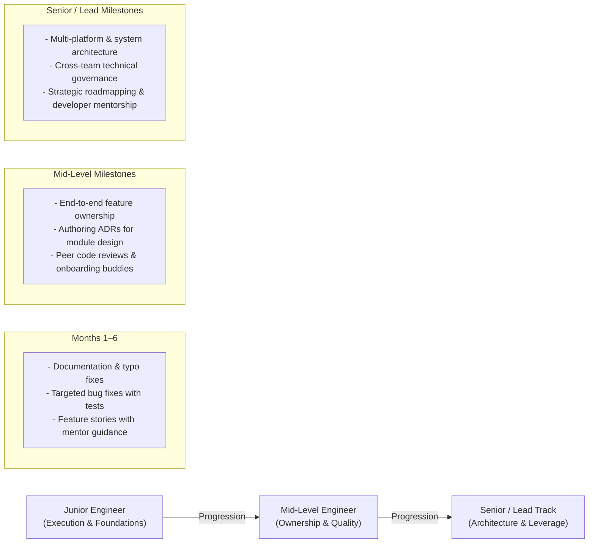

# Technical Leadership, Team Governance & Architectural Strategy

**Author:** Dinakar Prasad Maurya  
**Context:** Enterprise Mobile Platform Architecture & Engineering Operations (see [Technical References](../references.md#7-github-api--assessment-standards))

---

## Executive Engineering Philosophy

> **"Architecture is not merely code structure; it is the organizational operating system that enables cross-functional engineering teams to ship high-quality products faster, safer, and with zero friction."**

In scalable engineering organizations, technical excellence must be coupled with organizational leverage. True senior leadership is reflected in building scalable systems—designing decoupled architectures that eliminate merge bottlenecks, establishing automated quality gates, setting clear team SLAs, and building mentorship frameworks that accelerate junior and mid-level developers into high-impact contributors.

---

## 1. Architectural & Process Alignment

This management playbook builds upon the engineering foundations established across our technical specifications:
- **Platform Architecture & Decisions:** See [Engineering Leadership Strategy](./01_engineering_leadership.md) and [Operating Model Overview](./readme.md).
- **Contract-First Parallel Delivery:** Detailed in [Engineering Leadership Strategy](./01_engineering_leadership.md#3-team-scalability--parallel-delivery-model).
- **Code Review Standards & SLAs:** Detailed in [Code Review Guidelines](./04_code_review_guidelines.md) and [Collaborative Review Culture](./09_collaborative_review_culture.md).
- **Quality Gates & Definition of Done:** Detailed in [Definition of Done](./05_definition_of_done.md) and [Engineering Guardrails](./06_engineering_guardrails.md).

With technical guardrails automated via CI, engineering leadership focuses on **people enablement, operational efficiency, structured mentorship, and data-driven management**.

---

## 2. Scalable Knowledge Sharing & Mentorship Framework

### Documentation as Scalable Mentorship
Mentorship that relies exclusively on 1-on-1 pairing does not scale across growing teams. Comprehensive documentation acts as an asynchronous force multiplier:
- **Playbooks:** Structured onboarding roadmap guiding new hires from Day 1 environment setup to their first production PR within 2 weeks.
- **Architecture Decision Records (ADRs):** Documents the 'why' behind architectural choices, alternatives considered, and trade-offs, providing institutional memory for future team members.
- **Diagnostic Runbooks:** 13 common build and runtime errors documented with root-cause analysis and immediate remediation steps.

### Structured Engineering Growth Tracks

#### Mentorship Principles:
- **Psychological Safety:** Blameless retrospectives and constructive review taxonomies.
- **Progressive Ownership:** Moving engineers from well-scoped tasks to architectural trade-off evaluations.
- **Observable Milestones:** Clear expectations for what success looks like at every career level.

---

## 3. Technical Writing & Thought Leadership

A strong engineering culture shares knowledge externally, elevating the organization's technical reputation and attracting top engineering talent:

### Engineering Publications
1. **"Building a Headless Kotlin Multiplatform Engine: Lessons from Production"**
   - *Topics:* KMP Gradle configuration, Swift async/await interop, XCFramework distribution, and multiplatform network testing.
2. **"Zero Merge Conflicts: Architecting for Parallel Team Delivery"**
   - *Topics:* Contract-First development, interface segregation, mock DI substitution, and branching hygiene.
3. **"13 Android Build Pitfalls and How to Fix Them"**
   - *Topics:* Gradle daemon JVM allocations, version catalog migration, cross-module smart casting, and Ktor multiplatform engine resolution.

### Conference Presentations
- **Conference Talk Proposal:** *"From Code Review to Cross-Platform: Scaling Engineering Velocity in Modern Mobile"*
- *Abstract:* Real-world demonstration of contract-first parallel delivery, automated CI/CD quality gates, and headless KMP integration across Android and iOS teams.

---

## 4. Engineering Metrics & Operational KPIs

Decisions are guided by data-driven operational metrics:

### Velocity & Efficiency KPIs
| Metric | Target | Rationale & Remediation |
|:---|:---:|:---|
| **PR Review Turnaround** | < 24 hours | Prevents WIP backlog; if breached, rebalance reviewer load or reduce PR sizing. |
| **PR Size** | 100–200 LOC | Ensures high review depth; PRs > 400 LOC require decomposition. |
| **Sprint Commitment Accuracy** | > 85% | Measures estimation reliability via Fibonacci story points. |

### Quality & Stability KPIs
| Metric | Target | Rationale & Remediation |
|:---|:---:|:---|
| **Unit & Integration Test Coverage** | ≥ 80% | Protects core business domain logic and repository mapping. |
| **CI Pipeline Success Rate** | > 95% | Low rates indicate flaky tests, brittle scripts, or inadequate local pre-checks. |
| **Production Crash-Free User Rate** | ≥ 99.9% | Standard enterprise SLA; monitored via Firebase Crashlytics with automated alert velocity thresholds. |

### Team Health & Scalability KPIs
| Metric | Target | Rationale & Remediation |
|:---|:---:|:---|
| **Time-to-First-PR (New Hires)** | < 2 weeks | Validates onboarding clarity and local setup automation. |
| **Internal Promotion Velocity** | Annual reviews | Measures effectiveness of structured mentorship and skill growth tracks. |

---

## 5. Engineering Management Case Studies

### Case 1: Resolving Architectural Divergence & Technical Pushback
- **Scenario:** Proposing a multi-module KMP architecture when team members voice concern that "multiplatform adds unnecessary complexity for an initial single-platform delivery."
- **Leadership Approach:**
  1. **Acknowledge & Validate:** Confirm that single-module architectures are simpler initially for isolated single-platform teams.
  2. **Present Business Context:** Highlight that enterprise mobile roadmaps inevitably require iOS delivery, and building Android-only guarantees total logic re-implementation later.
  3. **Data-Driven Compromise:** Implement a *headless* core (data + domain only) rather than full Compose Multiplatform UI. UI remains 100% native on both platforms, minimizing friction while eliminating 50% of duplicate client logic.
  4. **Document via ADR:** Formalize the decision in an ADR with explicit trade-offs, ensuring alignment and shared ownership.

### Case 2: Addressing Engineering Blockers & Performance Gaps
- **Scenario:** A team member consistently struggles to meet sprint commitments and submit timely pull requests.
- **Leadership Approach:**
  1. **Diagnostic 1-on-1:** Approach with empathy rather than blame. Determine whether the root cause is environmental (unclear requirements, slow build machines), skill-related (unfamiliarity with coroutines/Compose), or personal/operational.
  2. **Targeted Support:** Pair with a senior mentor, clarify task acceptance criteria, or assign targeted bite-sized user stories.
  3. **Observable Goals:** Establish a 30-day milestone plan with weekly check-ins to track progress collaboratively.
  4. **Systemic Remediation:** If the blocker reveals missing team documentation or ambiguous requirements, update the team onboarding and ticket templates to prevent recurrence.

### Case 3: Autonomous Team Governance (High Autonomy, High Accountability)
- **Scenario:** Empowering senior engineers to propose new libraries or architectural patterns without creating technical debt or fragmentation.
- **Leadership Approach:**
  - Provide high autonomy: Engineers have full latitude to explore modern tools (e.g., Ktor, Detekt, SKIE).
  - Enforce high accountability: Any fundamental architectural change requires an ADR addressing:
    - What problem does this solve that existing tools cannot?
    - What is the maintenance and migration cost?
    - How does it impact build times, CI/CD, and cross-platform compatibility?
  - Decisions are evaluated collaboratively against team standards, fostering innovation with institutional discipline.

---

## 6. Summary: Strategic Leadership Impact

Engineering leadership is about multiplying team impact:
1. **Architectural Foresight:** Choosing headless KMP and Clean Architecture ensures the platform scales seamlessly from 1 platform to 2, and from 1 engineer to 10.
2. **Delivery Predictability:** Contract-first parallel development and strict branch/PR standards eliminate integration bottlenecks.
3. **Sustainable Quality:** Automated CI quality gates, static analysis, and 80%+ test coverage safeguard production stability.
4. **People Enablement:** Structured onboarding, constructive review culture, and progressive growth tracks ensure the entire engineering organization grows in capability and confidence.
