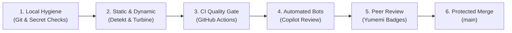
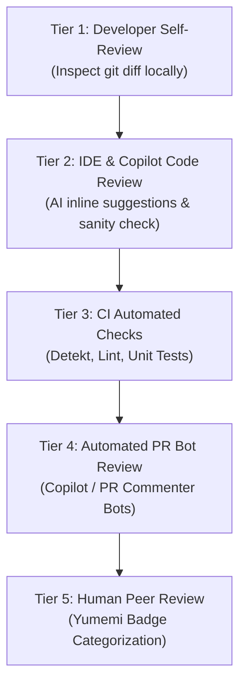

# Engineering Guardrails, Quality Gates & Repository Policies

## 1. Overview & Philosophy

To sustain high engineering velocity while preventing regressions, technical debt, and security vulnerabilities, this repository establishes automated **Engineering Guardrails**. 

These guardrails enforce the **Fail-Fast Principle**: defects, style inconsistencies, secret leaks, and architectural violations are caught automatically at the earliest possible stage—first locally in the IDE and pre-commit, then in CI pipelines and automated bot reviews, before human peer review.



---

## 2. Git & Commit Formatting Guardrails

### 2.1 Conventional Commits Standard
All commit messages must adhere to the [Conventional Commits v1.0.0](https://www.conventionalcommits.org/) specification:

```text
<type>(<scope>): <imperative summary>

[optional body explaining motivation and architectural tradeoffs]

[optional footer: closes #issue-number]
```

#### Allowed Commit Types
| Type | Purpose | Example |
|:---|:---|:---|
| `feat` | A new user-facing feature or enhancement | `feat(auth): implement biometric authentication flow` |
| `fix` | A bug fix | `fix(profile): handle null avatar URL in user profile mapping` |
| `refactor` | Code restructuring without behavioral change | `refactor(core): extract network client to dedicated module` |
| `test` | Adding or correcting automated tests | `test(cart): add Turbine flow assertions for CheckoutViewModel` |
| `docs` | Documentation additions or updates | `docs(team): add engineering guardrails and policies guide` |
| `style` | Formatting, whitespace, or lint fixes | `style(app): apply editorconfig rules and remove wildcards` |
| `build` | Build system or dependency catalog updates | `build(deps): update Kotlin to 1.9.22 in libs.versions.toml` |
| `ci` | CI pipeline scripts or workflow modifications | `ci(actions): add Detekt static analysis step to PR gate` |
| `chore` | Routine maintenance or tooling updates | `chore(gradle): clean up unused convention plugins` |

#### Commit Scopes
Permitted scopes mirror standard mobile architectural boundaries:
`app`, `feature`, `domain`, `data`, `network`, `designsystem`, `ui`, `shared`, `build-logic`, `ci`, `docs`.

### 2.2 Commit Hygiene Rules
1. **The 50/72 Rule**: Commit subject lines must not exceed 50 characters, followed by a blank line, with body paragraphs wrapped at 72 characters.
2. **Imperative Mood**: Use imperative present tense (e.g., *"add feature"*, not *"added feature"* or *"adds feature"*).
3. **Atomic Granularity**: Each commit must represent a single logical unit of work. Never mix formatting refactors with behavioral bug fixes.
4. **Zero Broken Commits**: Every commit in the git history must compile and pass tests cleanly. Squashing or rebasing before PR merge guarantees a bisectable history.

---

## 3. Pull Request & Branch Protection Policies

### 3.1 Semantic Branch Naming
All branches must branch from `main` using standard semantic conventions:
- `<type>/<short-description>` (e.g., `feat/...`, `fix/...`, `refactor/...`, `docs/...`)

### 3.2 Branch Protection on `main`
The primary development and release branch (`main`) is protected with the following rules:

| Protection Rule | Setting | Rationale |
|:---|:---|:---|
| **Direct Pushes** | **Blocked** | All modifications must arrive through vetted Pull Requests. |
| **Required Approvals** | **Minimum 1 Approval** | Human peer verification required before code reaches production. |
| **Required Status Checks** | **Must Pass** | `Android CI Quality Gate` must complete with zero errors. |
| **Require Branches to be Up to Date** | **Enabled** | Prevents race conditions and semantic merge conflicts. |
| **Require Conversation Resolution** | **Enabled** | All inline review comments and bot feedback must be explicitly resolved. |
| **Require Linear History** | **Enabled** | Enforces Squash & Merge or Rebase to keep git history clean and readable. |
| **Force Pushes (`--force`)** | **Blocked** | Protects collaborative commit history from deletion or rewrites. |

### 3.3 GitHub Repository Configuration & Branch Hygiene

To maintain a clean remote git history and prevent stale branch accumulation across the organization:

| Repository Setting | Configuration | Operational Standard & Policy |
|:---|:---:|:---|
| **Automatically delete head branches** | **ENABLED** | In `GitHub Settings -> General -> Pull Requests`, this setting is strictly enabled. Once a topic PR is merged into `dev` or `main`, GitHub immediately purges the remote head branch. Feature branches are strictly ephemeral. Engineers prune locally via `git fetch --prune`. |
| **Allow merge commits** | **ENABLED** | Used for promotional environment integration (`dev` -> `stg` -> `main`). |
| **Allow squash merging** | **ENABLED** | Used for single-purpose bugfixes and atomic topic branches to maintain a clean linear commit log. |
| **Always suggest updating PR branches** | **ENABLED** | Surfaces the "Update branch" button in GitHub UI to prevent merge skew against `dev`. |

### 3.4 Mandatory PR Template
Every pull request must adhere to the standard corporate Pull Request template:
1. **Issue Traceability**: Explicitly link the closed issue (e.g., `close #4`).
2. **Summary**: Concise explanation of the problem solved and approach taken.
3. **Screenshots & Media**: Side-by-side Before/After screenshots or video for any UI modifications.
4. **Review Level Checkbox**: Author specifies expected reviewer rigor (Yumemi standard).

---

## 4. Static & Dynamic Analysis Guardrails

### 4.1 Static Analysis Gates
- **Detekt 1.23.5**: Zero violations allowed across all 10 modules (`./gradlew detekt`).
  - Rules configured in `config/detekt/detekt.yml`.
  - Enforces cyclomatic complexity limits, maximum class lengths, and prevents swallowed exceptions.
- **Android Lint**: Zero fatal errors (`./gradlew lintDebug`).
- **EditorConfig**: Standardized via `.editorconfig` (120 char line limit, explicit package imports, no wildcard imports, UTF-8 charset).
- **Zero Forced Null Unwraps**: The `!!` operator is strictly forbidden across all production code.

### 4.2 Dynamic Analysis & Runtime Verification
- **Turbine Flow Testing**: Asynchronous `StateFlow` emissions must be verified deterministically with Turbine.
- **Offline Mock Reliability**: All features must function reliably under the `mock` flavor without network access.
- **Lifecycle & Memory Leak Prevention**:
  - No `Activity` or `Context` references held in long-lived singletons or ViewModels.
  - Coroutine jobs must be bound to structured lifecycles (`viewModelScope`), never `GlobalScope`.
- **Process Death Survival**: ViewModels handling state must integrate `SavedStateHandle` to survive OS process termination.

---

## 5. AI Safety & Secret Prevention Guardrails

### 5.1 Credential & Secret Protection
To prevent accidental exposure of sensitive information:

> [!CAUTION]
> **Zero Secret Policy:** Never commit API keys, Personal Access Tokens (PAT), OAuth client secrets, keystore files (`*.jks`, `*.keystore`), or environment files (`.env`) into git.

- **Local Secrets Isolation**: Any local development credentials must reside in `local.properties` or system environment variables, which are ignored by `.gitignore`.
- **Pre-Commit Secret Scanning**: Developers and automated scripts should utilize secret scanning tools (e.g. `gitleaks` or `trufflehog`) to detect credential entropy before commits are created.

### 5.2 AI Coding Pair-Programming Rules
When utilizing AI pairing tools (e.g. Antigravity, Gemini, GitHub Copilot):

1. **Zero Autonomous Commits**: AI agents must never autonomously execute `git commit` or `git push`. All code changes must remain in the working tree for human developer inspection via `git status` and `git diff`.
2. **Contract Verification**: AI-generated code must adhere to existing architectural interfaces (Domain UseCases, Repositories) without introducing arbitrary external dependencies or bloated helper utilities.
3. **Hallucination Check**: Verify that all third-party APIs, library versions, and imports exist in `gradle/libs.versions.toml`.
4. **Candidate Accountability**: The human developer remains 100% accountable for all code submitted.

---

## 6. Automated Review Bots & Tooling Hierarchy

To maximize reviewer efficiency and respect human reviewers' time, code reviews follow a strict five-tier review hierarchy:



### Review Tier Responsibilities
1. **Tier 1 (Self-Review)**: Author inspects their own diff on GitHub before requesting review, removing temporary logs and comments.
2. **Tier 2 (IDE & Copilot Review)**: Run local AI code review in the IDE to catch edge cases, missing null checks, and naming improvements.
3. **Tier 3 (Automated CI Gates)**: GitHub Actions executes lint, Detekt, and unit tests. If CI is red, review is automatically paused.
4. **Tier 4 (Automated PR Bots)**: GitHub Copilot and automated bot checkers leave initial feedback and diff summaries on the PR.
5. **Tier 5 (Human Peer Review)**: Reviewers apply Yumemi feedback badges (`must`, `nits`, `memo`, `imo`) focusing on business logic, UX, and architectural elegance.

---

## 7. Verification Checklist for Developers

Before opening or merging a Pull Request, confirm every item on this checklist:

- [ ] Branch follows semantic naming (`<type>/<description>`)
- [ ] Commits follow Conventional Commits standard with imperative mood
- [ ] No secrets, credentials, or API keys committed
- [ ] Zero Detekt violations (`./gradlew detekt`)
- [ ] Unit tests pass cleanly (`./gradlew testDevDebugUnitTest testMockDebugUnitTest`)
- [ ] Pull Request template filled out completely with issue number and review level
- [ ] GitHub Actions CI status check shows green
- [ ] At least 1 peer approval obtained
- [ ] All conversations and inline review comments resolved
