# 🚀 Mobile CI/CD & Release Standards Policy

**Document Classification:** Company Engineering Standard (100% Reusable)  
**Target Audience:** Mobile Engineering Teams, QA Leads, Release Engineers, EMs  
**Confluence Space:** `DEVOPS / CI-CD-GOVERNANCE`  

---

## 1. Purpose & Strategic Overview

In high-maturity mobile organizations, CI/CD is not merely a collection of build scripts—it is an **automated delivery pipeline and governance system**. 

This policy establishes the universal standards for how mobile applications are built, tested, distributed to QA via Firebase App Distribution, and released to the Google Play Store.

```mermaid
flowchart LR
    subgraph DevEnv["1. Developer Integration (dev)"]
        PR["Feature / Fix PR"] --> CI1["CI Quality Gate<br/>(Lint, Unit Tests, Build)"]
        CI1 --> DEV["Merge to dev"]
    end

    subgraph StgEnv["2. QA & Staging (stg)"]
        DEV --> PR2["Promotion PR"]
        PR2 --> STG["Merge to stg"]
        STG --> CD1["Firebase App Distribution<br/>(Internal QA & Stakeholders)"]
        CD1 --> QA["QA Test Sign-off"]
    end

    subgraph ProdEnv["3. Production Release (main)"]
        QA --> PR3["Release PR"]
        PR3 --> MAIN["Merge to main"]
        MAIN --> CD2["Google Play Console<br/>(Internal Track -> Production)"]
        CD2 --> PROD["5% -> 100% Phased Rollout"]
    end
```



---

## 2. Multi-Environment Promotion Rules

All mobile projects across the company must enforce the **3-Tier Promotion Gate**:

| Environment | Primary Branch | Build Type / Flavor | Backend Infrastructure Tier | Automated Trigger | Primary Audience & Purpose |
|:---|:---|:---|:---|:---|:---|
| **Development** | **`dev`** | `debug` / `dev` | **Dev Gateway** (`dev-api.internal.company`) & Local Mocks | Push to `dev` or PR to `dev` | **Engineers:** Continuous integration, lint verification, unit test execution, and fast feedback. |
| **Staging** | **`stg`** | `staging` / `stg` | **Staging QA Gateway** (`stg-api.internal.company`) | Push to `stg` | **QA & Stakeholders:** Automatic distribution to **Firebase App Distribution** for manual & regression QA. |
| **Production** | **`main`** | `release` / `prod` | **Production Gateway** (`api.company.com` + Edge CDN) | Push to `main` (Release PR) | **End Users:** Packaging signed AAB, uploading R8 mapping files, and publishing to Google Play Console. |

> [!NOTE]
> **Backend Infrastructure Alignment:** Mobile leads must ensure client API versioning matches the targeted backend infrastructure tier before promoting builds from `dev` to `stg` and `prod`. Cross-squad sync-ups with the dedicated Backend Platform Team are required for all schema or gateway migrations.

---

## 3. QA & Staging Distribution Protocol (Firebase App Distribution)

To maintain absolute traceability and prevent untracked builds:

1. **Zero Raw APK Sharing:**
   - Developers are **strictly prohibited** from exporting raw `.apk` files from their laptops and sharing them via Slack, Google Drive, or email.
   - All test builds must originate from reproducible GitHub Actions CI runners.
2. **Automated Tester Groups:**
   - `qa-engineers`: Internal QA team automatically notified upon merge to `stg`.
   - `client-stakeholders`: Product Managers and external stakeholders notified after initial QA smoke testing passes.
3. **Automated Release Notes:**
   - CI generates release notes automatically from commit subjects between git tags (`git log --pretty=format:"* %s (%an)" $PREV_TAG..HEAD`).
4. **Build Expiry & Hygiene:**
   - Staging builds are configured with a 30-day expiration to prevent testers from filing defect tickets against obsolete revisions.

---

## 4. Production Release & Phased Rollout Protocol

Releasing to the Google Play Store requires strict change management:

```
[Release Candidate] -> [Internal Track] -> [Closed Testing] -> [5% Staged Rollout] -> [100% Production]
```

1. **Pre-Release Quality Gates:**
   - 100% test pass rate on CI.
   - Zero critical/high static analysis violations (`./gradlew detekt`).
   - Explicit written sign-off from QA Lead on Staging test matrix.
2. **Phased Rollout Cadence (Google Play Store):**
   - Day 1: **5%** rollout &rarr; Monitor Crashlytics for 24 hours.
   - Day 2: **10%** rollout if crash-free rate exceeds **99.8%**.
   - Day 3: **20%** rollout.
   - Day 4: **50%** rollout.
   - Day 5: **100%** complete rollout.
3. **Rollout Halt Triggers:**
   - If Crashlytics reports an unexpected crash spike or crash-free sessions drop below **99.5%**, rollout is halted immediately.

---

## 5. Emergency Hotfix Fast-Track SLA

When a critical P0 production incident occurs:

1. **Branching:** Branch directly from `main`: `hotfix/<incident-id>-<description>`.
2. **SLA:** Maximum **4 hours** from incident confirmation to Play Store emergency release submission.
3. **Review Bypass Rule:** Requires approval from at least 1 Senior Engineer + EM.
4. **Post-Mortem Requirement:** A blameless post-mortem document must be published to Confluence within **48 hours** detailing Root Cause Analysis (RCA) and preventive guardrails.

---

## 6. Security, Keystores & Secret Governance

1. **Zero Plaintext Credentials:**
   - Production `.jks` signing keystores are Base64 encoded and stored strictly in **GitHub Repository Secrets** (`ANDROID_KEYSTORE_BASE64`).
   - Keystore passwords and alias keys are injected as runner environment variables at runtime and purged on job completion.
2. **Obfuscation Mapping Files:**
   - ProGuard/R8 `mapping.txt` files must be uploaded automatically to Google Play Console and Firebase Crashlytics on every release build to ensure stack traces remain readable.
3. **Dependency Vulnerability Audits:**
   - Dependency updates must undergo Dependabot or Snyk vulnerability audits prior to merging into `dev`.

---

## Related References

- [Code Review SLA & Guidelines](./04_code_review_guidelines.md)
- [Enterprise Definition of Done](./05_definition_of_done.md)
- [Engineering Guardrails & Policies](./06_engineering_guardrails.md)
- [Developer Workflow & Quality Verification](./08_developer_workflow.md)
