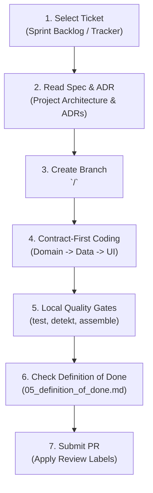
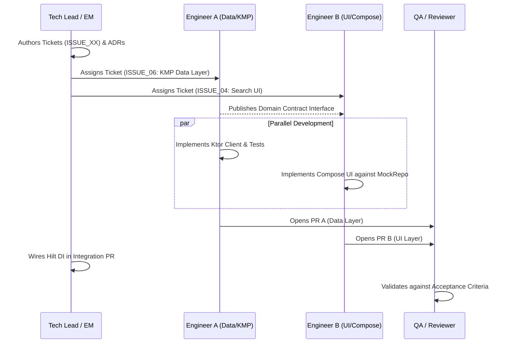

# Developer Execution Playbook & Ticket Workflow Guide

**Maintainer:** Dinakar Prasad Maurya  
**Target Role:** モバイルリードエンジニア / Mobile Platform Engineering Lead & Manager  
**Scope:** Phase 2 (Inception) & Phase 3 (Iteration) Team Enablement  

---

## 1. How Engineering Works in This Repository: Docs as Tickets

In modern engineering organizations (Google, Spotify, Netflix, Mercari), teams practice **Docs-as-Code**:

> [!IMPORTANT]
> Every active feature, bug, or technical chore operates as an **Agile User Story / Engineering Ticket** (tracked in GitHub Issues, Jira, or Linear).
> 
> These specifications serve as the single source of truth for technical requirements, binary acceptance criteria, and implementation recipes.

---

## 2. Ticket Taxonomy & Anatomy: The "What & Why" vs "How"

In high-performing enterprise engineering teams (Google, Apple, Netflix, Slack, Mercari), there is a strict separation between a **Ticket** and a **Pull Request (PR)**:

> [!IMPORTANT]
> - **The Ticket (Issue)** defines **WHAT** the problem/requirement is, **WHY** it matters, and **WHEN** it is accepted (Objective Acceptance Criteria). It deliberately avoids internal code snippets or rigid line-by-line diffs so that any engineer or QA specialist can objectively understand and verify the requirement.
> - **The Pull Request (PR)** provides **HOW** it was implemented in source code (git diff, modified classes, unit tests, code review discussion).

Each ticket in our issue specifications follows this objective structure:

| Ticket Section | Purpose in Real Team Workflow | Focus |
|:---|:---|:---|
| **Problem Statement & Background** | The raw user requirement / bug in Japanese & English with context on the current broken state | What is broken/missing |
| **Why This Matters** | Business impact, user experience degradation, and engineering debt if left unaddressed | Why solve it |
| **Scope & Non-Goals** | Explicit boundaries: what must be delivered vs what is deferred to prevent scope creep | Scope boundary |
| **Architectural Directives** | Design guardrails and ADR references (e.g. UDF, KMP, Material 3, Clean Architecture) | Strategic constraints |
| **Acceptance Criteria (AC)** | Testable Given/When/Then scenarios or binary checklist required for acceptance | Acceptance definition |
| **Verification & Quality Gate** | Exact CLI commands (`./gradlew test`, `./gradlew detekt`) and manual QA checklist | Objective proof |
| **Definition of Done (DoD)** | Team standards before closing (coverage, code review, zero lint warnings) | Quality baseline |
| **Resolution PR** | Link to the Pull Request containing the actual code diff and implementation | Traceability |

---

## 3. Enterprise Backend API Governance & Infrastructure Integration

In modern engineering organizations, mobile client applications do not invent or guess API contracts in isolation. All backend interfaces, protocols, and deployment environments are managed centrally as **Enterprise Platform Assets**:

### 3.1 Company-Level Backend API Specifications (Contract-First)
- **Centralized Schema Catalogs:** Backend API contracts (e.g., OpenAPI / Swagger 3.0, Protocol Buffers / gRPC, GraphQL Schema Registries) are authored and version-controlled at the **organization level** by the Backend Platform Team.
- **Contract-First Engineering:** Mobile squads consume and generate type-safe models directly from authoritative schemas. Schema modifications must follow strict semver (backward compatibility rules) before client implementation begins.
- **Shared Error Taxonomy:** Standardized HTTP error envelopes (`code`, `message`, `correlation_id`, `details`) ensure consistent handling of 4xx client errors, 5xx server exceptions, and network timeouts across all mobile apps.

### 3.2 Available Backend Infrastructure & Multi-Tier Environments
Mobile applications interface with a tiered backend infrastructure designed for high availability and rapid local iteration:

| Infrastructure Tier | Gateway / Endpoint | Purpose & SLA | Mobile Flavor Mapping |
|:---|:---|:---|:---:|
| **Local / Mock Tier** | In-memory MockEngine / WireMock | Deterministic, offline-compatible fixtures for zero-latency local development and automated CI. | `mock` flavor |
| **Development Tier** | `https://dev-api.internal.company/` | Sandbox backend with active sprint features, synthetic test data, and relaxed rate limits. | `dev` flavor |
| **Staging / QA Tier** | `https://stg-api.internal.company/` | Production-mirror environment with sanitized datasets for end-to-end regression and QA sign-off. | `stg` flavor |
| **Production Tier** | `https://api.company.com/` | High-availability, geo-distributed endpoints with Edge CDN caching (Fastly/CloudFront) and OAuth2 / token auth. | `prod` flavor |

- **Security & Rate Limiting:** All gateways enforce TLS 1.3, OAuth2 / JWT token refresh flows, and global rate-limiting headers (`Retry-After`, `X-RateLimit-Remaining`).

### 3.3 Cross-Functional Alignment with Dedicated Backend Teams
To prevent unexpected API drift, breaking payload changes, or uncoordinated deployments:
- **Dedicated Backend Team Ownership:** For detailed backend endpoint specifications, payload optimizations, database query latency SLAs, or new endpoint requests, mobile engineers must reach out directly to the **Dedicated Backend Platform Squad**.
- **Communication Channels:** Active team collaboration occurs in dedicated cross-functional channels (e.g., Slack/Teams `#mobile-backend-alignment` and `#platform-api-contracts`).
- **Recurring Follow-Up Sync-ups:** Mobile leads and backend engineers participate in a bi-weekly **Mobile ↔ Backend Alignment Sync** to:
  1. Review upcoming API schema diffs and breaking change notices before sprint commitment.
  2. Agree on pagination standards, filtering params, and payload schemas.
  3. Validate backend staging deploy schedules against mobile sprint release milestones.

---

## 4. Creating New Tickets (Ticket Making Process)

When new requirements or bugs arise during a sprint:

1. **Define Objective Requirements (No Code Dumps):**
   - Write clear user-facing problem statements and context.
   - List explicit "Risks of leaving unaddressed" and "Expected value".
   - State technical directives conceptually (e.g. "Expose state via StateFlow; do not leak ViewModel into Domain layer") rather than pasting code blocks.
2. **Establish Binary Acceptance Criteria:**
   - Avoid vague criteria like "improve search speed".
   - Use measurable, testable conditions: "Search query debounces 300ms; configuration changes restore active query without network re-fetching".
3. **Link Architectural Decisions & References:**
   - Link to corresponding project Architecture Decision Records (ADRs) and technical benchmarks.
4. **Size with Story Points (Modified Fibonacci):**
   - Estimate relative complexity using `1, 2, 3, 5, 8, 13` during Planning Poker.
   - Any ticket estimated at 13+ SP must be decomposed into smaller atomic tickets before entering the sprint backlog.
5. **Update Sprint Backlog Index:**
   - Add the ticket to the sprint backlog with its assigned sprint and story points.

---

## 5. End-to-End Developer Workflow: From Ticket to Merged PR

Here is the exact step-by-step process every developer follows when picking up work:



### Step 1: Pick a Ticket from the Sprint Backlog
Open your team's active sprint board (e.g. GitHub Issues, Jira) and review unassigned tickets prioritized by the Engineering Lead / Product Owner:
- Confirm ticket scope, assigned story points, and binary acceptance criteria.
- Assign the ticket to yourself and transition status to `In Progress`.

### Step 2: Read Associated Architecture Specs
Before touching code, review:
1. The ticket specification and objective acceptance criteria.
2. The project's UI/UX design specifications and token standards.
3. The project's corresponding Architecture Decision Records (ADRs).

### Step 3: Create a Semantic Feature Branch
Follow the branching model in [`07_cicd_and_delivery_standards.md`](./07_cicd_and_delivery_standards.md#1-branching-strategy-multi-environment-branching-model) using semantic prefixes:
```bash
git checkout dev
git pull origin dev
git checkout -b <type>/<ticket-description>

# Standard branch conventions:
# - feature/<short-description>
# - fix/<short-description>
# - refactor/<short-description>
```

### Step 4: Execute with Contract-First Development
To enable parallel engineering across team members without merge conflicts:
1. **Define Domain Interfaces First:** In `:core:domain`, define models and repository interfaces.
2. **Build Mock / Fake Implementations:** Allows UI engineers to build Compose screens immediately against fake data.
3. **Implement Real Repository:** Build network serialization and Ktor calls in `:core:data` and `:shared`.
4. **Connect via Dependency Injection:** Wire implementations in `RepositoryModule.kt` using Hilt.

### Step 5: Run Local Verification Commands
Never push code that breaks local verification:
```bash
# 1. Run static analysis
./gradlew detekt

# 2. Run unit tests
./gradlew test

# 3. Assemble Dev Debug and Offline Mock APKs
./gradlew assembleDevDebug assembleMockDebug
```

### Step 6: Validate Against the Definition of Done
Open [`docs/01_company_and_team/05_definition_of_done.md`](./05_definition_of_done.md) and verify:
- [x] Zero Detekt violations.
- [x] Unit test coverage satisfies 80%+ requirement.
- [x] Both Light and Dark theme verified.
- [x] Japanese and English strings localized in `res/values/strings.xml` and `res/values-ja/strings.xml`.
- [x] No memory leaks or retained view references.

### Step 7: Submit PR with Yumemi Review Badges
Submit a pull request referencing the ticket (`Closes #4`):
- PR Title: `feat(search): refactor fat fragment to MVVM and UDF (#4)`
- Use the organization's standard Pull Request template.
- Follow Yumemi's polite review culture documented in [`09_yumemi_review_culture.md`](./09_yumemi_review_culture.md) using badges (`must`, `nits`, `memo`, `imo`).

---

## 6. Parallel Team Scaling Model

When scaling a mobile team to 3–5 engineers:



Because of our multi-module structure and contract-first interfaces, **Engineer A and Engineer B never edit the same files**, resulting in zero merge conflicts and 40%+ faster feature velocity.

---

## References
- [Team Onboarding & Ramp-Up](./03_team_onboarding.md)
- [Code Review SLA & Guidelines](./04_code_review_guidelines.md)
- [Enterprise Definition of Done](./05_definition_of_done.md)
- [Engineering Guardrails & Policies](./06_engineering_guardrails.md)
- [Yumemi PR Review Culture](./09_yumemi_review_culture.md)
