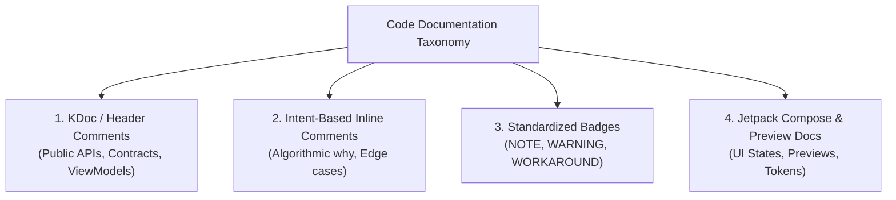

# 📝 Code Commenting & Living Documentation Standards

**Document Classification:** Company Engineering Standard (100% Reusable)  
**Target Audience:** Android & iOS Mobile Engineers, Technical Leads, Code Reviewers  
**Confluence Space:** `ENG-STANDARDS / CODE-QUALITY`  

---

## 1. Executive Summary & Core Philosophy

> [!IMPORTANT]
> **"Code tells you HOW; Comments tell you WHY."**  
> In high-performing mobile organizations, clean code is primarily self-documenting through expressive naming, strict typing, and modular separation of concerns. Comments must be applied intentionally to communicate **business intent, algorithmic rationale, architectural invariants, and non-obvious constraints**—not to restate the syntax.

### The Three Golden Rules of Code Commenting
1. **Explain Intent, Not Mechanics:** Never explain what the code is doing syntactically. Explain *why* this approach was chosen, what trade-offs were made, and what domain rules or edge cases are being satisfied.
2. **Avoid Comment Rot:** If code changes, the documentation must change in the exact same atomic commit. Comments that contradict the implementation are worse than no comments.
3. **Refactor Before Commenting:** If a method requires a paragraph to explain its mechanics, decompose it into smaller, single-responsibility functions with meaningful names.

---

## 2. Taxonomy & Comment Types

Our mobile engineering teams recognize four distinct types of code documentation:



| Type | Target Location | Purpose | Required Format |
|:---|:---|:---|:---|
| **KDoc / Header** | Interfaces, UseCases, ViewModels, Entities | Explains public contracts, threading guarantees, and architectural roles. | `/** ... */` |
| **Algorithmic Inline** | Non-trivial calculations, regex, transformations | Explains the mathematical or protocol rationale. | `// ...` |
| **Tagged Badges** | Edge case workarounds, API quirks, concurrency gates | Highlights security or platform nuances for future maintainers. | `// NOTE:`, `// WARNING:` |
| **Compose & Preview** | Screen composables, UI components, Preview functions | Documents visual specs, parameters, and light/dark preview states. | KDoc + `@Preview` |

---

## 3. KDoc Standards for Kotlin & KMP

### 3.1 Public Interfaces and Domain Contracts
Public interfaces in `:core:domain` and repository boundaries must document their contract, thread safety, and expected exceptions:

```kotlin
/**
 * Contract for fetching and caching GitHub repository data.
 *
 * All implementations must guarantee:
 * - Thread-safe operations suitable for invocation from any CoroutineContext.
 * - Graceful error handling mapping HTTP status codes to domain-level [NetworkException].
 * - LRU query caching to mitigate GitHub API rate limits.
 */
interface GitHubRepository {

    /**
     * Searches public GitHub repositories matching the specified [query] and [filter].
     *
     * @param query Keyword string to search across repository names and descriptions.
     * @param page 1-based page index for paginated retrieval.
     * @param sort Sorting criteria (e.g., Best Match, Stars, Forks).
     * @param filter Structured search qualifiers (language, min stars, update period).
     * @return [SearchResult] containing the retrieved items and pagination indicators.
     * @throws NetworkException When network connectivity fails or GitHub rate limits are hit.
     */
    suspend fun searchRepositories(
        query: String,
        page: Int = 1,
        sort: SearchSort = SearchSort.BEST_MATCH,
        filter: SearchFilter = SearchFilter()
    ): SearchResult
}
```

### 3.2 ViewModels and State Management
ViewModels must document their state hierarchy, Unidirectional Data Flow (UDF) lifecycle, and navigation responsibilities:

```kotlin
/**
 * ViewModel coordinating GitHub repository search flow, debounced queries,
 * pagination, sorting, and filtering while exposing immutable [SearchUiState].
 *
 * Invariants:
 * - Emits [SearchUiState.Idle] when query is blank.
 * - Debounces rapid text input by 500ms to conserve API quotas.
 * - Retains active search query across process recreation via [SavedStateHandle].
 */
@HiltViewModel
class SearchViewModel @Inject constructor(
    private val searchRepositoriesUseCase: SearchRepositoriesUseCase,
    private val savedStateHandle: SavedStateHandle
) : ViewModel()
```

---

## 4. Standardized Inline Badges

To maintain readability and simplify code audits, engineers must use standardized badges for non-obvious code paths:

### 4.1 `// NOTE:`
Explains domain-specific constraints or API protocol expectations that may look counter-intuitive:
```kotlin
// NOTE: GitHub Search API returns maximum 1,000 search results across all pages.
// Requests beyond page 34 (at 30 items/page) will return HTTP 422 Unprocessable Entity.
val hasNextPage = page * PAGE_SIZE < totalCount.coerceAtMost(1000)
```

### 4.2 `// WARNING:`
Flags concurrency hazards, memory leak vectors, or irreversible mutations:
```kotlin
// WARNING: Do not dispatch network calls on Dispatchers.Main. 
// Ktor HTTP client dispatches internally on the configured engine dispatcher.
```

### 4.3 `// WORKAROUND:`
Documents temporary patches for external library bugs, OS-level quirks, or legacy API constraints with tracking links:
```kotlin
// WORKAROUND: Issue #4821 - Android 12 Splash Screen API can trigger double animations.
// Postpone splash transition until Compose UI tree has drawn its first frame.
```

### 4.4 `// ARCHITECTURE:`
Highlights architectural boundaries (e.g. Clean Architecture purity rules):
```kotlin
// ARCHITECTURE: Domain layer must remain 100% pure Kotlin. 
// Never import android.* classes into this module to maintain KMP multiplatform portability.
```

---

## 5. Jetpack Compose & UI Preview Standards

All user-facing screens and reusable design system components must follow strict preview guidelines to support rapid design iteration in Android Studio:

### 5.1 Preview Coverage Requirements
Every UI Screen (`*Screen.kt`) and reusable component must include `@Preview` annotations covering:
1. **Light Theme:** Default Material 3 light color scheme (`CodeCheckTheme(darkTheme = false)`).
2. **Dark Theme:** High-contrast dark color scheme (`CodeCheckTheme(darkTheme = true)`).
3. **Core UI States:**
   - **Success / Content:** Rendered with realistic, production-like mock fixtures.
   - **Loading / Skeleton:** Circular spinners or shimmer skeleton placeholders.
   - **Empty State:** Friendly zero-results illustration with recovery action.
   - **Error State:** Error banner or retry illustration with actionable button.

### 5.2 Decoupled Stateful vs Stateless Screen Pattern
To make composables easily previewable without spinning up Hilt dependency injection:
- The **public composable** collects state from `@HiltViewModel` and delegates user intentions.
- The **internal composable** is 100% stateless, accepting pure state objects and lambda callbacks.
- Previews target the stateless internal composable directly using private sample fixtures.

```kotlin
// 1. Stateful container (Injected via Hilt)
@Composable
fun SearchScreen(
    onRepositoryClick: (RepositoryItem) -> Unit,
    modifier: Modifier = Modifier,
    viewModel: SearchViewModel = hiltViewModel()
) {
    val uiState by viewModel.uiState.collectAsState()
    SearchScreen(
        uiState = uiState,
        onRepositoryClick = onRepositoryClick,
        modifier = modifier
    )
}

// 2. Stateless content (Previewable & Unit-testable)
@Composable
internal fun SearchScreen(
    uiState: SearchUiState,
    onRepositoryClick: (RepositoryItem) -> Unit,
    modifier: Modifier = Modifier
) { ... }

// 3. Theme & State Previews
@Preview(name = "Search - Success Light", showBackground = true)
@Composable
private fun SearchScreenSuccessLightPreview() {
    CodeCheckTheme(darkTheme = false) {
        SearchScreen(
            uiState = SearchUiState.Success(previewSampleRepositories),
            onRepositoryClick = {}
        )
    }
}
```

---

## 6. Commenting Anti-Patterns (What to AVOID)

Reviewers should flag and reject the following anti-patterns during peer review:

| Anti-Pattern | Bad Example | Good Solution |
|:---|:---|:---|
| **Restating Syntax** | `// Set title to string`<br/>`title = text` | Delete the comment. The code is already self-explanatory. |
| **Commented-Out Code** | `// val oldService = LegacyApi()`<br/>`// oldService.fetch()` | Delete dead code immediately. Git history preserves past implementations. |
| **Apology Comments** | `// Sorry for this hack, I will fix it next sprint` | Refactor the code or create a tracked issue with `// WORKAROUND: #ticket`. |
| **Vague TODOs** | `// TODO: fix this later` | Include ticket reference and ownership: `// TODO(#142): Add offline Room database cache`. |
| **Noise on Getters/Setters** | `/** Get user name */`<br/>`fun getName(): String` | Delete trivial KDoc. Only document parameters, return values, or side-effects when non-obvious. |

---

## 7. Review Checklist for Code Comments

During peer reviews (see [`04_code_review_guidelines.md`](./04_code_review_guidelines.md)), reviewers verify:
- [ ] Are all public domain interfaces, use cases, and repositories documented with KDoc?
- [ ] Do comments explain the *business why* rather than mechanically repeating the syntax?
- [ ] Are non-obvious algorithmic choices (e.g. jittered exponential backoff, caching strategies) explained?
- [ ] Are temporary workarounds tagged with `// WORKAROUND:` and linked to a tracking issue?
- [ ] Are all newly added UI screens and components equipped with Light and Dark `@Preview` composables?
- [ ] Is all commented-out dead code eliminated from the pull request?
