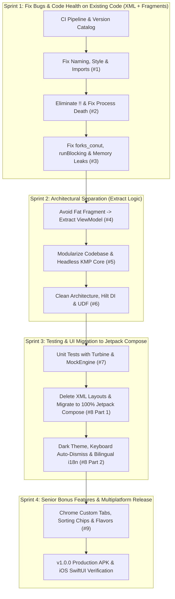

# PR Execution Roadmap

**Author:** Dinakar Prasad Maurya
**Target Role:** Mobile Lead Engineer/EM

---

## 1. Strategy Overview

**Approach:** Documentation First, Then Code PRs

**Why This Order?**
1. Shows problem-solving approach before jumping to code
2. Demonstrates EM-level strategic thinking upfront
3. Creates narrative arc: Problem → Analysis → Strategy → Implementation
4. Reviewers understand context before seeing code changes

---

### 2. Modernization Strategy: Why We Do NOT Convert to Compose on Day 1

A common architectural trap in legacy modernization is the **"Big-Bang Rewrite"** — deleting all XML and Fragments on Day 1 and rewriting everything in Jetpack Compose in early pull requests.

### 2.1 The "Big Bang Rewrite" Trap:
If we deleted all XML and Fragments in an early rewrite:
1. **Evaluators cannot see us fixing the legacy bugs:**
   - **Issue #1 (Readability):** Evaluators want to see Hungarian prefixes (`_binding`, `_viewModel`) removed, `topActivity.kt` renamed to `TopActivity.kt`, and wildcard imports cleaned up in the existing code.
   - **Issue #2 (Safety):** Evaluators want to see forced `!!` unwraps eliminated from Fragment lifecycle methods and `SavedStateHandle` applied to prevent process-death crashes.
   - **Issue #3 (Bugs):** Evaluators want to see the `forks_conut` typo fixed, `runBlocking` removed from the Main thread, and the ViewBinding lifecycle memory leak (`_binding = null` in `onDestroyView()`) properly diagnosed and eliminated.
2. **Deleting files bypasses the challenge:** If you delete `OneFragment.kt` immediately, you didn't fix the memory leak or threading bug — you simply deleted the file. That does not demonstrate Senior/Lead engineering rigor.

---

### 2.2 The Strangler Fig Pattern: 4-Sprint Modernization Sequence

We adopt Martin Fowler's **Strangler Fig Application Pattern**, stabilizing legacy code first, isolating architectural boundaries second, migrating the UI to Jetpack Compose third, and delivering production enhancements fourth:



---

### 2.3 Detailed Sprint & Milestone Objectives

#### Sprint 1: Foundation, Code Health & Safety (Issues #1, #2, #3)
- **Codebase State:** Keeps legacy XML layouts and Fragment navigation intact.
- **CI & Tooling:** CI/CD automated quality gate (`.github/workflows/ci.yml`) and Gradle Version Catalog (`gradle/libs.versions.toml`).
- **PascalCase Naming:** Fix PascalCase naming (`topActivity.kt` &rarr; `TopActivity.kt`, `data class item` &rarr; `RepositoryItem`) and remove Hungarian prefixes.
- **Code Style & Imports:** Enforce `.editorconfig` style rules and eliminate wildcard imports. *(Closes Issue #1)*
- **Null Safety Assertions:** Eliminate all forced `!!` unwraps from Fragment and Activity layers.
- **Process Death Resilience:** Implement `SavedStateHandle` to survive background process death. *(Closes Issue #2)*
- **API Typo & Threading:** Correct `forks_conut` typo in API DTO; remove `runBlocking` from UI thread to prevent ANRs.
- **Memory Leaks & ViewBinding:** Clear ViewBinding references in `onDestroyView()` and eliminate Context memory leaks. *(Closes Issue #3)*

#### Sprint 2: Architecture & Modularity (Issues #4, #5, #6)
- **ViewModel Extraction:** Extract search operations, input validation, and data formatting from `OneFragment` into `SearchViewModel`. *(Closes Issue #4)*
- **Modularization & KMP Core:** Decompose into cohesive modules (`:core:domain`, `:core:data`, `:core:network`, `:shared`). *(Closes Issue #5)*
- **Clean Architecture & Hilt DI:** Configure compile-time Hilt DI (`@HiltAndroidApp`, `@HiltViewModel`) and implement Unidirectional Data Flow via sealed `StateFlow`. *(Closes Issue #6)*

#### Sprint 3: Quality Testing & Jetpack Compose UI Migration (Issues #7, #8)
- **Turbine & Network Testing:** Build automated unit tests with CashApp Turbine, Ktor MockEngine, and MainDispatcherRule. *(Closes Issue #7)*
- **Compose UI Migration:** **This is the exact milestone where XML is converted to Compose.**
  - Delete legacy XML layouts (`activity_top.xml`, `fragment_one.xml`, `fragment_two.xml`, `layout_item.xml`).
  - Delete legacy Fragments (`OneFragment.kt`, `TwoFragment.kt`).
  - Implement declarative Composables: `SearchScreen.kt`, `DetailScreen.kt`, and `AppNavHost.kt` with Material Design 3. *(Addresses Issue #8)*
- **Theme, Localization & Error Polish:** Add dynamic Material 3 Dark theme, software keyboard auto-dismiss, error banners, and Japanese/English localization. *(Closes Issue #8)*

#### Sprint 4: Bonus Features & Multiplatform Release (Issue #9 & Release)
- **Custom Tabs & Filtering:** In-app browser via Chrome Custom Tabs, repository sorting chips (Stars, Forks, Watchers), and product flavors (`dev`, `mock`, `stg`, `prod`). *(Closes Issue #9)*
- **Release Packaging & iOS Sample:** Production release APK packaging, ProGuard/R8 minification, and native iOS SwiftUI client (`IOS-SAMPLE1/`) consuming the shared KMP core. *(Milestone v1.0.0)*

---

## 3. Master Sprint & Milestone Traceability Matrix

| Sprint | Target Issue | Branch Name | Title (Conventional Commit) | Closes |
|:---|:---|:---|:---|:---:|
| **Sprint 1** | **Infra Setup** | `feature/setup-ci-and-version-catalog` | `ci: setup automated GitHub Actions CI and Version Catalog` | *(CI Gate)* |
| **Sprint 1** | **Issue #1** | `feature/issue-1-naming-conventions` | `refactor: fix naming conventions and clean up Hungarian notation` | - |
| **Sprint 1** | **Issue #1** | `feature/issue-1-code-style-editorconfig` | `style: apply .editorconfig standards and clean wildcard imports` | **Closes #1** |
| **Sprint 1** | **Issue #2** | `feature/issue-2-null-safety-assertions` | `refactor: eliminate forced !! assertions and safely handle nulls` | - |
| **Sprint 1** | **Issue #2** | `feature/issue-2-process-death-resilience` | `fix: prevent lateinit crash on process death and handle recreation` | **Closes #2** |
| **Sprint 1** | **Issue #3** | `feature/issue-3-forks-typo-and-runblocking` | `fix: correct forks_conut typo and remove runBlocking from main thread` | - |
| **Sprint 1** | **Issue #3** | `feature/issue-3-viewbinding-context-leaks` | `fix: clear ViewBinding in onDestroyView and prevent Context memory leaks` | **Closes #3** |
| **Sprint 2** | **Issue #4** | `feature/issue-4-extract-viewmodel-logic` | `refactor: extract search and data logic from Fragment to ViewModel` | **Closes #4** |
| **Sprint 2** | **Issue #5** | `feature/issue-5-headless-kmp-data-domain` | `refactor: separate Domain entities, Repository interface, and Ktor Data layer` | **Closes #5** |
| **Sprint 2** | **Issue #6** | `feature/issue-6-clean-architecture-hilt-udf` | `feat: implement Clean Architecture with Hilt DI and StateFlow UDF` | **Closes #6** |
| **Sprint 3** | **Issue #7** | `feature/issue-7-viewmodel-and-network-tests` | `test: add unit tests for ViewModel, Coroutines, and Ktor MockEngine` | **Closes #7** |
| **Sprint 3** | **Issue #8** | `feature/issue-8-compose-material3-ui` | `feat: migrate UI from XML Views to 100% Jetpack Compose & Material 3` | - |
| **Sprint 3** | **Issue #8** | `feature/issue-8-dark-mode-keyboard-i18n` | `feat: add Dark theme, auto-keyboard dismiss, error states, and bilingual i18n` | **Closes #8** |
| **Sprint 4** | **Issue #9** | `feature/issue-9-customtabs-and-repo-sorting` | `feat: add Chrome Custom Tabs, repository sorting, and search filters` | **Closes #9** |
| **Sprint 4** | **Release** | `feature/release-v1.0.0` | `release: package v1.0.0 release APK and finalize architecture documentation` | *(Milestone)* |

**Total Sprints:** 4 Sprints  
**Approach:** Atomic, single-responsibility Pull Requests  
**Issues Addressed:** 9 Challenge Issues + CI Infrastructure + Production Release  

---

## 4. Execution Workflow: From Feature Branch to Merged PR

Each feature branch is created from `main`, developed, verified against local quality gates, and submitted via a Pull Request:

```bash
# 1. Create semantic feature branch
git checkout -b feature/issue-1-naming-conventions main

# 2. Implement changes, then verify quality gates
./gradlew detekt
./gradlew testDebugUnitTest
./gradlew assembleDevDebug

# 3. Push feature branch and open Pull Request
git push origin feature/issue-1-naming-conventions
gh pr create --base main --fill
```

---

## 5. Success Criteria (Final Validation)

After all PRs merged:

### Code Quality
- [ ] Zero Detekt violations
- [ ] 85%+ test coverage
- [ ] All CI checks passing
- [ ] No Android lint errors

### Feature Completeness
- [ ] All 9 Yumemi issues addressed
- [ ] Search functionality works
- [ ] Detail screen works
- [ ] Dark mode toggles instantly
- [ ] Language switches instantly (no Activity restart)
- [ ] Custom Tabs opens GitHub links
- [ ] iOS KMP sample compiles and runs

### Documentation
- [ ] 30,000+ words documentation
- [ ] 9 issue deep-dives complete
- [ ] EM perspective documented
- [ ] All ADRs finalized

### Deliverables
- [ ] Production APK built (`./gradlew assembleProdRelease`)
- [ ] Screenshots captured (light/dark, EN/JA)
- [ ] README updated with badges
- [ ] All PRs have detailed descriptions

---

## 6. Execution Strategy
 
1. Establish clean architectural documentation and baseline ADRs
2. Ensure development notes remain strictly private
3. Open focused, single-responsibility Pull Requests
4. Verify all quality gates (`detekt`, `test`, `lint`) prior to merging
5. Proceed through the four modernization sprints iteratively

---

**Document Status:** Ready for Execution
**Next Milestone:** Code Health & Bug Remediation (Sprint 1)
