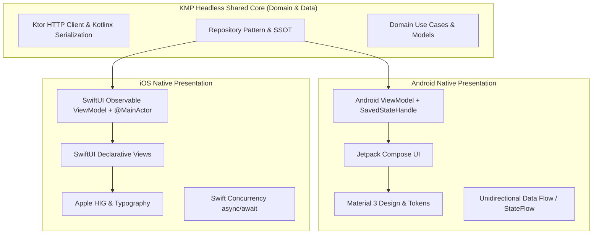

# Architecture & Platform Engineering References

**Maintainer:** Dinakar Prasad Maurya  
**Target Role:** モバイルリードエンジニア / Mobile Platform Engineering Lead & Manager  
**SDLC Phase:** Phase 1 (Concept) & Phase 2 (Inception) Architectural Foundation  

---

## 1. Executive Summary & Foundational Philosophy

Modern enterprise mobile applications across global technology leaders (Google, Apple, Netflix, Slack, Block/Square) and prominent Japanese engineering organizations (LINE, Mercari, Yumemi) demand rigorous adherence to established platform conventions, defensive software engineering guardrails, and industry architectural standards. 

This repository is architected upon four foundational pillars:
1. **Google Official Android Architecture**: Modern Unidirectional Data Flow (UDF), Layered Clean Architecture (UI, Domain, Data), and reactive state handling via Kotlin Coroutines and StateFlow.
2. **Apple Human Interface Guidelines (HIG) & Swift Concurrency**: Native declarative UI with SwiftUI, Actor-isolated asynchronous concurrency (`@MainActor`), and accessibility-first design.
3. **JetBrains Kotlin Multiplatform (KMP)**: The **"Share logic, keep UI native"** paradigm—centralizing networking, business domain rules, and data persistence in shared Kotlin while honoring 100% native platform presentation.
4. **Industry & Enterprise Architecture Patterns**: Martin Fowler's *Strangler Fig Pattern* for legacy migration, Uncle Bob's *Clean Architecture*, and reactive data flow patterns published across leading engineering blogs.

---

## 2. Google Official Android Developer Documentation

### 2.1 Guide to App Architecture & Layering
* **Guide to App Architecture**: [https://developer.android.com/topic/architecture](https://developer.android.com/topic/architecture)
  * Establishes the three-tier separation: **UI Layer**, optional **Domain Layer**, and **Data Layer**.
  * Enforces the **Dependency Inversion Principle**: higher-level UI modules depend on domain abstractions, not concrete data implementations.
* **Data Layer & Repository Pattern**: [https://developer.android.com/topic/architecture/data-layer](https://developer.android.com/topic/architecture/data-layer)
  * **Single Source of Truth (SSOT)**: Repositories coordinate remote network calls and in-memory caching to guarantee data consistency.
  * Exposing data via observable reactive streams (`Flow<T>`).
  * **Architectural Scoping Note on Offline Persistence**: For this GitHub exploration client, caching is handled in-memory for active sessions. Full offline-first database synchronization (e.g. Room/SQLDelight) was intentionally scoped out to avoid serving stale repository search indices and preserve live GitHub API query accuracy.
* **Preferences DataStore**: [https://developer.android.com/topic/libraries/architecture/datastore](https://developer.android.com/topic/libraries/architecture/datastore)
  * Asynchronous, transactional local persistence for user preferences (Theme mode and Language settings) backed by Kotlin Coroutines and Flow.
* **UI Layer Guide & Unidirectional Data Flow (UDF)**: [https://developer.android.com/topic/architecture/ui-layer](https://developer.android.com/topic/architecture/ui-layer)
  * State flows down from ViewModel to UI as immutable sealed states (`Loading`, `Success`, `Error`, `Empty`); user events flow up from UI to ViewModel.
  * State hoisting ensures UI components remain stateless, reusable, and easily previewable/testable.

### 2.2 Reactive Programming: Kotlin Coroutines & Flow
* **Kotlin Coroutines on Android**: [https://developer.android.com/kotlin/coroutines](https://developer.android.com/kotlin/coroutines)
  * Structured concurrency: bounding asynchronous operations within explicit lifecycles (`viewModelScope`).
  * Dispatcher separation: `Dispatchers.IO` for disk/network I/O, `Dispatchers.Default` for CPU-intensive JSON transformations, and `Dispatchers.Main` for UI emissions.
* **Kotlin Flows on Android**: [https://developer.android.com/kotlin/flow](https://developer.android.com/kotlin/flow)
  * Reactive cold streams with declarative operators (`map`, `filter`, `debounce`, `catch`, `flowOn`).
  * Defensive error handling using the `catch` operator to prevent unhandled coroutine cancellation.
* **StateFlow and SharedFlow**: [https://developer.android.com/kotlin/flow/stateflow-and-sharedflow](https://developer.android.com/kotlin/flow/stateflow-and-sharedflow)
  * `StateFlow`: hot, conflated state holder emitting the latest UI state to new collectors.
  * `SharedFlow`: hot stream for one-shot UI side-effects (e.g. Navigation events, Snackbar notifications).
* **Lifecycle-Aware Flow Collection**: [https://developer.android.com/jetpack/compose/lifecycle](https://developer.android.com/jetpack/compose/lifecycle)
  * Using `collectAsStateWithLifecycle()` to automatically halt Flow collection when the app is backgrounded, conserving CPU and battery resources.

### 2.3 ViewModel & State Preservation
* **ViewModel Overview**: [https://developer.android.com/topic/libraries/architecture/viewmodel](https://developer.android.com/topic/libraries/architecture/viewmodel)
  * UI state holders surviving configuration changes (screen rotation, fold/unfold transitions, locale switches) without redundant network queries.
* **Saved State Module for ViewModel**: [https://developer.android.com/topic/libraries/architecture/viewmodel/viewmodel-savedstate](https://developer.android.com/topic/libraries/architecture/viewmodel/viewmodel-savedstate)
  * Restoring critical state (search query, pagination index, selected repository) across Android OS system-initiated process termination (low-memory killer).

### 2.4 Modern UI: Jetpack Compose & Material 3
* **Jetpack Compose Toolkit**: [https://developer.android.com/jetpack/compose](https://developer.android.com/jetpack/compose)
  * Declarative UI model eliminating Android Fragment lifecycle bugs and `ViewBinding` memory leaks.
* **Material Design 3 (Material You)**: [https://m3.material.io/](https://m3.material.io/)
  * Dynamic color theming, standardized elevation and typography tokens, and WCAG AA contrast compliance.
* **Compose Design Systems**: [https://developer.android.com/jetpack/compose/designsystems/material3](https://developer.android.com/jetpack/compose/designsystems/material3)
* **Navigation Compose**: [https://developer.android.com/jetpack/compose/navigation](https://developer.android.com/jetpack/compose/navigation)
  * Single-Activity architecture with declarative `NavHost` and type-safe argument passing.

### 2.5 Dependency Injection & Testing
* **Hilt Dependency Injection**: [https://developer.android.com/training/dependency-injection/hilt-android](https://developer.android.com/training/dependency-injection/hilt-android)
  * Standard compile-time DI framework for Android providing `@Singleton`, `@ActivityRetainedScoped`, and `@ViewModelScoped` bindings.
* **Android Testing Fundamentals**: [https://developer.android.com/training/testing](https://developer.android.com/training/testing)
* **Testing Coroutines**: [https://kotlinlang.org/api/kotlinx.coroutines/kotlinx-coroutines-test/](https://kotlinlang.org/api/kotlinx.coroutines/kotlinx-coroutines-test/)
  * `runTest`, `StandardTestDispatcher`, and virtual time control via `advanceUntilIdle()`.
* **Cash App Turbine**: [https://github.com/cashapp/turbine](https://github.com/cashapp/turbine)
  * Deterministic assertions for Kotlin Flow emissions in unit tests.

### 2.6 Official Google Reference Applications
* **Google "Now in Android" (NiA)**: [https://github.com/android/nowinandroid](https://github.com/android/nowinandroid)
  * The official benchmark showcase for modern modular architecture, Compose, offline-first sync, and testing.
* **Android Architecture Samples**: [https://github.com/android/architecture-samples](https://github.com/android/architecture-samples)
* **Android Compose Samples**: [https://github.com/android/compose-samples](https://github.com/android/compose-samples)

---

## 3. Apple Human Interface Guidelines (HIG) & iOS Architecture

### 3.1 Apple Human Interface Guidelines (HIG)
* **Apple Human Interface Guidelines**: [https://developer.apple.com/design/human-interface-guidelines/](https://developer.apple.com/design/human-interface-guidelines/)
  * **Layout & Safe Area**: Conforming to Dynamic Island, notch geometries, and platform margins.
  * **Typography**: Leveraging Apple's San Francisco system font with Dynamic Type accessibility scaling.
  * **Dark Mode & Color Semantics**: Utilizing semantic system colors (`systemBackground`, `secondarySystemBackground`, `label`) that automatically adapt to light/dark system settings.
  * **Haptics & Feedback**: Integrating `UIImpactFeedbackGenerator` and `UINotificationFeedbackGenerator` for tactile state confirmation.

### 3.2 Modern SwiftUI & Concurrency Architecture
* **SwiftUI Overview**: [https://developer.apple.com/xcode/swiftui/](https://developer.apple.com/xcode/swiftui/)
  * Declarative view hierarchy with unidirectional data binding.
* **Managing Model Data in SwiftUI (`@Observable`)**: [https://developer.apple.com/documentation/swiftui/managing-model-data-in-your-app](https://developer.apple.com/documentation/swiftui/managing-model-data-in-your-app)
  * Modern observation framework (iOS 17+) and `@StateObject` / `@ObservedObject` (iOS 15-16) for MVVM presentation.
* **Swift Concurrency (async/await & Actors)**: [https://docs.swift.org/swift-book/documentation/the-swift-programming-language/concurrency/](https://docs.swift.org/swift-book/documentation/the-swift-programming-language/concurrency/)
  * **`@MainActor`**: Isolating UI state mutations and view-model emissions strictly to the main execution thread.
  * **Structured Concurrency**: Using `async let` and `TaskGroup` for cooperative cancellation.
* **`URLSession` & Modern Networking**: [https://developer.apple.com/documentation/foundation/urlsession](https://developer.apple.com/documentation/foundation/urlsession)
  * Asynchronous data streaming with `async/await` and built-in certificate pinning support.

---

## 4. JetBrains Kotlin Multiplatform (KMP) Architecture

### 4.1 "Share Logic, Keep UI Native" (`logic-native-ui`)
* **JetBrains KMP Official Portal**: [https://kotlinlang.org/multiplatform/](https://kotlinlang.org/multiplatform/)
* **KMP Architectural Strategy**: [https://kotlinlang.org/multiplatform/#choose-share-what-logic-native-ui](https://kotlinlang.org/multiplatform/#choose-share-what-logic-native-ui)
  * **Headless Shared Core**: The core business logic, domain models, networking client, repository contracts, and state transformations are implemented once in pure Kotlin (`:shared` / `:core-domain`).
  * **Native UI Integrity**: Both platforms retain 100% native UI implementations:
    * Android: Jetpack Compose with Material 3.
    * iOS: SwiftUI with Apple Human Interface Guidelines.
  * **Zero Compromise**: Avoids cross-platform UI abstraction penalties, ensuring full access to native platform capabilities (Dynamic Island, Live Activities, Jetpack Glance, Android Widgets).

### 4.2 Multiplatform Core Technologies
* **Ktor Multiplatform HTTP Client**: [https://ktor.io/docs/client-create-multiplatform-application.html](https://ktor.io/docs/client-create-multiplatform-application.html)
  * Engine abstraction: `OkHttp` engine on Android; `Darwin` engine (`URLSession`) on iOS.
  * Common interceptors, SSL pinning, and error handling.
* **Kotlinx Serialization**: [https://github.com/Kotlin/kotlinx.serialization](https://github.com/Kotlin/kotlinx.serialization)
  * Compile-time reflectionless JSON serialization for cross-platform data transport objects.
* **Kotlinx Coroutines Multiplatform**: [https://github.com/Kotlin/kotlinx.coroutines](https://github.com/Kotlin/kotlinx.coroutines)
  * Seamless coroutine dispatch across the JVM and native Apple Darwin runtimes.

---

## 5. Enterprise Architecture & Industry Publications

### 5.1 Clean Architecture & SOLID Principles
* **Uncle Bob (Robert C. Martin) - The Clean Architecture**: [https://blog.cleancoder.com/uncle-bob/2012/08/13/the-clean-architecture.html](https://blog.cleancoder.com/uncle-bob/2012/08/13/the-clean-architecture.html)
  * **The Dependency Rule**: Source code dependencies point strictly inward toward business domain logic.
  * Frameworks, UI kits, and databases are transient details at the outer ring; core domain rules have zero dependencies on Android or iOS SDKs.
* **Martin Fowler - The Strangler Fig Application Pattern**: [https://martinfowler.com/bliki/StranglerFigApplication.html](https://martinfowler.com/bliki/StranglerFigApplication.html)
  * Incremental modernization of legacy monolithic codebases.
  * Replacing deprecated XML Fragments and monolithic Activities piece by piece with modern Jetpack Compose screens without halting active feature development.

### 5.2 Reactive Unidirectional Data Flow (UDF) & MVI
* **Kaushik Gopal - Reactive Architecture & MVI on Android**: [https://fragmentedpodcast.com/](https://fragmentedpodcast.com/)
* **Android Developers Blog (Medium)**: [https://medium.com/androiddevelopers](https://medium.com/androiddevelopers)
  * Articles on modeling UI State as sealed classes/interfaces (`Loading`, `Success`, `Error`, `Empty`).
  * Managing one-shot events vs persistent UI state.
* **Square Engineering Blog**: [https://developer.squareup.com/blog/](https://developer.squareup.com/blog/)
  * Industry benchmarks on Retrofit, OkHttp, Moshi, and modern dependency injection.

### 5.3 Japanese & Global Mobile Engineering Standards & Case Studies
* **Yumemi Android Engineer Code Check Evaluation Guide (Qiita - Lead Reviewer blendthink)**: [https://qiita.com/blendthink/items/aa70b8b3106fb4e3555f](https://qiita.com/blendthink/items/aa70b8b3106fb4e3555f)
  * Specific criteria for code readability (naming, conventions), code safety (null safety, lifecycle management), bug fixes, architecture, and testing.
* **Slack Engineering - Mobile Modularization at Enterprise Scale (Project Duplo)**:
  * [Stabilize, Modularize, Modernize: Scaling Slack's Mobile Codebases](https://slack.engineering/stabilize-modularize-modernize-scaling-slacks-mobile-codebases-2/)
  * [Scaling Slack's Mobile Codebases: Modernization](https://slack.engineering/scaling-slacks-mobile-codebases-modernization/)
  * Documented 500+ Gradle modules, 65% faster compilation, and isolated feature squads.
* **Netflix TechBlog - Headless Kotlin Multiplatform (Shared Domain & Native UI)**:
  * [Netflix Android and iOS Studio Apps Powered by Kotlin Multiplatform](https://netflixtechblog.com/netflix-android-and-ios-studio-apps-kotlin-multiplatform-d6d4d8d25d23)
  * Multiplatform domain/networking with 100% native platform UI.
* **Cash App Code Blog (Block) - KMP & Reactive Tooling**:
  * [Native UI and Multiplatform Compose with Redwood](https://code.cash.app/native-ui-and-multiplatform-compose-with-redwood)
  * [Cash App Code Engineering Blog](https://code.cash.app/)
  * Real-world KMP adoption and modern reactive testing assertions (Turbine).
* **Square Engineering Blog**: [https://developer.squareup.com/blog/](https://developer.squareup.com/blog/)
  * Authoritative engineering on OkHttp, Retrofit, memory profiling (LeakCanary), and dependency injection.
* **Mercari Engineering Portal (Japan - Micro-Feature Modularization)**: [https://engineering.mercari.com/](https://engineering.mercari.com/)
  * Widely recognized benchmark in Japan for multi-module Android application design, micro-feature decoupling, and continuous delivery.
* **LINE / LY Corporation Engineering (Japan - Super-App Architecture)**: [https://engineering.linecorp.com/](https://engineering.linecorp.com/)
  * Japanese enterprise benchmark for large-scale modular Android architecture and code quality guardrails.

---

## 6. Architectural Traceability Matrix

Every decision and Pull Request executed in this repository is directly substantiated by these official references:

| Project Decision / Feature | Problem Addressed | Official Reference Source | Applied Scope / Issue |
|:---|:---|:---|:---|
| **CI Quality Gates** | Broken builds, regression leakage | [Android CI & Gradle Best Practices](https://developer.android.com/build) | **CI & Build Infrastructure** |
| **PascalCase Naming & Style** | Inconsistent naming, `topActivity.kt` CI failure | [Kotlin Coding Conventions](https://kotlinlang.org/docs/coding-conventions.html) | **Issue #1 (Readability)** |
| **Null Safety & Safe Unwrapping** | `NullPointerException` via `!!` crashes | [Kotlin Null Safety Guide](https://kotlinlang.org/docs/null-safety.html) | **Issue #2 (Null Safety)** |
| **Headless KMP Multiplatform** | Logic duplication between Android & iOS | [JetBrains KMP Architecture Guide](https://kotlinlang.org/multiplatform/#choose-share-what-logic-native-ui) | **Issue #5 (Modularization)** |
| **UDF & Sealed UI State** | Fragment spaghetti & unpredictable view state | [Android UI Layer Guide](https://developer.android.com/topic/architecture/ui-layer) | **Issue #6 (Architecture & UDF)** |
| **Jetpack Compose + Material 3** | Fragment ViewBinding memory leaks & outdated UI | [Material 3 Design Guidelines](https://m3.material.io/) | **Issue #8 (Jetpack Compose)** |
| **Virtual Time Coroutine Tests** | Flaky asynchronous unit tests | [Kotlinx Coroutines Test API](https://kotlinlang.org/api/kotlinx.coroutines/kotlinx-coroutines-test/) | **Issue #7 (Turbine & Testing)** |
| **Process Death State Recovery** | Query loss on background app kill | [Android SavedStateHandle](https://developer.android.com/topic/libraries/architecture/viewmodel/viewmodel-savedstate) | **Issue #2 (Process Death)** |
| **Custom Tabs & Settings** | External browser context switching | [Chrome Custom Tabs Guide](https://developer.chrome.com/docs/android/custom-tabs/) | **Issue #9 (Custom Tabs)** |
| **SwiftUI Native Client** | Cross-platform UI degradation on iOS | [Apple HIG & SwiftUI Guidelines](https://developer.apple.com/design/human-interface-guidelines/) | **Issue #9 (iOS Verification)** |
| **Build Flavors & Offline Mocking** | Fragile API tests & rate-limiting during demo | [Android Product Flavors Guide](https://developer.android.com/build/build-variants) | **Issue #9 (Product Flavors)** |

---

## 7. Related Architectural Documents

- [Solution Proposal](01_solution_proposal.md) - High-level project vision and problem-solution breakdown
- [Technical Leadership & Architecture Strategy](03_technical_leadership_and_decisions.md) - Leadership rationale and engineering standards
- [Architecture Decision Records (ADRs)](../02_inception/adr/) - Detailed ADR index (ADR 001 - 006)
- [Developer Workflow & Ticket Playbook](../02_inception/team/developer_workflow_and_ticket_guide.md) - Engineering execution and ticket lifecycle
