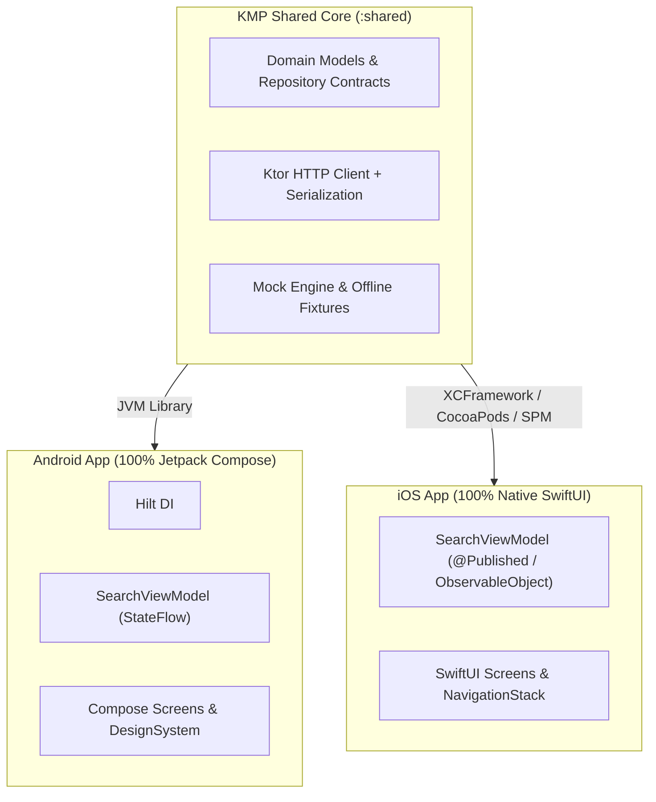

# ADR-004: Headless Kotlin Multiplatform (KMP) Architecture Boundary

**Status:** 📋 Proposed  
**Deciders:** Dinakar Prasad Maurya  
**Technical Story:** Cross-Platform Strategy, Code Reuse & Multi-Platform Excellence  

---

## Context

Mobile development across Android and iOS frequently results in duplicated business logic, divergent API models, and redundant networking code. 

When benchmarking open-source reference implementations and baseline solutions for this challenge:
- Standard open-source reference solutions built siloed, platform-bound Android-only implementations with zero code sharing.
- No baseline solution provided cross-platform capabilities for iOS companion apps.

However, enterprise digital consultancies and modern client engineering teams manage cross-platform portfolios delivering both Android and iOS applications. Building a headless core presents an opportunity to eliminate duplicate client logic while maintaining 100% native UI performance.

---

## Decision

We establish a **Headless Kotlin Multiplatform (KMP)** shared engine in `:shared`:
1. **Scope of Sharing:** Business models (`RepositoryItem`), data transfer serialization (`SearchRepositoriesResponse`), Ktor HTTP networking, error handling, and repository contracts (`GitHubRepository`, `MockGitHubRepository`).
2. **Strictly Headless Boundary:** UI is **not** shared in KMP. Android uses 100% Jetpack Compose with Material 3; iOS uses 100% native SwiftUI.
3. **Distribution Mechanism:** The shared module compiles to:
   - Android Library (JVM / Android AAR) consumed by Android feature modules.
   - Objective-C / Swift XCFramework framework consumed natively by `iosApp` in Xcode.
4. **Clean Concurrency:** Kotlin Coroutines (`suspend fun getRepositories()`) seamlessly bridge to Swift async/await (`try await repository.getRepositories()`).

---

## Architecture Boundary Diagram

---

## Consequences

### Positive ✅
- **Zero Business Logic Duplication:** Parsing algorithms, GitHub API query parameters, and validation rules are written and tested once in `commonMain`.
- **Single Source of Truth:** Changes to the GitHub API schema are reflected simultaneously in Android and iOS.
- **Native UI Polish:** No compromise on native platform feel (Compose follows Android Material 3; SwiftUI follows iOS Human Interface Guidelines).
- **Enterprise Multi-Platform Leverage:** Eliminates dual maintenance overhead across platform boundaries while maintaining 100% native UI fidelity.

### Negative ⚠️
- **Tooling Overhead:** Requires local Xcode and CocoaPods/KMP Gradle integration for the iOS framework build.
- **Swift / Kotlin Interop Friction:** Coroutines exceptions and generics require careful wrapping or bridging (`suspend` functions map to async Swift).

---

## Alternatives Considered

1. **Compose Multiplatform for iOS:**
   - *Rejected:* Compose on iOS draws via Skia/Metal canvas, bypassing native UIKit/SwiftUI controls. This leads to subtle non-native behaviors (scrolling physics, accessibility, system keyboard behaviors).
2. **Flutter:**
   - *Rejected:* Requires rewriting the entire application in Dart, abandoning existing Android Jetpack ecosystem investments.
3. **Android-Only Single Codebase:**
   - *Rejected:* Misses the opportunity to share business logic and network mapping across both mobile operating systems while preserving native UI.

---

## References
- [Kotlin Multiplatform Official Documentation](https://kotlinlang.org/docs/multiplatform.html)
- [Ktor HTTP Client Documentation](https://ktor.io/docs/client-create-multiplatform-application.html)
- [Docs: KMP Shared Engine Guide](../architecture/02_kmp_shared_engine.md)
