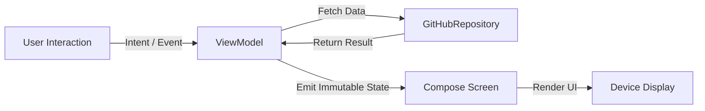

# ADR-006: Migration from Android Views / Fragments to Declarative Jetpack Compose

**Status:** 📋 Proposed
**Deciders:** Dinakar Prasad Maurya
**Technical Story:** Declarative UI Migration & Material 3  

---

## Context

The legacy starter codebase used traditional Android View hierarchies:
1. **XML Layouts & ViewBinding:** `activity_top.xml`, `fragment_one.xml`, `fragment_two.xml`.
2. **Fat Fragment Architecture:** UI rendering, lifecycle observers, navigation callbacks, and network requests were coupled inside `OneFragment.kt` (400+ lines).
3. **Imparative State Mutations:** Manual view visibility toggles (`view.visibility = View.VISIBLE`), text setting, and RecyclerView adapter diffing introduced state inconsistency and potential NullPointerExceptions.

---

## Decision

We replace all legacy XML layouts and Fragment controllers with **100% Declarative Jetpack Compose** using **Material 3**:
1. **Unidirectional Data Flow (UDF):** The UI is a pure function of state (`StateFlow<SearchUiState>`). ViewModels emit immutable states; UI emits user events (`SearchUiIntent`).
2. **Navigation Compose:** Replaced Android Navigation Component XML (`nav_graph.xml`) with type-safe Jetpack Compose Navigation (`NavHost`).
3. **Design System:** Created a dedicated `:core:designsystem` module providing unified Material 3 typography, spacing tokens, dynamic colors, and light/dark theme support.
4. **Coil Image Loading:** Adopted modern `AsyncImage` with crossfade, disk caching, and error fallbacks.

---

## State Flow Diagram

---

## Consequences

### Positive ✅
- **Eliminated Fragment Lifecycle Bugs:** No more `onDestroyView()` view-binding leak risks or fragment transaction state losses.
- **Drastic Boilerplate Reduction:** Removed ~600 lines of XML layouts, adapters, and ViewHolders.
- **Design System Consistency:** Colors and typography automatically adapt across Light and Dark themes.
- **Enhanced Testability:** Compose UI components can be tested in isolation using `ComposeTestRule` and screenshot tests without complex fragment hosting.

### Negative ⚠️
- **Recomposition Pitfalls:** Requires careful state modeling (e.g., using `@Immutable`, `remember`, and stable collections) to avoid unnecessary recomposition cycles.
- **Compiler Overhead:** Jetpack Compose compiler plugin adds time to initial builds.

---

## Alternatives Considered

1. **Retain XML with ViewBinding:**
   - *Rejected:* Does not solve the fundamental impedance mismatch of imperative view updates and leaves the codebase on a legacy, non-standard path for modern Android development.
2. **Hybrid Migration (Compose inside Fragment):**
   - *Rejected:* `ComposeView` inside Fragments adds unnecessary complexity when a clean break to full Compose is feasible for an app of this size.

---

## References
- [Android Developers: Thinking in Compose](https://developer.android.com/develop/ui/compose/mental-model)
- [Docs: Clean Architecture and UDF](../architecture/01_clean_architecture_and_udf.md)
- [Docs: UI/UX Design Specification](../design/ui_ux_design_specification.md)
