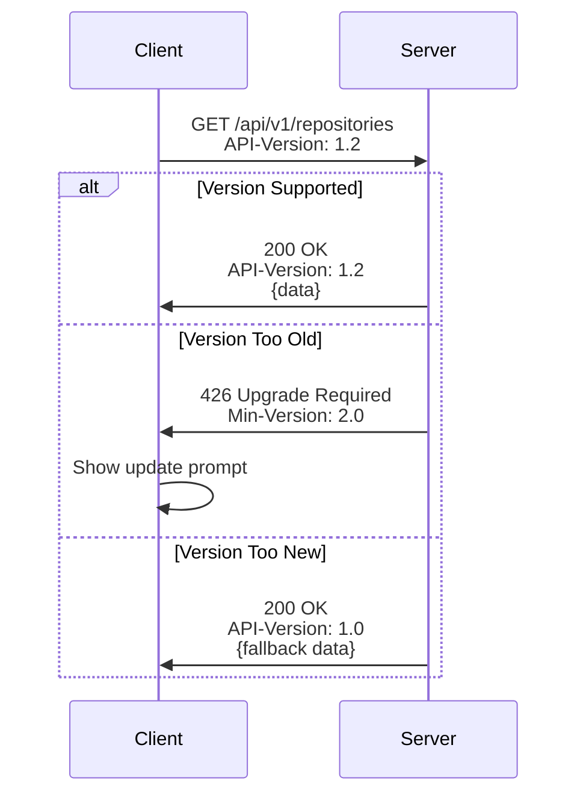

# API Versioning Guide

**Category:** API Contract Management
**Scope:** Client-Server API Evolution & Backward Compatibility

---

## Overview

This guide documents API versioning strategies for both external (GitHub API) and internal backend services. Proper versioning ensures mobile clients remain compatible as APIs evolve.

---

## 1. External API: GitHub REST API v3

### Version Specification

**Header-Based Versioning:**
```
Accept: application/vnd.github.v3+json
```

**Why Explicit Versioning?**
- GitHub API has multiple versions (v3, v4 GraphQL)
- Without explicit header, defaults to latest version
- API changes between versions can introduce breaking changes
- Mobile clients update slowly, need predictable behavior

### Implementation Example

```kotlin
// Ktor HTTP Client Configuration
@Provides
@Singleton
fun provideHttpClient(): HttpClient {
    return HttpClient(engine) {
        install(ContentNegotiation) {
            json(Json {
                ignoreUnknownKeys = true
                isLenient = true
            })
        }

        defaultRequest {
            // Explicit GitHub API v3 version
            header("Accept", "application/vnd.github.v3+json")
            header("User-Agent", "YourApp-Android/1.0")
        }
    }
}
```

### Version Detection

Check API version from response headers:
```kotlin
response.headers["X-GitHub-Media-Type"] // "github.v3"
```

---

## 2. Internal Backend API Versioning (If Applicable)

### Versioning Strategies

#### A. URL-Based Versioning (Recommended)

```
https://api.example.com/v1/repositories
https://api.example.com/v2/repositories
```

**Pros:**
- Clear version visible in URL
- Easy to test different versions
- Browser-friendly

**Cons:**
- URL changes with major versions
- Need to maintain multiple endpoints

#### B. Header-Based Versioning

```
GET /repositories
API-Version: 2024-09-10
```

**Pros:**
- Clean URLs
- Version in metadata, not resource path

**Cons:**
- Version not visible in browser
- Requires header configuration

#### C. Accept Header Versioning

```
GET /repositories
Accept: application/vnd.yourapp.v2+json
```

**Pros:**
- Follows REST standards
- Granular content negotiation

**Cons:**
- Complex header syntax
- Not intuitive for developers

---

## 3. Version Compatibility Matrix

### Environment → API Version Mapping

| Mobile Flavor | Backend Tier | API Version | Purpose |
|:---|:---|:---|:---|
| `dev` | Development | `v2-beta` | Latest unstable features |
| `stg` | Staging | `v2-rc` | Release candidate testing |
| `prod` | Production | `v1` | Stable public API |

### Client Requirements

Minimum required versions documented in build configuration:

```kotlin
// BuildConfig
const val MIN_API_VERSION = "1.0"
const val TARGET_API_VERSION = "1.2"
```

---

## 4. Breaking vs Non-Breaking Changes

### Non-Breaking Changes (Minor Version)

✅ **Safe to deploy:**
- Adding new optional fields
- Adding new endpoints
- Adding new query parameters (with defaults)
- Deprecation warnings (with migration timeline)

**Example:**
```json
// v1.0 → v1.1 (backward compatible)
{
  "id": 123,
  "name": "repo",
  "stars": 100,
  "description": "New optional field"  // ✅ Safe addition
}
```

### Breaking Changes (Major Version)

⚠️ **Requires new version:**
- Removing fields or endpoints
- Renaming fields
- Changing field types
- Making optional fields required
- Changing response structure

**Example:**
```json
// v1 → v2 (breaking change)
{
  "repository_id": 123,  // ❌ "id" renamed
  "title": "repo",       // ❌ "name" renamed
  "star_count": 100      // ❌ "stars" renamed
}
```

---

## 5. Version Negotiation Flow



---

## 6. Client-Side Version Handling

### Detecting Version Mismatches

```kotlin
sealed class ApiVersionResult {
    data class Compatible(val data: Response) : ApiVersionResult()
    data class UpdateRequired(val minVersion: String) : ApiVersionResult()
    data class Deprecated(val message: String) : ApiVersionResult()
}

suspend fun checkApiVersion(response: HttpResponse): ApiVersionResult {
    val serverVersion = response.headers["API-Version"]
    val minVersion = response.headers["Min-Client-Version"]

    return when {
        response.status == HttpStatusCode.UpgradeRequired -> {
            ApiVersionResult.UpdateRequired(minVersion ?: "unknown")
        }
        serverVersion != null && isDeprecated(serverVersion) -> {
            ApiVersionResult.Deprecated("API version $serverVersion is deprecated")
        }
        else -> {
            ApiVersionResult.Compatible(response.body())
        }
    }
}
```

### Graceful Degradation

```kotlin
// Fallback for missing fields in older API versions
data class Repository(
    val id: Long,
    val name: String,
    val description: String? = null,  // Optional, may not exist in v1
    val topics: List<String> = emptyList()  // Added in v2, default to empty
)
```

---

## 7. Deprecation Strategy

### Deprecation Timeline

1. **Announce (T+0):** Notify clients of upcoming deprecation
2. **Warning Period (T+3 months):** API returns deprecation headers
3. **Migration Period (T+6 months):** Parallel version support
4. **Sunset (T+12 months):** Old version removed

### Deprecation Headers

```
Deprecation: true
Sunset: Sat, 31 Dec 2024 23:59:59 GMT
Link: <https://docs.api.com/v2-migration>; rel="deprecation"
```

---

## 8. Testing Different API Versions

### Mock Multiple Versions

```kotlin
class MockGitHubRepositoryV1 : GitHubRepository { /* v1 behavior */ }
class MockGitHubRepositoryV2 : GitHubRepository { /* v2 behavior */ }

@Provides
fun provideRepository(
    @ApiVersion version: Int
): GitHubRepository {
    return when (version) {
        1 -> MockGitHubRepositoryV1()
        2 -> MockGitHubRepositoryV2()
        else -> throw IllegalArgumentException("Unsupported version")
    }
}
```

### Integration Tests

```kotlin
@Test
fun `test API v1 compatibility`() {
    val client = createClientWithVersion("v1")
    val response = client.searchRepositories("kotlin")
    // Assert v1 response structure
}

@Test
fun `test API v2 new fields`() {
    val client = createClientWithVersion("v2")
    val response = client.searchRepositories("kotlin")
    assertNotNull(response.topics) // New field in v2
}
```

---

## 9. Documentation Requirements

### API Changelog

Maintain version changelog in `CHANGELOG.md`:

```markdown
## [2.0.0] - 2024-09-10
### Breaking Changes
- Renamed `id` to `repository_id`
- Removed deprecated `forks_count` field

### Added
- New `topics` array field
- New `license` object

## [1.2.0] - 2024-06-01
### Added
- Optional `description` field
```

### OpenAPI Specification

Use OpenAPI to document versioned APIs:

```yaml
openapi: 3.0.0
info:
  title: Repository API
  version: 2.0.0
servers:
  - url: https://api.example.com/v2
    description: Production v2
  - url: https://api.example.com/v1
    description: Production v1 (deprecated)
```

---

## References

- **ADR:** [007_api_versioning_strategy.md](../adr/007_api_versioning_strategy.md)
- **GitHub API Docs:** [API Versioning](https://docs.github.com/en/rest/overview/api-versions)
- **OpenAPI Spec:** [Swagger Specification](https://swagger.io/specification/)
- **Semantic Versioning:** [SemVer](https://semver.org/)
- **API Evolution:** [Stripe API Versioning Guide](https://stripe.com/docs/api/versioning)
