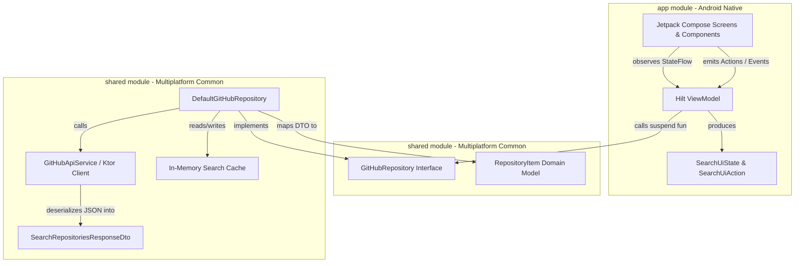
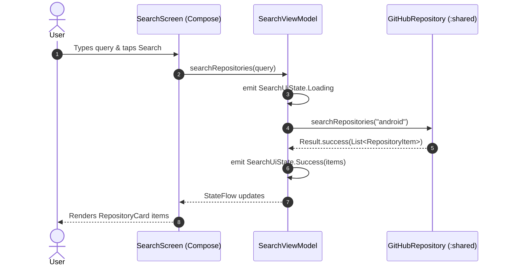

# Architecture Specification: Clean Architecture & UDF Pattern

## 1. Architectural Layers & Boundaries

The codebase adheres strictly to **Google Android Clean Architecture** and JetBrains' multiplatform patterns, enforcing unidirectional dependency rules:



### Dependency Rule:
- Presentation depends only on Domain interfaces (`GitHubRepository`) and pure entities (`RepositoryItem`).
- Presentation has **zero knowledge** of Ktor network services, JSON DTOs, or HTTP clients.
- Domain has **zero dependencies** on Android OS frameworks (`Context`, `Bundle`, `Parcelable`).

---

## 2. Unidirectional Data Flow (UDF) Pattern

State flows down, events flow up:



---

## 3. UI State Specification (`SearchUiState.kt`)

The UI state is modeled as an immutable sealed hierarchy:

```kotlin
sealed interface SearchUiState {
    /** Cold start idle state before any search is triggered */
    object Idle : SearchUiState

    /** Active network request in progress */
    object Loading : SearchUiState

    /** Successful query returning one or more repositories */
    data class Success(val repositories: List<RepositoryItem>) : SearchUiState

    /** Successful query returning 0 results */
    object Empty : SearchUiState

    /** Network failure, rate limit, or server exception */
    data class Error(val message: String) : SearchUiState
}
```

### Advantages of Sealed Interface UI States:
1. **Exhaustive `when` Matching**: The compiler enforces handling of every single visual state (`Idle`, `Loading`, `Success`, `Empty`, `Error`).
2. **Impossible States Prevented**: It is impossible to render both an error banner and a loading indicator simultaneously.
3. **Deterministic Testing**: Verifying state transitions requires simple sequential assertion using Turbine (`awaitItem()`).
