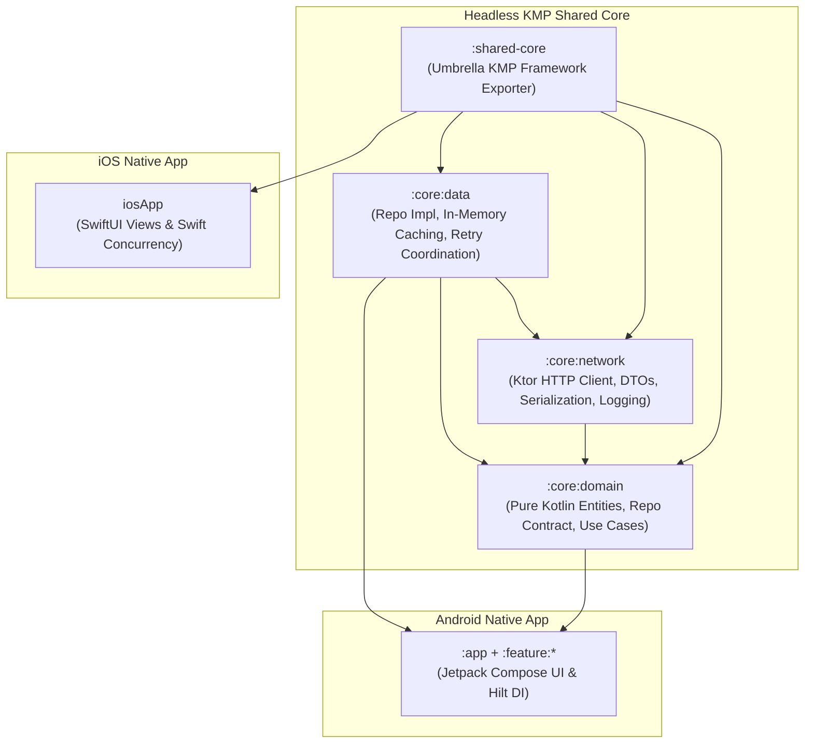

# Architecture Specification: Kotlin Multiplatform (KMP) Shared Core

## 1. Executive Summary & Design Pattern

The core data, networking, and business domain logic of the application are architected across modular Kotlin Multiplatform modules:
- **`:core:domain`**: Pure Kotlin models, repository interfaces, and use cases.
- **`:core:network`**: Multiplatform Ktor HTTP client, DTOs, mappers, and expect/actual engine provider.
- **`:core:data`**: Repository implementation (`GitHubRepositoryImpl`), in-memory caching, and error mapping.
- **`:shared-core`**: Umbrella KMP module that consolidates all core modules into a single unified framework exportable for iOS.

Following JetBrains' official **Pattern 2: "Share logic, keep UI native" (`logic-native-ui`)**, 70% of the non-UI business logic is shared, while presentation is 100% native: Jetpack Compose on Android and SwiftUI on iOS.



---

## 2. Multiplatform Targets & Convention Plugin

All KMP modules apply the custom convention plugin `codecheck.kotlin.multiplatform` (`build-logic/convention/src/main/kotlin/KotlinMultiplatformConventionPlugin.kt`), which configures:
1. **Android Library Target**: `androidTarget { compilations.all { kotlinOptions { jvmTarget = "17" } } }`
2. **Apple iOS Framework Targets**: `iosX64()`, `iosArm64()`, `iosSimulatorArm64()`
3. **Common Source Sets**: Coroutines Core, Kotlinx Serialization, and Ktor Core.

```kotlin
// shared-core/build.gradle.kts
plugins {
    alias(libs.plugins.codecheck.kotlin.multiplatform)
}

android {
    namespace = "jp.co.yumemi.android.codecheck.shared"
}

kotlin {
    sourceSets {
        commonMain.dependencies {
            // Umbrella module - exports all core modules as single framework for iOS
            api(project(":core:domain"))
            api(project(":core:network"))
            api(project(":core:data"))
        }
    }
}
```

---

## 3. Platform Abstraction via Expect / Actual Pattern

For HTTP execution, `:core:network` defines an `expect` declaration in `commonMain`:
```kotlin
// core/network/.../HttpClientEngineProvider.kt
expect fun createHttpClientEngine(): HttpClientEngineFactory<*>
```
And provides platform-specific `actual` implementations:
- **`androidMain`**: Returns `OkHttp` engine factory.
- **`iosMain`**: Returns `Darwin` (`URLSession`) engine factory.

---

## 4. Directory Layout & Module Responsibilities

```text
core/
├── domain/                                      # Pure Kotlin business rules
│   └── src/commonMain/kotlin/.../domain/
│       ├── model/RepositoryItem.kt              # Business model
│       ├── repository/GitHubRepository.kt       # Repository abstraction
│       └── usecase/                             # Use cases
├── network/                                     # Ktor HTTP client
│   └── src/
│       ├── commonMain/kotlin/.../network/       # GitHubApiService, DTOs, Mappers
│       ├── androidMain/kotlin/.../network/      # OkHttp engine actual
│       └── iosMain/kotlin/.../network/          # Darwin engine actual
├── data/                                        # Data coordination & cache
│   └── src/commonMain/kotlin/.../data/
│       └── repository/GitHubRepositoryImpl.kt   # Caching repository implementation
└── shared-core/                                 # Umbrella framework
    └── src/commonMain/kotlin/.../               # Framework export configuration
```

---

## 5. Defense & Justification for Technical Leadership
- **Zero Framework Leaks**: Business logic in `:core:domain` has zero dependencies on `android.*` or UIKit.
- **Cross-Platform Readiness**: By exporting `:shared-core`, the entire data and domain pipeline can be consumed natively in Xcode via SwiftUI.
- **Test Velocity**: Multiplatform unit tests execute on the local JVM in milliseconds without Android emulators.

---

## 6. Official Kotlin Multiplatform References

1. **JetBrains KMP Official Portal**: [https://kotlinlang.org/multiplatform/](https://kotlinlang.org/multiplatform/)
   - Primary guide for multiplatform architectures and code sharing.
2. **"Share logic, keep UI native" (`logic-native-ui`)**: [https://kotlinlang.org/multiplatform/#choose-share-what-logic-native-ui](https://kotlinlang.org/multiplatform/#choose-share-what-logic-native-ui)
   - Architectural justification for headless KMP with native UI.
3. **Multiplatform Expect and Actual Declarations**: [https://kotlinlang.org/docs/multiplatform-expect-actual.html](https://kotlinlang.org/docs/multiplatform-expect-actual.html)
   - Official reference for the expect/actual mechanism used in engine selection.
4. **Ktor Multiplatform HTTP Client**: [https://ktor.io/docs/client-create-multiplatform-application.html](https://ktor.io/docs/client-create-multiplatform-application.html)
   - Guide for multiplatform Ktor networking.
5. **Ktor Client Engines**: [https://ktor.io/docs/client-engines.html](https://ktor.io/docs/client-engines.html)
   - Engine choices: OkHttp for Android and Darwin for iOS.
6. **Objective-C and Swift Interoperability**: [https://kotlinlang.org/docs/native-objc-interop.html](https://kotlinlang.org/docs/native-objc-interop.html)
   - Framework compilation and Swift API consumption.
7. **KMP Project Discovery & Source Sets**: [https://kotlinlang.org/docs/multiplatform-discover-project.html](https://kotlinlang.org/docs/multiplatform-discover-project.html)
   - Standard source set organization (`commonMain`, `androidMain`, `iosMain`).
