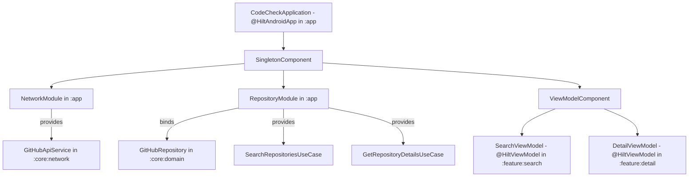

# Architecture Specification: Dependency Injection with Hilt

## 1. Overview & Dependency Graph
The native Android presentation layer uses **Dagger Hilt** for compile-time dependency injection. Hilt manages component lifecycles, scopes dependencies, and enables seamless substitution of fake test doubles during unit testing.



---

## 2. Multi-Module Hilt Architecture Breakdown

In accordance with [Google's Multi-Module Hilt Architecture Guide](https://developer.android.com/training/dependency-injection/hilt-multi-module), DI configuration is organized to maintain strict encapsulation and prevent circular module dependencies:

### 1. Application Shell (`:app`)
Contains the `@HiltAndroidApp` entry point and assembly DI modules that bind interface contracts to concrete multi-module implementations:
- **`NetworkModule.kt` (`SingletonComponent`)**:
  Provides the configured Ktor multiplatform `GitHubApiService` with HTTP logging:
  ```kotlin
  @Module
  @InstallIn(SingletonComponent::class)
  object NetworkModule {
      @Provides
      @Singleton
      fun provideGitHubApiService(): GitHubApiService = GitHubApiServiceImpl()
  }
  ```
- **`RepositoryModule.kt` (`SingletonComponent`)**:
  Binds the pure Kotlin `GitHubRepository` domain contract to `GitHubRepositoryImpl` (`:core:data`) and provides domain use cases:
  ```kotlin
  @Module
  @InstallIn(SingletonComponent::class)
  object RepositoryModule {
      @Provides
      @Singleton
      fun provideGitHubRepository(apiService: GitHubApiService): GitHubRepository =
          GitHubRepositoryImpl(apiService)

      @Provides
      fun provideSearchRepositoriesUseCase(repository: GitHubRepository): SearchRepositoriesUseCase =
          SearchRepositoriesUseCase(repository)

      @Provides
      fun provideGetRepositoryDetailsUseCase(repository: GitHubRepository): GetRepositoryDetailsUseCase =
          GetRepositoryDetailsUseCase(repository)
  }
  ```

### 2. Feature Modules (`:feature:search`, `:feature:detail`)
Feature modules depend only on `:core:domain` and do **NOT** depend on `:core:data` or `:app`. They consume dependencies via constructor injection:
- `SearchViewModel @Inject constructor(searchRepositoriesUseCase, savedStateHandle)`
- `DetailViewModel @Inject constructor(getRepositoryDetailsUseCase, savedStateHandle)`

### 3. Navigation Compose Scoping
In `AppNavHost.kt`, ViewModels are scoped to the Compose back-stack using `hiltViewModel()`:
```kotlin
composable("search") {
    val viewModel: SearchViewModel = hiltViewModel()
    SearchScreen(viewModel = viewModel, ...)
}
```

---

## 3. Testability via Constructor Injection

Because all ViewModels and Repositories rely strictly on **constructor injection**, unit tests in `:feature:search` and `:feature:detail` do **NOT** require launching Hilt test rules or Android instrumentation; fake test doubles (`FakeGitHubRepository`) are passed directly into the constructor.

---

## 4. Official Multi-Module Hilt References

1. **Hilt in Multi-Module Apps**: [https://developer.android.com/training/dependency-injection/hilt-multi-module](https://developer.android.com/training/dependency-injection/hilt-multi-module)
   - Official Google guide for structuring Hilt modules across library and dynamic feature modules.
2. **Hilt Navigation Compose**: [https://developer.android.com/jetpack/compose/libraries#hilt-navigation](https://developer.android.com/jetpack/compose/libraries#hilt-navigation)
   - Scoping `@HiltViewModel` instances to Navigation Compose destinations via `hiltViewModel()`.
3. **Dependency Injection with Hilt**: [https://developer.android.com/training/dependency-injection/hilt-android](https://developer.android.com/training/dependency-injection/hilt-android)
   - Core concepts: `@HiltAndroidApp`, `@AndroidEntryPoint`, `@Module`, `@InstallIn`.
4. **Hilt and Jetpack Integrations**: [https://developer.android.com/training/dependency-injection/hilt-jetpack](https://developer.android.com/training/dependency-injection/hilt-jetpack)
   - Integration with ViewModels, `SavedStateHandle`, and WorkManager.
5. **Testing with Hilt**: [https://developer.android.com/training/dependency-injection/hilt-testing](https://developer.android.com/training/dependency-injection/hilt-testing)
   - Multi-module unit and integration test strategies with test modules.
