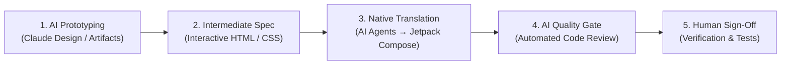

# 🎨 AI-Assisted Design-to-Code Workflow

**Document Type:** Technical Methodology & AI Pairing Guide  
**SDLC Phase:** Phase 2 (Inception) & Phase 3 (Construction)  
**Parent Guidelines:** [`docs/01_company_and_team/10_ai_agent_skills_guide.md`](../../01_company_and_team/10_ai_agent_skills_guide.md) & [`docs/02_project_architecture/design/ui_ux_design_specification.md`](./ui_ux_design_specification.md)

---

## 1. Overview & Philosophy

Rather than relying on traditional, slow design handoffs, this project adopts an **AI-assisted design-to-code workflow**. We leverage AI as an end-to-end accelerator across UI ideation, specification, native code generation, and quality review.

> [!NOTE]
> **Engineering Evaluation Context:**  
> In accordance with transparent, disciplined AI adoption policies (see [Technical References](../../references.md#7-github-api--assessment-standards)), using AI across the design-to-code pipeline demonstrates modern software engineering velocity while maintaining high architectural rigor and code quality.

---

## 2. Core Workflow Stages

### Stage 1: AI-Powered UI Prototyping
UI concepts and layouts are explored interactively using generative AI design tools:
- **Primary Tool:** **Claude (Anthropic) / Claude Artifacts / Claude Design** — rapid generation of responsive UI components, token palettes, typography scales, and accessibility contrasts (WCAG 2.1 AA).
- **Alternative / Complementary Tools:** Tools like **v0.dev**, **Figma AI**, and **ChatGPT / Gemini Canvas** can similarly be used for initial layout exploration and component ideation.

### Stage 2: HTML/CSS as an Intermediate Specification
Instead of relying solely on static image mockups or redline sheets, designs are exported as **interactive HTML/CSS specifications**:
- **Why HTML/CSS?**
  - **Preserves Tokens:** Exact hex colors, alpha transparencies, padding, and corner radii remain unambiguous.
  - **Instant Visual Verification:** Can be previewed in any browser and inspected using developer tools before writing mobile code.
  - **Machine-Readable:** AI coding agents can read and parse HTML/CSS directly without the ambiguity of static screenshots.

### Stage 3: AI-Assisted Native Code Implementation
Using the HTML/CSS specs as a reference, AI coding assistants (such as **Google Gemini / Antigravity CLI**, **Anthropic Claude Code**, or **Cursor / GitHub Copilot**) translate the design into native Android code:
- **Design System Tokens:** Centralized color palettes and themes in `:core:designsystem` (`Color.kt`, `Theme.kt`).
- **Declarative UI:** Stateless Jetpack Compose components consuming domain models via Unidirectional Data Flow (UDF).
- **Automated Testing:** Generating companion unit and Compose UI tests alongside UI components.

### Stage 4: AI Code Review & Quality Gates
Before merging, automated AI review agents check the code against authoritative evaluation guidelines (see [Technical References](../../references.md#7-github-api--assessment-standards)):
- Enforcing repository review skills ([`yumemi-code-review`](file:///Users/dinakarmaurya/Documents/Personal/dinakar-android-engineer-codecheck/.agents/skills/yumemi-code-review/SKILL.md), [`review-code`](file:///Users/dinakarmaurya/Documents/Personal/dinakar-android-engineer-codecheck/.claude/skills/review-code/SKILL.md)).
- Auditing for memory leaks, coroutine cancellation, lifecycle awareness, and clean layer boundaries.

---

## 3. Advanced Integrations: Connecting AI Directly to Design

Beyond manual export, several verified integration methods connect AI assistants directly with design systems:

1. **Claude Artifacts & Claude Design Previews:**
   - Real-time rendering of UI components directly inside Claude chats, enabling instant visual iteration and prompt-based adjustments before code translation.
2. **Figma Model Context Protocol (MCP) Server:**
   - Connects AI agents (Claude Code, Antigravity) directly to Figma files via MCP tools.
   - Allows agents to inspect Figma node hierarchies, extract layout constraints, and query design variables (colors, typography, spacing) programmatically without manual file exports.
3. **Automated Design Token Pipelines (Tokens Studio / Style Dictionary):**
   - Design tokens exported as JSON from Figma can be automatically transformed into Kotlin Compose `ColorScheme` and `Typography` tokens via CI or AI script pairing.
4. **Figma-to-Code AI Plugins:**
   - Tools such as Builder.io (Visual Copilot) and Locofy convert Figma frames directly into clean markup or Compose layouts for AI refinement.

---

## 4. Human-in-the-Loop Governance

AI acts as a force multiplier, while the human engineer retains architectural accountability:
- **Design Intent:** The engineer guides the prompt, selects the optimal layout variant, and ensures brand consistency.
- **Architectural Fit:** Verifies that AI-generated UI adheres to Clean Architecture and project conventions.
- **Deterministic Verification:** Always validates code with automated builds (`./gradlew assembleDebug`), unit tests (`./gradlew testDebugUnitTest`), and on-device checks before committing.

---

## 🔗 Related Documentation
- [UI/UX Design Specification & Architecture](./ui_ux_design_specification.md)
- [Design System & Material 3 Theming Specification](../features/03_design_system_and_theming.md)
- [AI Agent Skills Framework Standard](../../01_company_and_team/10_ai_agent_skills_guide.md)
