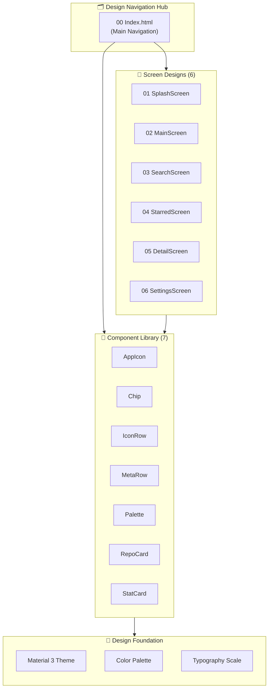
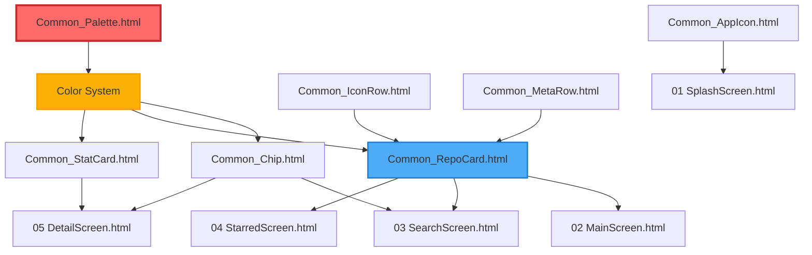
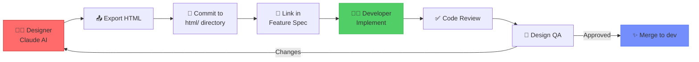

# 🎨 UI/UX Design Specifications

**Purpose**: Interactive design documentation for all screens and components
**Format**: Standalone HTML files with live previews
**Tool**: Claude AI Design Export (Interlinked Navigation)

---

## 🚀 Quick Start

**Open the design system in your browser:**

```bash
# From project root
open docs/02_project_architecture/design/html/00\ Index.html

# Or via relative path from this directory
open "00 Index.html"
```

> **💡 Pro Tip:** All design files are interlinked. Start with `00 Index.html` for full navigation.

---

## 📐 Design System Architecture



---

## 📱 Screen Designs (6 Screens)

Interactive HTML specifications for all application screens.

| # | Screen | File | Key Features | Status |
|:---:|:---|:---|:---|:---:|
| **01** | **Splash Screen** | [`01 SplashScreen.html`](./01%20SplashScreen.html) | • Animated logo mark<br/>• Brand colors<br/>• Smooth transition | ✅ Final |
| **02** | **Main Screen** | [`02 MainScreen.html`](./02%20MainScreen.html) | • Repository list<br/>• Bottom navigation<br/>• Search integration | ✅ Final |
| **03** | **Search Screen** | [`03 SearchScreen.html`](./03%20SearchScreen.html) | • Search bar with debounce<br/>• Filter chips<br/>• Sort options<br/>• Recent searches | ✅ Final |
| **04** | **Starred Screen** | [`04 StarredScreen.html`](./04%20StarredScreen.html) | • Bookmarked repos<br/>• Empty state<br/>• Swipe actions | ✅ Final |
| **05** | **Detail Screen** | [`05 DetailScreen.html`](./05%20DetailScreen.html) | • Owner profile<br/>• Repository stats<br/>• Language badge<br/>• Action buttons | ✅ Final |
| **06** | **Settings Screen** | [`06 SettingsScreen.html`](./06%20SettingsScreen.html) | • Theme toggle<br/>• Language switcher<br/>• App info tiles | ✅ Final |

### 🖼️ Screen Previews

<!-- TODO: Add screenshot collage showing all 6 screens -->

<div align="center">

| Splash | Main | Search |
|:---:|:---:|:---:|
|  |  |  |

| Starred | Detail | Settings |
|:---:|:---:|:---:|
|  |  |  |

*Screenshots exported from HTML design specifications*

</div>

---

## 🧩 Component Library (7 Components)

Reusable UI components with detailed specifications.

| Component | File | Usage Context | Variants | Status |
|:---|:---|:---|:---:|:---:|
| **🎯 App Icon** | [`Common_AppIcon.html`](./Common_AppIcon.html) | App launcher, splash screen | 5 density sizes | ✅ Final |
| **🏷️ Chip** | [`Common_Chip.html`](./Common_Chip.html) | Language tags, filters | Outlined, Filled | ✅ Final |
| **📊 Icon Row** | [`Common_IconRow.html`](./Common_IconRow.html) | Stats display (stars/forks) | Leading icon + text | ✅ Final |
| **📝 Meta Row** | [`Common_MetaRow.html`](./Common_MetaRow.html) | Repository metadata | Label + value pairs | ✅ Final |
| **🎨 Color Palette** | [`Common_Palette.html`](./Common_Palette.html) | Material 3 color system | Light + Dark themes | ✅ Final |
| **📦 Repo Card** | [`Common_RepoCard.html`](./Common_RepoCard.html) | List item in search results | Compact + Detailed | ✅ Final |
| **📈 Stat Card** | [`Common_StatCard.html`](./Common_StatCard.html) | Numeric stats display | Icon + count + label | ✅ Final |

### 🎨 Component Hierarchy



---

## 🎯 Design System Foundation

### Material 3 Color Palette

The design system is built on **Material 3 Dynamic Color** with custom brand tokens.

| Theme Mode | Primary | Secondary | Tertiary | Surface | Background |
|:---|:---:|:---:|:---:|:---:|:---:|
| **Light** | `#3B50DF` | `#5D5FEF` | `#7C83F0` | `#FDFBFF` | `#FAF9F5` |
| **Dark** | `#B8C1FF` | `#C5C6FF` | `#D4D6FF` | `#1B1B1F` | `#131316` |

> **📄 Full Specification:** See [`Common_Palette.html`](./Common_Palette.html) for complete color tokens

### Typography Scale

| Style | Font | Size | Weight | Usage |
|:---|:---|:---:|:---:|:---|
| **Display** | Roboto | 57sp | Regular (400) | Hero headlines |
| **Headline** | Roboto | 32sp | Regular (400) | Screen titles |
| **Title** | Roboto | 22sp | Medium (500) | Card headers |
| **Body** | Roboto | 16sp | Regular (400) | Primary content |
| **Label** | Roboto | 14sp | Medium (500) | Buttons, chips |
| **Caption** | Roboto | 12sp | Regular (400) | Metadata |

### Spacing & Layout

- **Grid System:** 8dp baseline grid
- **Card Padding:** 16dp internal, 12dp between elements
- **List Item Height:** 72dp (standard), 88dp (detailed)
- **Icon Size:** 24dp (standard), 20dp (compact)
- **Corner Radius:** 12dp (cards), 8dp (chips), 24dp (FAB)

---

## 👨‍💻 Developer Workflow

### 1️⃣ Browse Design Specs

```bash
# Open interactive design hub
open docs/02_project_architecture/design/html/00\ Index.html
```

### 2️⃣ Implement Screen/Component

When implementing a feature, reference the corresponding HTML file:

**Example: Implementing Search Screen**
```kotlin
// feature:search/src/main/kotlin/SearchScreen.kt

/**
 * Search screen implementation based on design specification:
 * @see docs/02_project_architecture/design/html/03 SearchScreen.html
 *
 * Key design elements:
 * - Search bar with 300ms debounce
 * - Filter chips (Language, Stars, Updated)
 * - Repository cards using Common_RepoCard component
 */
@Composable
fun SearchScreen(/* ... */) {
    // Implementation following design specs
}
```

### 3️⃣ Reference Component Library

**Example: Using Chip Component**
```kotlin
// Reference: docs/02_project_architecture/design/html/Common_Chip.html

@Composable
fun LanguageChip(language: String) {
    FilterChip(
        selected = false,
        onClick = { /* ... */ },
        label = { Text(language) },
        // Design spec: Outlined variant with primary color
        colors = FilterChipDefaults.filterChipColors(/* ... */)
    )
}
```

---

## 🔄 Design-to-Code Workflow



### Design Update Process

1. **Designer** exports updated HTML from Claude AI
2. **Commit** to `docs/02_project_architecture/design/html/`
3. **Reference** in feature documentation or PR description
4. **Developer** reviews changes in browser
5. **Implement** UI updates based on new specs
6. **Design QA** validates implementation against HTML specs

---

## 🔗 Related Documentation

### Design System

| Document | Description | Link |
|:---|:---|:---|
| **UI/UX Design Specification** | Complete design architecture and principles | [`../ui_ux_design_specification.md`](../ui_ux_design_specification.md) |
| **AI-Assisted Design Workflow** | Claude AI design-to-code process | [`../ai_assisted_design_workflow.md`](../ai_assisted_design_workflow.md) |
| **Material 3 Theming** | Color system and theme implementation | [`../features/03_design_system_and_theming.md`](../features/03_design_system_and_theming.md) |

### Implementation

| Module | Purpose | Link |
|:---|:---|:---|
| `:core:designsystem` | Material 3 theme tokens and colors | `app/core/designsystem/` |
| `:core:ui` | Shared Compose components | `app/core/ui/` |
| `:feature:*` | Screen implementations | `app/feature/*/` |

---

## 📊 Design Specification Metrics

| Metric | Count | Status |
|:---|:---:|:---:|
| **Total Screens** | 6 | ✅ Complete |
| **Common Components** | 7 | ✅ Complete |
| **Total Design Files** | 14 (13 HTML + 1 Index) | ✅ Final |
| **Color Tokens** | 40+ (Light + Dark) | ✅ Documented |
| **Typography Styles** | 6 levels | ✅ Documented |
| **Interactive Preview** | Yes (00 Index.html) | ✅ Available |

---

## 🎓 Design System Principles

### 1. Material 3 First
All designs follow Google's Material 3 design language with custom brand colors.

### 2. Mobile-First Responsive
Designs are optimized for mobile phones (360dp - 411dp width) with tablet considerations.

### 3. Accessibility
- WCAG 2.1 AA color contrast ratios
- Touch targets ≥ 48dp
- Semantic component hierarchy

### 4. Dark Mode Parity
Every screen has equivalent light and dark mode specifications.

### 5. Component Reusability
Atomic design methodology: Atoms → Molecules → Organisms → Templates → Screens

---

## 📸 Screenshot Guidelines

To capture design screenshots for documentation:

```bash
# 1. Open design file in browser
open "02 MainScreen.html"

# 2. Take screenshot (macOS)
Cmd + Shift + 4 (select area)

# 3. Save to screenshots directory
# Naming: design_[screen-name].png
# Example: design_main.png, design_search.png
```

Recommended screenshot specs:
- **Format:** PNG with transparency
- **Size:** 1080px width (2x scale for retina)
- **Crop:** Remove browser chrome, show only design canvas
- **Save to:** `docs/screenshots/design_*.png`

---

## ❓ FAQ

### Q: Why HTML instead of Figma?
**A:** HTML design files are:
- ✅ Version controlled in Git (full history)
- ✅ Reviewable in PRs (design changes visible)
- ✅ No external tool dependencies
- ✅ Instantly previewable in any browser
- ✅ Interlinked navigation (better UX than static images)

### Q: Can I edit these HTML files?
**A:** Yes, but:
- Prefer exporting updated HTML from Claude AI for consistency
- Manual edits should only fix minor issues
- Always commit design changes with descriptive commit messages

### Q: How do I request design changes?
**A:**
1. Open GitHub Issue with `design` label
2. Reference specific HTML file (e.g., `03 SearchScreen.html`)
3. Describe desired changes with context
4. Designer updates and commits new HTML
5. Developer reviews in PR

---

**Last Updated:** September 13, 2026
**Design Tool:** Claude AI Design Export
**Design System:** Material 3 (Custom Brand Tokens)
**Total Files:** 14 HTML specifications
