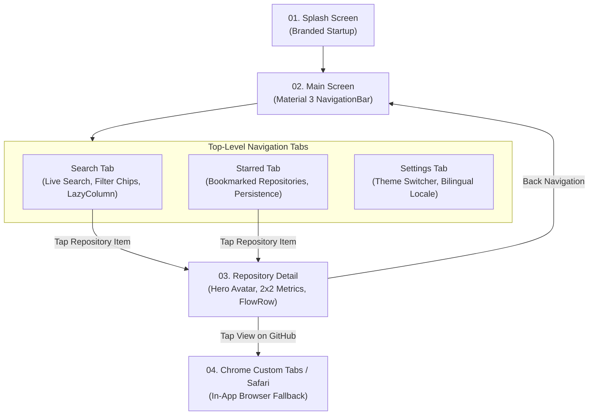

# UI/UX Design Specification & Design System Architecture

**Document Type:** Pre-Coding System Design & UI/UX Specification  
**SDLC Phase:** Phase 2 (Inception)  
**Maintainer:** Dinakar Prasad Maurya  
**Tooling References:** Figma Design System, Material Design 3, Apple Human Interface Guidelines  

---

## 1. Executive Summary & Design Vision

Before initiating source code implementation, enterprise mobile teams establish a comprehensive UI/UX Design Specification. This document bridges product requirements, user experience research, and platform implementation guidelines across Android (Jetpack Compose) and iOS (SwiftUI).

### 1.1 Core Design Objectives
1. **Clarity and Focus:** Maximize readability of technical repository data (stars, forks, languages, owners) without visual clutter.
2. **Zero-Latency Feel:** Provide instant visual feedback via debounced live search, skeleton shimmer loaders, and smooth page transitions.
3. **Multiplatform Consistency:** Maintain visual cohesion across Android and iOS while respecting native platform design paradigms (Material 3 on Android, Apple HIG on iOS).
4. **Enterprise Accessibility:** Conform to WCAG 2.1 AA standards for color contrast, dynamic font scaling, and screen-reader semantics.

---

## 2. Figma Design System & Asset Workspace

> [!TIP]
> **AI-Assisted Design-to-Code Workflow:**
> For details on how AI generative tools (Claude Design, Claude Artifacts) were used to create intermediate HTML/CSS specs and translate them into native Jetpack Compose Material 3 code, refer to [AI-Assisted Design-to-Code Workflow](./ai_assisted_design_workflow.md).

### 2.1 Figma Workspace Structure
In production environments, UI engineering references a centralized Figma project organized into standardized pages:

- **Figma Project File:** `https://www.figma.com/file/android-codecheck-design-system/` *(Design Workspace)*
  - **Page 01 - Foundations:** Color palette, typography scale, spacing grid, elevation, icon library.
  - **Page 02 - Components:** Atomic components (SearchBar, RepoCard, MetricTile, TagChip, ErrorBanner).
  - **Page 03 - User Flows:** End-to-end screen transitions and user journey diagrams.
  - **Page 04 - Android Specs:** Jetpack Compose Material 3 screens (light and dark mode).
  - **Page 05 - iOS Specs:** SwiftUI Apple Human Interface screens (light and dark mode).
  - **Page 06 - Handoff & Redlines:** Exact pixel dimensions, padding, corner radii, and token keys.

### 2.2 Interactive HTML/CSS Design Prototypes
In addition to Figma, all screen and component designs are provided as interactive, standalone HTML/CSS specifications in [`./html/`](./html/README.md):
- **[Interactive Design Portal (`00 Index.html`)](./html/00%20Index.html)**: Browser-based portal linking all screen mockups.
- **Screen Prototypes:**
  - [`01 SplashScreen.html`](./html/01%20SplashScreen.html) - Branded startup experience
  - [`02 MainScreen.html`](./html/02%20MainScreen.html) - Bottom navigation frame
  - [`03 SearchScreen.html`](./html/03%20SearchScreen.html) - Repository search & discovery
  - [`04 StarredScreen.html`](./html/04%20StarredScreen.html) - Starred bookmarks collection
  - [`05 DetailScreen.html`](./html/05%20DetailScreen.html) - Repository detail view
  - [`06 SettingsScreen.html`](./html/06%20SettingsScreen.html) - Dynamic theme & language preferences
- **Component Specifications:** [`Common_AppIcon.html`](./html/Common_AppIcon.html), [`Common_Chip.html`](./html/Common_Chip.html), [`Common_IconRow.html`](./html/Common_IconRow.html), [`Common_MetaRow.html`](./html/Common_MetaRow.html), [`Common_Palette.html`](./html/Common_Palette.html), [`Common_RepoCard.html`](./html/Common_RepoCard.html), [`Common_StatCard.html`](./html/Common_StatCard.html).

---

## 3. User Journey & Screen Navigation Flow

### 3.1 State Progression by Screen
Each screen defines explicit UI states before engineering commences:
- **Uninitialized / Empty:** Initial landing state prompting the user for input.
- **Active / Typing:** Immediate local state update with a debounced network query (300ms).
- **Loading:** Non-blocking skeleton shimmer placeholders preserving layout structure.
- **Success:** Populated list or detail view with smooth entry animations.
- **Error / Offline:** Clear diagnostic banner with an actionable retry button.

---

## 4. Screen-by-Screen UI Specifications

### 4.1 Screen 01: Application Splash Screen
- **Reference Prototype:** [`01 SplashScreen.html`](./html/01%20SplashScreen.html)
- **Branded Startup:** Centered GitHub Octocat vector logo with circular branding container.
- **Smooth Transition:** Fades seamlessly into `MainScreen` upon initialization.

---

### 4.2 Screen 02: Main Screen & Bottom Navigation Bar
- **Reference Prototype:** [`02 MainScreen.html`](./html/02%20MainScreen.html)
- **Material 3 `NavigationBar`:**
  - Tab 1: **Search** (`Icons.Default.Search`)
  - Tab 2: **Starred** (`Icons.Default.Star`)
  - Tab 3: **Settings** (`Icons.Default.Settings`)
- **State Preservation:** Tab switching preserves scroll position and search results without recreation.

---

### 4.3 Screen 03: Repository Search & Discovery View
- **Reference Prototype:** [`03 SearchScreen.html`](./html/03%20SearchScreen.html)

#### Layout & Hierarchy
- **Top App Bar:**
  - Integrated Search Field: Full-width search bar with leading search icon and trailing clear button (`X`).
- **Filter Chips Bar (Horizontal Scroll):**
  - Interactive filter chips allowing dynamic sorting: `All`, `Most Stars`, `Most Forks`, `Recently Updated`.
- **Content Area:**
  - **Empty State:** Illustrated empty vector graphic with explanatory text: *"Type a keyword to discover public GitHub repositories."*
  - **Loading State:** 5 shimmering placeholder card skeletons matching the exact dimensions of real items to eliminate layout shift (Cumulative Layout Shift = 0).
  - **Populated State:** High-performance lazy list rendering repository cards.

#### Repository Item Card Redline Specs
- **Reference Component:** [`Common_RepoCard.html`](./html/Common_RepoCard.html)
- **Container:**
  - Background: `colorSurfaceContainerLow` (Light: `#F3F4F6`, Dark: `#1E222B`).
  - Corner Radius: `12dp` (`RoundedCornerShape(12.dp)`).
  - Outer Padding: `Horizontal: 16dp`, `Vertical: 6dp`.
  - Inner Content Padding: `16dp` uniform.
  - Elevation: `1dp` tonal elevation; no drop shadow in dark mode.
- **Card Content Structure:**
  - Owner Avatar: `40x40dp` circular image with placeholder circle while loading.
  - Repository Full Name: `titleMedium` (16sp, SemiBold), single line with ellipsis.
  - Description: `bodyMedium` (14sp, Regular), max 2 lines with ellipsis.
  - Metadata Row (`FlowRow`):
    - Language Dot: `8x8dp` circular color pill matching GitHub linguistic colors (e.g. Kotlin: `#A97BFF`, Swift: `#F05138`, TypeScript: `#3178C6`).
    - Language Text: `labelMedium` (12sp, Medium).
    - Star Badge: Star icon (`16dp`) + formatted count (e.g. `12.4k`) in `labelMedium`.
    - Fork Badge: Fork icon (`16dp`) + formatted count in `labelMedium`.

---

### 4.4 Screen 04: Starred Repositories (Bookmarks) View
- **Reference Prototype:** [`04 StarredScreen.html`](./html/04%20StarredScreen.html)
- **Content Area:**
  - **Empty State:** Illustrated star graphic with prompt: *"No starred repositories yet. Bookmark repositories to view them offline."*
  - **Populated State:** Lazy list of bookmarked repository cards with quick un-star action and navigation to detail.

---

### 4.5 Screen 05: Repository Detail View
- **Reference Prototype:** [`05 DetailScreen.html`](./html/05%20DetailScreen.html)

#### Layout & Hierarchy
- **Top App Bar:**
  - Leading navigation icon (`ArrowBack` on Android, `< Back` chevron on iOS).
  - Title: Repository short name (`titleMedium`).
  - Trailing Action: Star / Unstar bookmark button and Share repository link.
- **Header Section (Owner & Name):**
  - Large Centered Owner Avatar: `88x88dp` circular shape with a `2dp` subtle border outline.
  - Repository Name: `headlineSmall` (24sp, Bold), centered.
  - Owner Username: `titleSmall` (14sp, Medium), muted text.
  - Repository Description: `bodyLarge` (16sp, Regular), full text wrapping with proper line spacing (`24sp` line height).
- **Metric Tiles Grid (2x2 Matrix):**
  - Reference Component: [`Common_StatCard.html`](./html/Common_StatCard.html)
  - 4 distinct metric cards displaying critical stats:
    1. **Stars:** Star icon + numerical count + label *"Stars"*.
    2. **Watchers:** Eye icon + numerical count + label *"Watchers"*.
    3. **Forks:** Fork icon + numerical count + label *"Forks"*.
    4. **Open Issues:** Alert-circle icon + numerical count + label *"Open Issues"*.
  - Container Specs: `Corner Radius: 12dp`, `Padding: 16dp`, `Background: colorSurfaceContainer`.
- **Metadata Section:**
  - Primary Language: Pill badge with color indicator.
  - License: Shield icon + license name (e.g. *"Apache-2.0"*, *"MIT"*).
  - Last Updated Date: Relative formatted timestamp (e.g. *"Updated 3 days ago"*).
- **Bottom Call to Action (Sticky):**
  - Primary Action Button: *"Open in GitHub"* with external link glyph.
  - Behavior: Launches Chrome Custom Tabs (Android) or `SFSafariViewController` (iOS), matching application brand color.

---

### 4.6 Screen 06: Application Settings View
- **Reference Prototype:** [`06 SettingsScreen.html`](./html/06%20SettingsScreen.html)

- **Appearance Section:**
  - Dark Theme Selector: Segmented Button / Radio Group: `System Default`, `Light Mode`, `Dark Mode`.
  - Preview swatch dynamically reflecting the chosen theme tokens.
- **Language & Localization Section:**
  - Language Options: `English (US)` and `日本語 (Japanese)`.
  - Selection changes apply instantaneously via Jetpack Compose state hoisting without requiring an Activity recreation.
- **About Section:**
  - App Version: `v1.0.0 (Build 100)`.
  - Architecture Summary: Headless KMP + Jetpack Compose / SwiftUI.

---

## 5. Responsive & Adaptive Design Architecture (Mobile, Tablet, Portrait & Landscape)

Enterprise mobile applications must deliver a flawless, accessible user experience across diverse form factors and orientation modes. This application is engineered with an adaptive design architecture thoroughly validated on both **Mobile Phones and Tablets** across both **Vertical (Portrait) and Horizontal (Landscape)** screens.

### 5.1 Multi-Device Form Factor Strategy
- **Mobile Phones (Compact Viewport — Tested on Medium Phone AVD, `emulator-5554`):**
  - Optimized for one-handed reachability with bottom-anchored navigation (`NavigationBar`).
  - Strict horizontal padding (`16dp`) to maximize data density while preserving tap target compliance.
  - Search results presented in a fluid `LazyColumn` with dynamic card height constraints.
- **Tablets & Large Screens (Expanded Viewport — Tested on Pixel Tablet AVD 2560x1600, `emulator-5556`):**
  - Expanded canvas layout gracefully bounds content width to prevent awkward edge-to-edge stretching of text lines.
  - Generous content margins (`24dp`–`32dp`) and centered reading columns preserve typographic hierarchy and eye-tracking comfort.
  - Detail screen 2x2 metric cards expand naturally without clipping or layout shifts.

### 5.2 Orientation Resilience (Vertical Portrait & Horizontal Landscape)
- **Vertical (Portrait Mode):**
  - Primary orientation for feed browsing, repository discovery, and rapid vertical scrolling.
  - Hero header in DetailScreen provides prominent avatar visualization and full metadata badges.
- **Horizontal (Landscape Mode):**
  - Reduced vertical height is defended by wrapping all detail content in `verticalScroll(rememberScrollState())` and search feeds in `LazyColumn`.
  - IME / Software Keyboard handling: Top search bars and action buttons remain fully accessible without obscuring list content or causing layout overflow crashes.
  - Zero UI clipping: Spacing grids and minimum touch targets (48dp) remain intact during orientation transitions.

### 5.3 Adaptive Content Wrapping (`FlowRow` Resilience)
- Real-world repository metadata features extreme variability (e.g. 63-character language tags like `Visual Basic for Applications (.NET Framework Core Edition)` and multi-billion star counts).
- Under rigid single-row layouts, rotating a phone or viewing on constrained widths causes zero-width wrapping and pathological card elongation (~1,170px).
- By implementing `@OptIn(ExperimentalLayoutApi::class) FlowRow(horizontalArrangement = Arrangement.spacedBy(14.dp), verticalArrangement = Arrangement.spacedBy(6.dp))` with `TextOverflow.Ellipsis`, metrics wrap cleanly:
  - On wide/tablet/landscape screens, Language, Stars, and Forks rest comfortably on a single line.
  - On compact/portrait screens or with extreme string lengths, Language remains on line 1 while Stars and Forks flow gracefully to line 2, maintaining bounded card height (~390px).

### 5.4 Rotation & Configuration Change State Preservation
- Screen rotation from Portrait to Landscape (and vice versa) triggers Android Activity recreation.
- All critical user state is preserved seamlessly:
  - **Search Query & Filter State:** Retained in ViewModel via `SavedStateHandle`.
  - **Scroll Positions:** Retained via Compose `rememberSaveable(saver = LazyListState.Saver)`.
  - **Active Theme & Language Selections:** Instantaneously reapplied without UI flickering or state loss.

### 5.5 Device & Orientation Validation Matrix

| Target Form Factor | Screen Dimensions | Orientation | Validation Status | Verification Method |
|:---|:---|:---:|:---:|:---|
| **Medium Phone AVD** | 1080 x 2400 (w412dp) | **Vertical (Portrait)** | ✅ **Verified** | Emulator `emulator-5554` & Compose UI unit tests |
| **Medium Phone AVD** | 2400 x 1080 (h412dp) | **Horizontal (Landscape)** | ✅ **Verified** | Emulator `emulator-5554` rotation test & layout bounds check |
| **Pixel Tablet AVD** | 2560 x 1600 (w1280dp) | **Horizontal (Landscape)** | ✅ **Verified** | Emulator `emulator-5556` tablet execution & visual review |
| **Pixel Tablet AVD** | 1600 x 2560 (w800dp) | **Vertical (Portrait)** | ✅ **Verified** | Emulator `emulator-5556` tablet rotation test & wide card check |

---

## 6. Design Tokens Specification

Design tokens are codified into Kotlin (`:core:designsystem`) and Swift to eliminate magic numbers and hardcoded styling:

### 6.1 Spacing Grid (4dp Standard)
All margins, padding, and layout boundaries adhere to a strict 4dp spatial system:

| Token Name | Value | Recommended Usage |
|:---|:---|:---|
| `spacing_xxs` | `2dp` | Micro badge padding, indicator borders |
| `spacing_xs` | `4dp` | Tight icon-to-text spacing, chip padding |
| `spacing_sm` | `8dp` | Space between related text elements |
| `spacing_md` | `16dp` | Standard screen margin, card inner padding |
| `spacing_lg` | `24dp` | Section separation, avatar margin |
| `spacing_xl` | `32dp` | Top header spacing, modal padding |
| `spacing_xxl` | `48dp` | Minimum touch target bounding box |

---

### 6.2 Typography Scale
Typography strictly follows Material 3 (Roboto / Google Sans) on Android and Apple San Francisco on iOS:

| Token | Size / Line Height | Weight | Usage |
|:---|:---|:---|:---|
| `headlineMedium` | 28sp / 36sp | Bold (700) | Screen titles, detail hero |
| `titleLarge` | 22sp / 28sp | SemiBold (600) | Modal headers, top app bars |
| `titleMedium` | 16sp / 24sp | SemiBold (600) | Card titles, list item primary text |
| `bodyLarge` | 16sp / 24sp | Regular (400) | Descriptions, long-form content |
| `bodyMedium` | 14sp / 20sp | Regular (400) | Card descriptions, secondary text |
| `labelMedium` | 12sp / 16sp | Medium (500) | Badges, filter chips, metadata |
| `labelSmall` | 11sp / 16sp | Medium (500) | Footnotes, relative timestamps |

---

### 6.3 Color Tokens (Day / Night Adaptation)

| Token Key | Light Theme Hex | Dark Theme Hex | Semantic Role |
|:---|:---|:---|:---|
| `colorPrimary` | `#0969DA` | `#58A6FF` | Brand accent, active chips, primary buttons |
| `colorOnPrimary` | `#FFFFFF` | `#0D1117` | Text on primary button container |
| `colorSurface` | `#FFFFFF` | `#0D1117` | Screen background |
| `colorSurfaceContainer` | `#F6F8FA` | `#161B22` | Card and metric tile containers |
| `colorOnSurface` | `#1F2328` | `#E6EDF3` | High-contrast primary text |
| `colorOnSurfaceVariant` | `#656D76` | `#8D96A0` | Secondary description text, icons |
| `colorOutline` | `#D0D7DE` | `#30363D` | Borders, dividers, search outline |
| `colorError` | `#CF222E` | `#F85149` | Error alerts, failed requests |

---

## 7. Accessibility & Inclusivity Standards (WCAG 2.1 AA)

1. **Touch Target Dimensions:** All interactive elements (buttons, search clear icon, filter chips, back buttons) enforce a minimum touch bounding box of **48x48dp** on Android and **44x44pt** on iOS.
2. **Color Contrast:** All text-to-background combinations achieve a minimum contrast ratio of **4.5:1** for standard body text and **3.0:1** for large headlines.
3. **Screen Reader Semantics:**
   - Avatar images include explicit content descriptions: `"${owner.login}'s profile avatar"`.
   - Metric badges include full textual descriptions: `"12,400 stars"`, not merely `"12.4k"`.
   - List items are grouped into a single accessible semantic node to avoid fragmented screen-reader announcements.
4. **Dynamic Type Support:** Text sizes scale proportionally when users adjust OS system font preferences without clipping or layout breakage.

---

## 8. Cross-Platform Design Translation Matrix

How Figma components map to native implementation code on both platforms:

| UI Component | Android Implementation (Jetpack Compose) | iOS Implementation (SwiftUI) |
|:---|:---|:---|
| **Design System Tokens** | `:core:designsystem:theme:AppTheme` | `SwiftUI.ShapeStyle` & `AssetCatalog` |
| **Search Input** | `DockedSearchBar` / `OutlinedTextField` | `.searchable(text: $query)` |
| **List Container** | `LazyColumn` with items keyed by ID | `List(repositories) { ... }` |
| **Image Loading** | `AsyncImage(model = avatarUrl)` (Coil) | `AsyncImage(url: avatarUrl)` / Nuke |
| **Metric Card** | Custom `Card` with `Column` layout | `RoundedRectangle` overlay with `VStack` |
| **In-App Web View** | Android `CustomTabsIntent` | `SFSafariViewController` |
| **Status Feedback** | `SnackbarHost` with `SnackbarVisuals` | Native `.banner` / Toast notification |

---

## 9. Pre-Coding Developer Handoff Checklist

Before coding any screen or component, engineers must verify:
- [ ] Figma component inspected and token mappings confirmed.
- [ ] Light and dark theme color tokens verified for WCAG AA compliance.
- [ ] Loading, empty, and error state layouts reviewed.
- [ ] Strings externalized into `values/strings.xml` and `values-ja/strings.xml`.
- [ ] Minimum touch targets (48dp) verified in Composable previews.
- [ ] Unit test assertions planned for view-model UI state transitions.

---

## Related Architectural Documents

- [Master Documentation Portal](../../readme.md) - Complete SDLC index
- [Interactive HTML Design Prototypes (`html/`)](./html/README.md) - Complete HTML/CSS prototype bundle
- [AI-Assisted Design-to-Code Workflow](./ai_assisted_design_workflow.md) - AI design-to-code pipeline
- [Feature Spec: Design System & Theming](../features/03_design_system_and_theming.md) - Compose token implementation
- [Architecture Blueprint: Clean Architecture & UDF](../architecture/01_clean_architecture_and_udf.md) - State management implementation
- [Architecture Blueprint: Tech Stack Matrix](../architecture/04_tech_stack_and_libraries.md) - Library selection
- [Developer Workflow Playbook](../../01_company_and_team/08_developer_workflow.md) - Coding and ticket lifecycle
