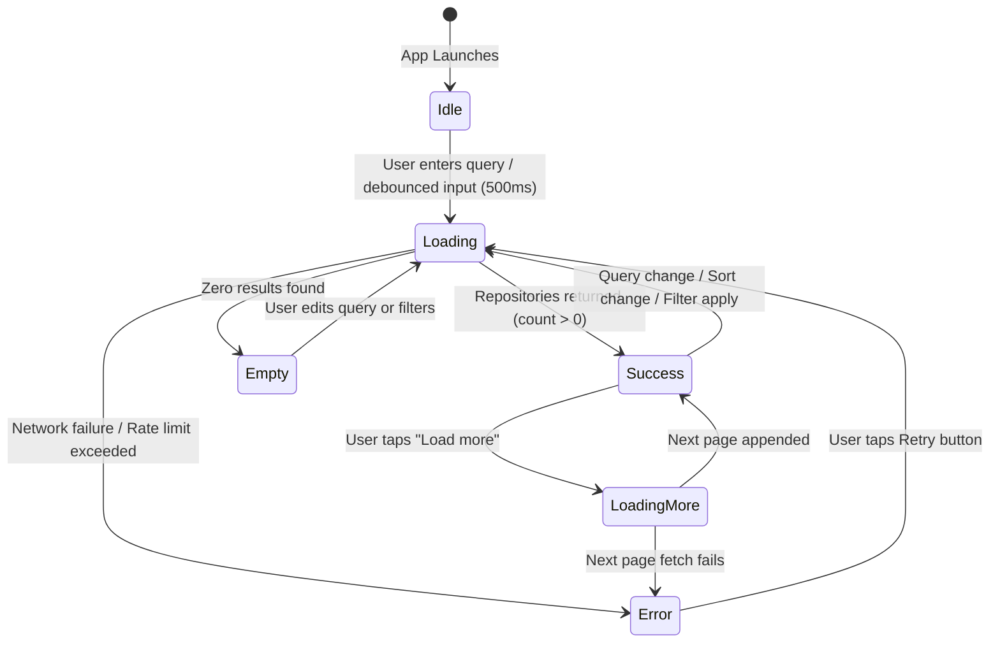

# Feature Specification: Repository Search

## 1. Overview & User Journey
The **Repository Search** feature is the primary entry point of the application. It empowers users to search for open-source repositories hosted on GitHub, browse paginated results, apply multi-criteria filtering, switch sorting orders, view repository health metrics, and navigate to detailed repository inspection.



---

## 2. Visual States & Behaviors

### State 1: `Idle` (Welcome State)
- **Condition**: Displayed on cold start when no search query has been entered.
- **Visuals & Actions**: Prompts the user to search GitHub repositories; soft keyboard focus initiates input.

### State 2: `Loading`
- **Condition**: Displayed immediately upon initiating a new search, changing sort order, or applying filters.
- **Visuals & Protection**: Shows a centered progress indicator; prevents duplicate network dispatches.

### State 3: `Success` (Results List)
- **Condition**: Displayed when the query yields one or more repositories.
- **Visuals & Layout**: Scrollable list of repository cards displaying:
  - Owner avatar (asynchronously loaded with crossfade animation).
  - Repository full name (`owner/name`) with overflow truncation.
  - Repository description (when available).
  - Language indicator badge.
  - Engagement metrics (Stargazers and Forks counts).
- **Interactions**: Tapping any card navigates to the **Repository Detail** screen.
- **Pagination & Summary**: Displays total match counter and a **"Load more"** button when additional pages exist.

### State 4: `Empty`
- **Condition**: Displayed when GitHub API returns 200 OK with zero matching repositories.
- **Visuals & Guidance**: Displays an empty state message suggesting query or filter refinements. Filter bar remains visible so users can easily adjust search criteria without starting over.

### State 5: `Error`
- **Condition**: Displayed upon network failure, timeout, or HTTP 403 rate limiting.
- **Visuals & Recovery**: Clear error description paired with an explicit **"Retry"** button that re-executes the last query.

---

## 3. Search Input & Debouncing

### Input Handling & Instant Search:
- **500ms Debounce Window**: Automatically triggers search 500ms after the user stops typing, skipping duplicate queries.
- **Keyboard Action**: Tapping the keyboard "Search" (IME) action triggers immediate execution and dismisses the keyboard.
- **Fast-Typing Cancellation**: Rapid typing cancels prior pending requests silently; cancellation exceptions are caught and suppressed to prevent false error states.
- **State Preservation**: The active query and state are retained across device rotation and process recreation via saved instance state.

---

## 4. Sorting Capabilities

When an active search query exists, sorting tabs are displayed directly below the search bar:

- **Best Match (Default)**: GitHub's relevance-based ranking combining query match density and activity.
- **Most Stars**: Repositories ordered by stargazers count descending.
- **Most Forks**: Repositories ordered by fork count descending.

### Behavior:
- Selection changes immediately trigger a fresh search.
- Pagination is reset to page 1 upon changing the sort criterion.
- The active sort selection is indicated by an underline tab indicator.

---

## 5. Filtering & Modal Bottom Sheet

### Filter Bar:
- Positioned alongside the sort options when a search query is present.
- Displays a **"Filters"** trigger button with an active indicator when filters are applied.
- Renders active filter chips (e.g., `Language: Kotlin`, `Stars: ≥1000`) with quick-remove (`×`) buttons.
- Includes a **"Clear all"** action to reset all filters at once.

### Filter Bottom Sheet (Modal):
- **Language Filter**: Single selection from common languages (Rust, Kotlin, Python, Go, TypeScript, C++).
- **Minimum Stars**: Segmented options (Any, 100+, 500+, 1,000+).
- **Last Updated (Recency)**: Segmented options (Any time, This year, This month).
- **Action Buttons**:
  - **"Show results"**: Full-width primary action button applying selected criteria and closing the modal.
  - **"Reset"**: Restores filter criteria to default settings.

### Query Synthesis:
Selected filters are dynamically converted into GitHub search qualifiers and appended to the API query:
- Language selection translates to `language:<name>`.
- Star threshold translates to `stars:>=<count>`.
- Recency translates to `pushed:><date>`.

---

## 6. Pagination: Manual "Load More" Strategy

### UX Rationale: Manual Button vs. Infinite Scrolling:
1. **GitHub Platform Alignment**: Mirrors GitHub's own web and mobile search interface.
2. **Intentional Evaluation**: Users searching for code repositories need time to review results rather than being forced into endless scrolling.
3. **API Rate Limit Conservation**: Protects against rapid exhaustion of GitHub's unauthenticated/authenticated rate limits.
4. **Bandwidth & Performance**: Prevents unwanted background page loading on metered or slow connections.
5. **Accessibility & Screen Readers**: Provides a clear, predictable interactive element for assistive technologies.

### Pagination Mechanics:
- When additional pages exist, a full-width **"Load more"** button appears at the end of the results list.
- During pagination requests, the button shows an inline loading spinner while keeping existing results on screen.
- **Cumulative Result Counter**: Displays loaded range against total count (e.g., `1–30 OF 144,530`, then `1–60 OF 144,530` after loading page 2).
- Loading stops and the button disappears when all items have been retrieved or the last page is reached.

---

## 7. Component Structure & Organization

The search feature is modularized within `:feature:search` following Unidirectional Data Flow (UDF):

```text
feature/search/
├── SearchScreen.kt             # Top-level screen composable & state observation
├── SearchViewModel.kt          # Business logic, query debounce, pagination, filter state
├── SearchUiState.kt            # Immutable UI state hierarchy (Idle, Loading, Success, Empty, Error)
└── component/                  # Feature-specific components
    ├── SearchTopBar.kt         # Search input bar and clear action
    ├── SortTabs.kt             # Best Match, Most Stars, Most Forks tabs
    ├── FilterBar.kt            # Active filter chips and filter sheet opener
    ├── FilterBottomSheet.kt    # Filter modal with language, stars, and date selectors
    ├── RepositoryCard.kt       # Repository item view with avatar, title, and metrics
    └── LoadMoreButton.kt       # Manual pagination trigger with loading state
```
