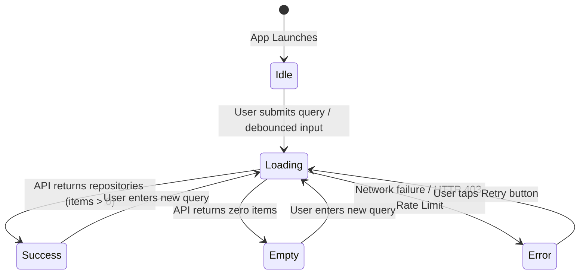

# Feature Specification: Repository Search

## 1. Overview & User Journey
The **Repository Search** feature is the primary entry point of the application. It enables users to search for open-source repositories hosted on GitHub, browse paginated results, apply filters and sorting, view key repository health metrics (language, stargazers, forks), and navigate to detailed metrics.



---

## 2. Visual States & Behaviors

### State 1: `Idle` (Welcome State)
- Displayed on cold start when no search query has been entered.
- Visual elements: Welcome message prompting user to search repositories, search input bar with search leading icon and placeholder text.
- Keyboard action: IME Search action initiates query.

### State 2: `Loading`
- Displayed immediately upon search dispatch.
- Visual elements: Centered Material 3 `CircularProgressIndicator`.
- State protection: Disables multiple parallel network dispatches.

### State 3: `Success` (Results List)
- Displayed when repository list contains one or more items.
- Visual elements: `LazyColumn` with vertical item spacing (8dp).
- Each item is rendered via `RepositoryCard`:
  - Circular owner avatar loaded asynchronously via Coil with crossfade animation.
  - Repository full name (`owner/repo`) formatted with `titleMedium` typography, single line with `TextOverflow.Ellipsis`.
  - Language chip badge: Pill container styled with `MaterialTheme.colorScheme.primaryContainer`.
  - Stargazers count accompanied by a gold star icon (`#FFB800`).
- Tap interaction: Clicking any item triggers navigation callback `onRepositoryClick(item)`.

### State 4: `Empty`
- Displayed when GitHub API returns 200 OK with `total_count: 0`.
- Visual elements: Centered descriptive text ("No repositories found") styled with `bodyLarge`.

### State 5: `Error`
- Displayed when network connection fails, timeout occurs, or GitHub API responds with non-2xx status (e.g., HTTP 403 Rate Limit).
- Visual elements: Centered error message explaining failure reason, accompanied by an explicit **"Retry"** action button.
- User recovery: Tapping **"Retry"** re-executes the last query without requiring manual text re-entry.

---

## 3. UI Component Architecture & Packaging

To maintain clean separation of concerns and high cohesion, the UI layer follows the standard **3-File MVI/UDF Triad** accompanied by a feature-scoped `components/` directory:

```text
ui/features/search/
├── SearchScreen.kt         # Stateful Screen container + Stateless Composable content
├── SearchViewModel.kt      # State holder, coroutine scope, SavedStateHandle integration
├── SearchUiState.kt        # Sealed interface defining Idle, Loading, Success, Empty, Error
└── components/             # Feature-specific small views (used ONLY by Search)
    ├── SearchInputField.kt # Debounced search bar with clear icon & keyboard actions
    ├── RepositoryCard.kt   # Individual repository card with avatar & metrics
    └── LanguageBadge.kt    # Pill badge displaying repository programming language
```

### Component Placement Rule:
- **Feature-Scoped Views** (e.g., `RepositoryCard`, `SearchInputField`): Placed directly under `ui/features/search/components/`. If the search feature is updated or refactored, all its sub-views remain localized.
- **Cross-Feature Reusable Views** (e.g., `ErrorBanner`, `LoadingIndicator`, `EmptyStateView`): Placed in `ui/components/` (or `ui/common/`) to be shared across Search, Detail, and future screens.

---

## 4. Key Implementation Details

### Debounce & Keyboard Handling:
```kotlin
// Keyboard actions trigger immediate search and dismiss soft keyboard
keyboardActions = KeyboardActions(
    onSearch = {
        keyboardController?.hide()
        viewModel.searchRepositories()
    }
)
```

### Surviving Configuration Changes & Process Death:
- Query text is bound to `SavedStateHandle`:
```kotlin
@HiltViewModel
class SearchViewModel @Inject constructor(
    private val gitHubRepository: GitHubRepository,
    private val savedStateHandle: SavedStateHandle
) : ViewModel() {
    val searchInput: StateFlow<String> = savedStateHandle.getStateFlow(KEY_SEARCH_INPUT, "")
}
```
- Rotating device from Portrait to Landscape or OS process recreation restores query state without reloading.

---

## 5. Pagination Strategy: Load More Button

### Decision: Manual Load More vs. Infinite Scroll

We implemented **manual "Load More" button pagination** instead of automatic infinite scroll for the following reasons:

#### Why Load More Button:

1. **Aligns with GitHub's UX Pattern**
   - GitHub's own search results use explicit "Load more" interaction
   - Maintains consistency with the platform being searched
   - Users familiar with GitHub will recognize this pattern

2. **Intentional Search Behavior**
   - Repository search is a deliberate, evaluative task (not casual browsing)
   - Users need to review and compare results carefully
   - Manual control allows users to pause and analyze findings

3. **API Rate Limit Protection**
   - GitHub API enforces strict rate limits (5,000 requests/hour authenticated, 60/hour unauthenticated)
   - Automatic scroll could trigger excessive API calls during fast scrolling
   - Manual button prevents accidental exhaustion of rate limits

4. **Performance & Network Efficiency**
   - User controls when to initiate network requests
   - Beneficial for slow or metered connections
   - Prevents background loading when user isn't interested in more results

5. **Accessibility & User Control**
   - Screen readers can announce and interact with the button clearly
   - Users with motor disabilities have predictable interaction target
   - No unexpected navigation or loading during assistive technology use

6. **Footer Reachability**
   - If app has footer content or pagination info, it remains accessible
   - Infinite scroll often makes bottom UI elements unreachable

#### Implementation Details:

```kotlin
// SearchUiState.kt
data class Success(
    val repositories: List<RepositoryItem>,
    val totalCount: Int,
    val hasNextPage: Boolean,      // Controls button visibility
    val isLoadingMore: Boolean      // Controls button loading state
) : SearchUiState
```

```kotlin
// LoadMoreButton.kt
@Composable
fun LoadMoreButton(
    isLoading: Boolean,
    onClick: () -> Unit,
    modifier: Modifier = Modifier
) {
    Surface(
        modifier = modifier.clickable(enabled = !isLoading, onClick = onClick),
        shape = RoundedCornerShape(4.dp),
        color = AppWhite,
        border = BorderStroke(1.dp, Slate300)
    ) {
        if (isLoading) {
            CircularProgressIndicator(...)
        } else {
            Text("Load more")
            Icon(Icons.Default.KeyboardArrowDown)
        }
    }
}
```

**Result Counter Display:**
- Shows cumulative loaded items: `"1–30 OF 3,120"`
- After loading page 2: `"1–60 OF 3,120"`
- Accurately represents all loaded items from first to current page

---

## 6. Search Debouncing & Query Management

### Debounce Implementation:

To prevent excessive API calls during fast typing, search queries are debounced with a **500ms delay**:

```kotlin
// SearchViewModel.kt
init {
    viewModelScope.launch {
        _query
            .debounce(500L)              // Wait 500ms after last keystroke
            .distinctUntilChanged()      // Skip duplicate queries
            .collect { debouncedQuery ->
                if (debouncedQuery.isNotBlank()) {
                    executeSearch(debouncedQuery, page = 1)
                }
            }
    }
}
```

### Cancellation Exception Handling:

When users type quickly, older search requests are cancelled. We properly handle `CancellationException` to avoid showing error messages:

```kotlin
try {
    val result = searchRepositoriesUseCase(query, page, sort, filter)
    _uiState.value = SearchUiState.Success(...)
} catch (e: CancellationException) {
    // Rethrow - this is expected during debouncing
    // Don't show "something went wrong" to user
    throw e
} catch (throwable: Throwable) {
    // Only real errors shown to user
    _uiState.value = SearchUiState.Error(throwable.message)
}
```

**Why 500ms?**
- 400ms felt too aggressive (triggered mid-typing)
- 500ms provides good balance between responsiveness and API efficiency
- Users perceive near-instant results while reducing unnecessary calls

---

## 7. Sorting & Filtering Features

### Sort Tabs (Always Visible When Query Exists):

Three sorting criteria matching GitHub's search API:

```kotlin
enum class SearchSort(val apiValue: String) {
    BEST_MATCH(""),           // Default relevance ranking
    MOST_STARS("stars"),      // Popularity-based
    MOST_FORKS("forks")       // Community engagement
}
```

**UI Design:**
- Tab-style underline indicator for selected sort
- Tabs visible below search box whenever query is not empty
- Sort changes reset pagination (restart from page 1)

### Filter Bar & Bottom Sheet:

**Filter Bar:**
- "Filters" button with sliders icon
- Active filter chips with remove (×) actions
- Filters button shows blue border when filters are active

**Filter Bottom Sheet (Modal):**
- **Language:** Rust, Kotlin, Python, Go, TypeScript, C++ (single selection)
- **Minimum Stars:** Any, 100+, 500+, 1K+ (segment control)
- **Last Updated:** Any time, This year, This month (segment control)

**Design Decisions:**
- Bottom sheet uses pure white background (`tonalElevation = 0.dp`)
- No real-time repository count updates (avoids unnecessary API calls)
- Static "Show repositories" button (applies filters on click)
- Filter criteria sent as GitHub API query parameters

```kotlin
// Filter application example
data class SearchFilter(
    val language: String? = null,
    val minStars: Int? = null,
    val updatedPeriod: String = "any",
    val updatedAfter: String? = null
)

// Converts to GitHub query string:
// "kotlin stars:>1000 pushed:>2024-01-01"
```

### Visibility Logic:

```kotlin
// Sort tabs & filter bar always visible when user has typed query
if (query.isNotEmpty()) {
    SortTabs(selectedSort, onSortSelected)
    FilterBar(filter, onOpenFilterSheet, ...)
}
```

**Why Always Visible?**
- Users can access filters during Loading, Error, Empty, and Success states
- Prevents frustration when trying to refine zero-result searches
- Allows filter adjustments before results fully load

---

## 8. Design System Colors

### Theme Color Tokens (Eliminates Hardcoded Colors):

All search UI components use centralized theme colors from `Color.kt`:

**Main Palette:**
- `AppNavy` - Header backgrounds
- `AppBlue` - Actions, links, focus states
- `AppWhite` - Card surfaces, backgrounds
- `Slate300` - Borders, drag handle
- `Slate500` - Meta text, icons

**Derived Tints:**
- `SelectedBlueBg` - Active filter chip backgrounds (blue at 9% opacity)
- `ScrimOverlay` - Bottom sheet overlay (navy at 60% opacity)

**Usage Examples:**
- Search box background uses `AppWhite`
- Active filter chips use `SelectedBlueBg` with `AppBlue` border
- Bottom sheet scrim uses `ScrimOverlay`
- "Load more" button border uses `Slate300`

**Design Consistency:**
- All colors verified against design specification
- No hardcoded color values in component files
- Centralized color system supports future dark mode implementation
