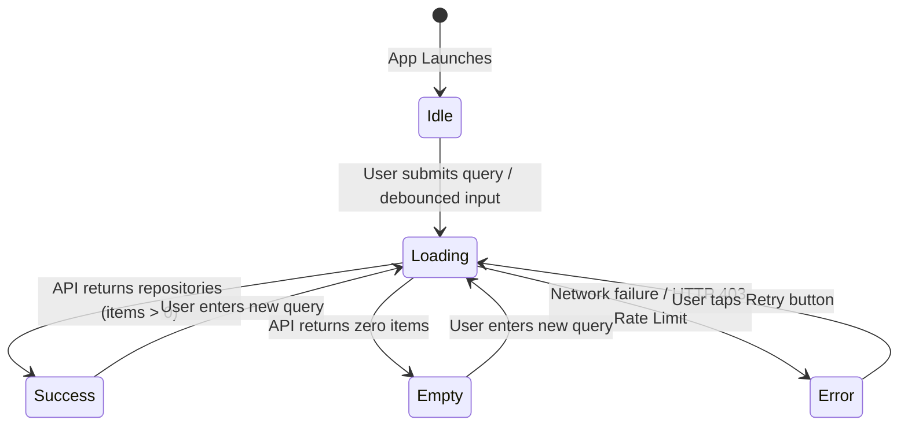

# Feature Specification: Repository Search & List Screen

## 1. Overview & User Journey
The **Repository Search & List Screen** is the primary entry point of the application. It enables users to search for open-source repositories hosted on GitHub, browse paginated results, view key repository health metrics (language, stargazers, forks), and navigate to detailed metrics.



---

## 2. Visual States & Behaviors

### State 1: `Idle` (Welcome State)
- Displayed on cold start when no search query has been entered.
- Visual elements: Welcome message prompting user to search repositories, search input bar with search leading icon and placeholder text.
- Keyboard action: IME Search action initiates query.

### State 2: `Loading`
- Displayed immediately upon search dispatch.
- Visual elements: Centered Material 3 `CircularProgressIndicator`.
- State protection: Disables multiple parallel network dispatches.

### State 3: `Success` (Results List)
- Displayed when repository list contains one or more items.
- Visual elements: `LazyColumn` with vertical item spacing (8dp).
- Each item is rendered via `RepositoryCard`:
  - Circular owner avatar loaded asynchronously via Coil with crossfade animation.
  - Repository full name (`owner/repo`) formatted with `titleMedium` typography, single line with `TextOverflow.Ellipsis`.
  - Language chip badge: Pill container styled with `MaterialTheme.colorScheme.primaryContainer`.
  - Stargazers count accompanied by a gold star icon (`#FFB800`).
- Tap interaction: Clicking any item triggers navigation callback `onRepositoryClick(item)`.

### State 4: `Empty`
- Displayed when GitHub API returns 200 OK with `total_count: 0`.
- Visual elements: Centered descriptive text ("No repositories found") styled with `bodyLarge`.

### State 5: `Error`
- Displayed when network connection fails, timeout occurs, or GitHub API responds with non-2xx status (e.g., HTTP 403 Rate Limit).
- Visual elements: Centered error message explaining failure reason, accompanied by an explicit **"Retry"** action button.
- User recovery: Tapping **"Retry"** re-executes the last query without requiring manual text re-entry.

---

## 3. UI Component Architecture & Packaging

To maintain clean separation of concerns and high cohesion, the UI layer follows the standard **3-File MVI/UDF Triad** accompanied by a feature-scoped `components/` directory:

```text
ui/features/search/
├── SearchScreen.kt         # Stateful Screen container + Stateless Composable content
├── SearchViewModel.kt      # State holder, coroutine scope, SavedStateHandle integration
├── SearchUiState.kt        # Sealed interface defining Idle, Loading, Success, Empty, Error
└── components/             # Feature-specific small views (used ONLY by Search)
    ├── SearchInputField.kt # Debounced search bar with clear icon & keyboard actions
    ├── RepositoryCard.kt   # Individual repository card with avatar & metrics
    └── LanguageBadge.kt    # Pill badge displaying repository programming language
```

### Component Placement Rule:
- **Feature-Scoped Views** (e.g., `RepositoryCard`, `SearchInputField`): Placed directly under `ui/features/search/components/`. If the search feature is updated or refactored, all its sub-views remain localized.
- **Cross-Feature Reusable Views** (e.g., `ErrorBanner`, `LoadingIndicator`, `EmptyStateView`): Placed in `ui/components/` (or `ui/common/`) to be shared across Search, Detail, and future screens.

---

## 4. Key Implementation Details

### Debounce & Keyboard Handling:
```kotlin
// Keyboard actions trigger immediate search and dismiss soft keyboard
keyboardActions = KeyboardActions(
    onSearch = {
        keyboardController?.hide()
        viewModel.searchRepositories()
    }
)
```

### Surviving Configuration Changes & Process Death:
- Query text is bound to `SavedStateHandle`:
```kotlin
@HiltViewModel
class SearchViewModel @Inject constructor(
    private val gitHubRepository: GitHubRepository,
    private val savedStateHandle: SavedStateHandle
) : ViewModel() {
    val searchInput: StateFlow<String> = savedStateHandle.getStateFlow(KEY_SEARCH_INPUT, "")
}
```
- Rotating device from Portrait to Landscape or OS process recreation restores query state without reloading.
