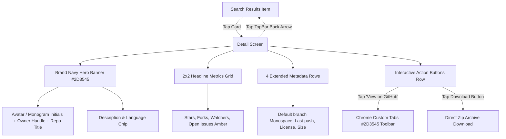

# Feature Specification: Repository Detail Screen (Screen 04)

## 1. Overview & User Journey
The **Repository Detail Screen (Screen 04)** provides in-depth inspection of a selected GitHub repository. Adhering to the unified design specification (`04 Detail Screen.dc.html`), it features a brand Dark Navy hero banner (`#2D3545`), a 2x2 headline metrics grid, an extended metadata table of 4 cards, and integrated actions including branded Chrome Custom Tabs and a companion repository zip download button.



---

## 2. Screen Specifications & Metrics

### 1. Brand Navy Hero Banner (`#2D3545`):
- **Pinned TopAppBar**: Pinned at the top with container color `#2D3545` (`AppNavy`) and title "Repository".
- **Natural Scroll Collapse**: The hero banner is integrated into the vertical scroll hierarchy (`Modifier.verticalScroll(rememberScrollState())`). As the user scrolls up, the hero section smoothly scrolls under the pinned navy TopAppBar, providing a clean collapsed navigation experience.
- **Owner Avatar**: 56dp circular avatar loaded via Coil with smooth crossfade and automatic monogram fallback initials (`getMonogramInitials`).
- **Owner Handle**: 13sp `Slate400` (`#94A3B8`).
- **Repository Title**: 24sp bold `AppWhite` (`#FFFFFF`).
- **Description**: 13sp `Slate300` (`#CBD5E1`), 20sp line height. Omitted if null or blank.
- **Language Chip**: Pill surface container in `Slate600` (`#475569`) with 12sp `Slate300` text.

### 2. Headline Metrics (2x2 StatCard Grid):
- **Stars**: Label `STARS`, value in `Slate900` (`#0F172A`).
- **Forks**: Label `FORKS`, value in `Slate900` (`#0F172A`).
- **Watchers**: Label `WATCHERS`, value in `Slate900` (`#0F172A`).
- **Open Issues**: Label `OPEN ISSUES`, value in `AppAmber` (`#B45309`) — distinctive warning color drawing attention to open items.

### 3. Extended Metadata Rows (4 Cards):
Adheres strictly to the `MetaRow.dc.html` specification (8dp rounded card container with 1dp `Slate200` border, 13sp `Slate500` label, and 13sp `Slate800` SemiBold value):
- **Default branch**: Rendered with monospace font (`FontFamily.Monospace`). Fallback: `N/A`.
- **Last push**: Formatted to `YYYY-MM-DD` via `DetailFormatters.formatPushDate`. Fallback: `—`.
- **License**: SPDX identifier (e.g., `MIT`, `Apache-2.0`) or formal name. Fallback: `None`.
- **Size**: Formatted disk size in KB, MB, or GB via `DetailFormatters.formatSize` (e.g., `4.2 MB`). Fallback: `0 KB`.

### 4. Interactive Action Buttons:
- **"View on GitHub" Button**: Full-height (48dp) brand blue action button (`AppBlue` `#3B50DF`), launching Chrome Custom Tabs.
- **Companion Download Button**: 48dp x 48dp square button with 1dp `Slate300` border and `Icons.Default.Download` icon, directly targeting:
  ```kotlin
  "${repository.htmlUrl}/archive/refs/heads/${repository.defaultBranch ?: "main"}.zip"
  ```
- **Chrome Custom Tabs**: Configured with `#2D3545` brand navy toolbar color matching the header, with automatic fallback to system browser (`Intent.ACTION_VIEW`):
  ```kotlin
  val customTabsIntent = CustomTabsIntent.Builder()
      .setShowTitle(true)
      .setDefaultColorSchemeParams(
          CustomTabColorSchemeParams.Builder()
              .setToolbarColor(AppNavy.toArgb())
              .build()
      )
      .build()
  ```

---

## 3. UI Component Architecture & Packaging

```text
feature/detail/src/main/kotlin/jp/co/yumemi/android/codecheck/feature/detail/
├── DetailScreen.kt              # Scaffold, TopAppBar, DetailContent, StatCard, CustomTab launcher
├── DetailViewModel.kt           # DetailUiState holder and navigation argument processor
├── DetailFormatters.kt          # Pure formatters: formatSize, formatPushDate
└── component/
    └── MetaRow.kt               # Reusable MetaRow component (8dp rounded card, label + value)
```

---

## 4. Accessibility & Localization
- **Multi-locale Support**: Full English (`values/strings.xml`) and Japanese (`values-ja/strings.xml`) localized strings for all labels and fallback values.
- **Screen Reader Semantics**: Clear content descriptions for the back navigation button, owner avatar monogram, and download companion action.
- **Responsive Layout**: Designed for seamless scrolling on small screen sizes and split-screen multitasking.
