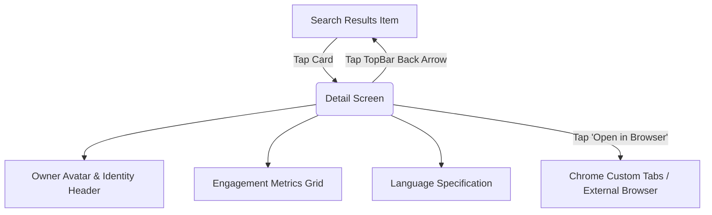

# Feature Specification: Repository Detail Screen

## 1. Overview & User Journey
The **Repository Detail Screen** provides in-depth inspection of a selected GitHub repository. It displays the owner branding, repository name, language, core engagement metrics (Stars, Watchers, Forks, Open Issues), and enables the user to seamlessly transition to the live repository on GitHub via Chrome Custom Tabs.



---

## 2. Screen Specifications & Metrics

### 1. Identity Header:
- **Owner Avatar**: Circular image (96dp diameter) loaded via Coil with smooth crossfade and error placeholder.
- **Repository Full Name**: Styled with `MaterialTheme.typography.headlineSmall`, bold font weight.
- **Owner Username**: Subtitle styled with `MaterialTheme.typography.bodyMedium`.

### 2. Metrics Cards Grid:
Individual metric cards display repository health statistics:
- **Stars Count**: Labeled `Stars` (or `言語` / `スター数` in Japanese), accompanied by StarYellow icon.
- **Watchers Count**: Labeled `Watchers` (`閲覧者数`), displaying watcher count.
- **Forks Count**: Labeled `Forks` (`フォーク数`), accompanied by ForkBlue icon.
- **Open Issues Count**: Labeled `Open Issues` (`未解決の課題数`), displaying issue count.
- **Language**: Labeled `Language` (`言語`), displaying repository language or fallback string "Unknown".

### 3. External Browser Integration (Chrome Custom Tabs):
- Primary action button: **"Open in Browser"** with `OpenInBrowser` icon.
- Implementation: Uses Android Jetpack `CustomTabsIntent` for an in-app browser experience, with fallback to standard `Intent.ACTION_VIEW` if no custom tabs provider is available:
```kotlin
val url = item.htmlUrl
if (!url.isNullOrBlank()) {
    val customTabs = CustomTabsIntent.Builder().build()
    try {
        customTabs.launchUrl(context, Uri.parse(url))
    } catch (e: Exception) {
        val intent = Intent(Intent.ACTION_VIEW, Uri.parse(url))
        context.startActivity(intent)
    }
}
```

---

## 3. UI Component Architecture & Packaging

Following the Clean Architecture component rules:

```text
ui/features/detail/
├── DetailScreen.kt         # Screen container with Scaffold & TopAppBar
└── components/             # Feature-specific small views (used ONLY by Detail)
    ├── OwnerHeader.kt      # Avatar, owner name, and full repository name
    ├── MetricCard.kt       # Reusable card tile displaying numeric metric + label
    └── BrowserButton.kt    # Button initiating Chrome Custom Tabs intent
```

### Component Placement Rule:
- `MetricCard` and `OwnerHeader` are packaged inside `ui/features/detail/components/` because their layouts and constraints are specialized for detail viewing.
- If a metric card is later reused in user profile screens, it can be promoted to `ui/components/MetricCard.kt`.

---

## 4. Accessibility & Responsiveness
- **Screen Reader Support**: Every metric card announces both the title and numeric value as a semantic unit.
- **Scrollable Viewport**: Wrapped in `Modifier.verticalScroll(rememberScrollState())` to ensure usability on compact devices and in landscape orientation.
- **Dark Mode Support**: Card background colors utilize `MaterialTheme.colorScheme.surfaceVariant` for optimal contrast against dark surfaces.
