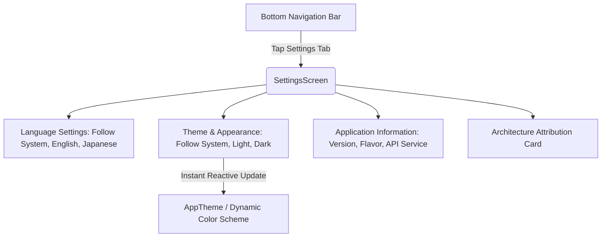

# Feature Specification: Settings & Preferences Screen

## 1. Overview & User Journey
The **Settings & Preferences Screen** provides user controls for configuring application language (English, Japanese, or System default), theme appearance (Light, Dark, or System default), reviewing build metadata, and observing architectural attribution, modeled directly after the multiplatform engineering standards.



---

## 2. Screen Elements & Specifications

### 1. Language Selection Section (`Icons.Default.Language`):
- `Follow System`: Automatically adheres to the OS device locale.
- `English (US)`: Forces application strings to English.
- `日本語 (Japanese)`: Forces application strings to Japanese.
- Rendered via `SettingsOptionTile` with an interactive `RadioButton` indicator.

### 2. Theme Mode Selection Section (`Icons.Default.Palette`):
- `Follow System`: Automatically matches the device's dark or light theme.
- `Light Mode`: Material 3 light surfaces.
- `Dark Mode`: Material 3 dark surfaces (`GitHubDark` `#121212`, `GitHubCardDark` `#1E1E1E`).
- Tapping any option immediately triggers reactive recomposition across the entire application without needing an activity restart.

### 3. Application Information Section (`Icons.Default.Info`):
- **Version**: Displays active version and build number from `BuildConfig` (e.g. `1.0.0 (Build 1)`)
- **Environment**: Displays active build flavor badge (`DEV` in blue, `MOCK` in amber, `PROD` in green)
- **API Service**: Displays `GitHub REST API v3` (for `dev`/`prod`) or `Offline Mock Dataset (Zero Rate Limits)` (for `mock`)
- Rendered via `SettingsInfoTile` displaying clear key-value metadata rows with subtle dividers.

### 4. Architectural Attribution Footer:
- Top pill badge: `Mobile Platform Engineering`
- Subtitle: `Clean Architecture • Kotlin Multiplatform • Jetpack Compose`

---

## 3. UI Component Architecture & Packaging

```text
ui/features/settings/
├── SettingsScreen.kt       # Screen Composable rendering the 3 sections and footer
├── SettingsViewModel.kt    # State holder managing themeMode and language StateFlow
├── SettingsUiState.kt      # Immutable state model and AppThemeMode / AppLanguage enums
└── components/             # Feature-scoped components
    ├── SettingsOptionTile.kt # Selectable card row with RadioButton indicator
    └── SettingsInfoTile.kt   # Metadata key-value row with optional badge
```
