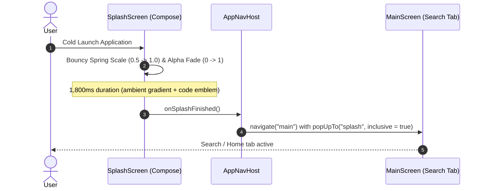

# Feature Specification: Animated Splash Screen

## 1. Overview & Visual Progression
The **Animated Splash Screen** is displayed for 1.8 seconds upon cold app launch. It establishes application branding, highlights core technical objectives (GitHub discovery, exploration, and stargazing), and smoothly transitions into the `MainScreen` without lingering or causing perceived latency.



---

## 2. Visual Elements & Design Tokens

### 1. Central Brand Emblem:
- Circular `Surface` container (96dp diameter) with `MaterialTheme.colorScheme.primaryContainer` background and 8dp tonal elevation.
- Centered `Icons.Default.Code` icon styled with `MaterialTheme.colorScheme.primary`.
- Entrance animation driven by Compose `Animatable` with bouncy spring specs (`Spring.DampingRatioMediumBouncy`, `Spring.StiffnessLow`).

### 2. Typography & Branding:
- **Title**: `stringResource(R.string.app_name)` rendered with `headlineMedium` typography and bold font weight.
- **Tagline**: `stringResource(R.string.splash_tagline)`:
  - English: *"Discover • Explore • Stargaze"*
  - Japanese: *"発見 • 探求 • スター"*

### 3. Engineering Attribution Footer:
- Styled pill container displaying:
  - `Clean Architecture • Kotlin Multiplatform • Jetpack Compose`

---

## 3. Navigation & Lifecycle Protection
To ensure the back button does not inadvertently return to the splash screen:
```kotlin
composable("splash") {
    SplashScreen(
        onSplashFinished = {
            navController.navigate("main") {
                popUpTo("splash") { inclusive = true }
            }
        }
    )
}
```
`popUpTo("splash") { inclusive = true }` clears the splash screen completely from the navigation backstack, ensuring the user exits the app naturally upon pressing Back from the home search screen.
