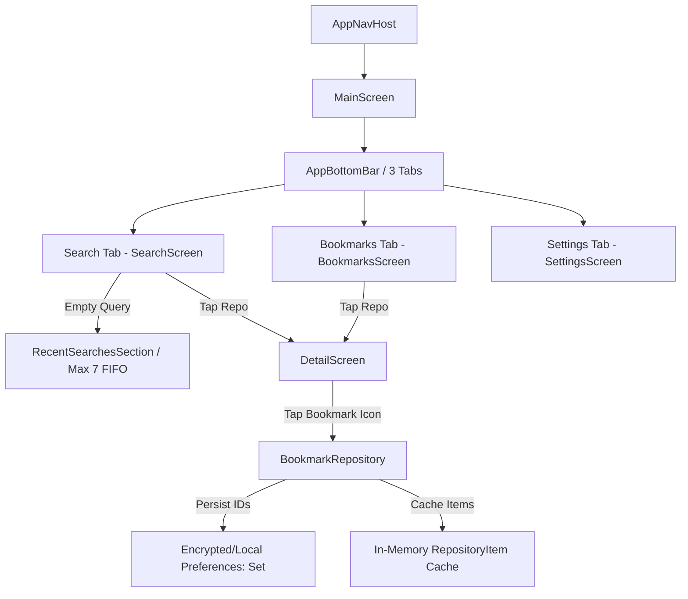

# Feature Specification: Navigation Tabs, Search History & Offline Bookmarks

## 1. Overview & Architecture
This document specifies the implementation of the primary navigation shell, recent search history, and offline repository bookmarks for the Yumemi Android Engineer CodeCheck application.



---

## 2. Bottom Navigation Bar (`AppBottomBar`)
The application uses a 3-tab Bottom Navigation Bar located in `:core:designsystem`:
- 🔍 **Search (`MainTab.SEARCH`)**: Primary repository search with debounce, filter sheet, sorting tabs, and recent search history.
- 🔖 **Bookmarks (`MainTab.BOOKMARKS`)**: Offline saved repositories list with instant browsing, 1-tap delete, and "Clear All" with confirmation dialog.
- ⚙️ **Settings (`MainTab.SETTINGS`)**: Theme mode (System/Light/Dark), Language selection (System/EN/JA), and build metadata.

---

## 3. Search History (Last 7 Searches)
- **FIFO / MRU Order**: Recent searches are recorded automatically when a search query is submitted or debounced.
- **Capacity**: Maximum of 7 recent queries are retained (`MAX_HISTORY_SIZE = 7`).
- **Display**: Shown on the Search screen when the search bar query is empty.
- **Interactions**:
  - Tapping a chip re-triggers search immediately with that query.
  - Tapping the `X` icon on a chip removes that query from history.
  - Tapping "Clear all" removes all history entries.

---

## 4. Offline Bookmarks Strategy & API Architecture

### GitHub REST API Limitation:
1. **Endpoint**: `GET https://api.github.com/repositories/{id}` fetches a repository by its numeric GitHub database ID.
2. **No Batch API**: GitHub does *not* support batch fetching (e.g. `GET /repositories?ids=1,2,3`).
3. **Rate Limit Preservation**: Unauthenticated clients are limited to **60 requests/hour**. Querying 20 repositories individually upon opening the app would exhaust 1/3 of the entire hourly quota.

### Solution Design (Local-First ID Persistence + In-Memory Cache):
1. **Source of Truth**: The local persistence layer stores **only the repository IDs** (`Set<Long>`) under `bookmarked_repo_ids`.
2. **In-Memory Item Cache**: Whenever a repository is bookmarked from search results or details, the `RepositoryItem` model is cached in memory.
3. **Offline-First Browsing**: When opening the Bookmarks tab, cached items are rendered instantly with zero latency and zero network calls, functioning completely offline.
4. **On-Demand Hydration**: If an item is missing from cache (e.g., following a cold app restart), `BookmarkRepository` fetches the repository by ID via `GitHubApiService.getRepositoryById(id)` and populates the cache.
5. **Detail Screen Synchronization**: Tapping the bookmark icon in the `DetailScreen` top app bar toggles the bookmark status dynamically and syncs with the `BookmarksScreen`.

---

## 5. Module Structure

```text
feature/bookmarks/
├── build.gradle.kts
└── src/
    ├── main/
    │   ├── kotlin/jp/co/yumemi/android/codecheck/feature/bookmarks/
    │   │   ├── BookmarksScreen.kt      # Material 3 screen with empty state & repository cards
    │   │   ├── BookmarksViewModel.kt   # State holder collecting BookmarkRepository.getBookmarks()
    │   │   └── BookmarksUiState.kt     # Loading, Empty, Success(repositories)
    │   └── res/
    │       ├── values/strings.xml      # English strings
    │       └── values-ja/strings.xml   # Japanese strings
    └── test/
        └── kotlin/jp/co/yumemi/android/codecheck/feature/bookmarks/
            └── BookmarksViewModelTest.kt # Turbine unit tests verifying state & removal
```
