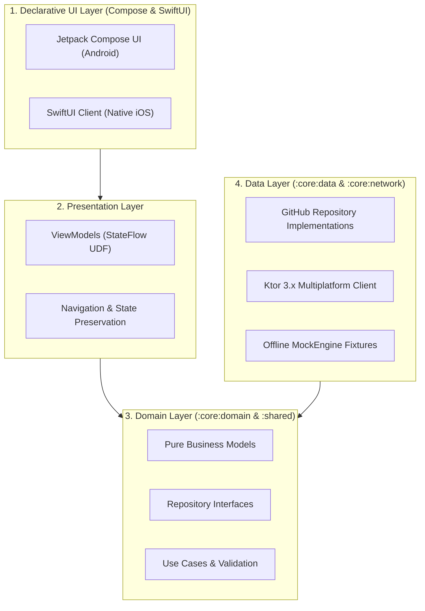

# 📱 Project Technical Architecture & Design Blueprints

**Classification:** Project-Specific Technical Documentation  
**Application:** GitHub Repository Search App (Android & Native iOS KMP Sample)  
**Parent Standard:** Adheres to the Company Engineering Operating Model in [`docs/01_company_and_team/`](../01_company_and_team/readme.md)  

---

## 🏗️ Architecture Overview

This section contains the comprehensive technical blueprints for the modernization of the code check repository into an enterprise-grade mobile application (see [Technical References](../references.md#7-github-api--assessment-standards)).

---

## 📑 Directory Contents

### 1. Architectural Blueprints ([`architecture/`](./architecture/))
- **[01_clean_architecture_and_udf.md](./architecture/01_clean_architecture_and_udf.md):** Clean Architecture layers, Unidirectional Data Flow, and StateFlow lifecycle models.
- **[02_kmp_shared_engine.md](./architecture/02_kmp_shared_engine.md):** Headless Kotlin Multiplatform core architecture (`:shared`) consumed natively by Android and iOS.
- **[03_dependency_injection_hilt.md](./architecture/03_dependency_injection_hilt.md):** Compile-time Dependency Injection with Hilt, module bindings, and test overrides.
- **[04_tech_stack_and_libraries.md](./architecture/04_tech_stack_and_libraries.md):** Complete library evaluation, version alignment, and license compliance.
- **[05_app_modules_and_responsibilities.md](./architecture/05_app_modules_and_responsibilities.md):** Multi-module dependency boundaries and isolation rules.

### 2. Architecture Decision Records ([`adr/`](./adr/readme.md))
- **[ADR-001](./adr/001_multi_module_architecture.md):** Multi-Module Architecture
- **[ADR-002](./adr/002_gradle_convention_plugins.md):** Gradle Convention Plugins (`build-logic`)
- **[ADR-003](./adr/003_detekt_static_analysis.md):** Detekt Static Code Analysis
- **[ADR-004](./adr/004_headless_kmp_boundary.md):** Headless KMP Layer Separation
- **[ADR-005](./adr/005_product_flavors_strategy.md):** 4 Product Flavors (`dev`, `mock`, `stg`, `prod`)
- **[ADR-006](./adr/006_jetpack_compose_migration.md):** Jetpack Compose Migration via Strangler Fig

### 3. Contract Specifications & Setup
- **[API Specification (`api_spec/`)](./api_spec/readme.md):** GitHub Search Repositories network contracts, error handling, and rate-limit mitigation.
- **[UI/UX Design Specification (`design/`)](./design/ui_ux_design_specification.md):** Material Design 3 design system, typography tokens, dark mode, and accessibility.
- **[AI-Assisted Design-to-Code Workflow (`design/`)](./design/ai_assisted_design_workflow.md):** End-to-end methodology for AI prototyping (Claude Design), HTML/CSS token specs, and Jetpack Compose translation.
- **[Project Setup & Toolchain (`setup/`)](./setup/01_project_setup.md):** Android Studio Iguana+, JDK 17, Gradle 8.5 build environment.
- **[Offline Mock Mode (`setup/`)](./setup/03_mock_development_and_offline_mode.md):** Offline Ktor MockEngine development fixtures and zero-network testing.
- **[Screenshots Guide (`screenshots/`)](./screenshots/screenshots_guide.md):** Guidelines for visual regression and presentation assets.

---

## 📊 Project Tracking

**GitHub Project Board:** [Mobile Platform Engineering - Issue Tracker](https://github.com/users/dinkar1708/projects/1/views/1)

**Implementation Status:** [Current Implementation Status & Recent Changes](./IMPLEMENTATION_STATUS.md)

Track all implementation progress, milestones, and issue status on the centralized project board. See the implementation status document for details on completed components and recent additions (including the stg flavor).

---

## 🔗 Traceability to Governance Standards

- **Definition of Done:** Technical components are validated against [`docs/01_company_and_team/05_definition_of_done.md`](../01_company_and_team/05_definition_of_done.md).
- **Delivery Pipeline:** Automated verification follows [`docs/01_company_and_team/07_cicd_and_delivery_standards.md`](../01_company_and_team/07_cicd_and_delivery_standards.md).
- **Milestone Delivery:** Implementation progress tracks [`docs/03_sprint_execution/01_execution_roadmap.md`](../03_sprint_execution/01_execution_roadmap.md).
