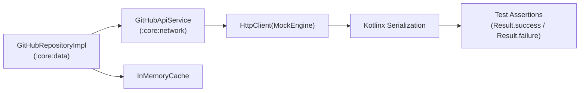

# Testing Specification: Data & Network Integration Testing

**Scope:** Phase 3 (Iteration & Construction)  
**Target:** Shared KMP Engine, Network Client & Repository Integration  

---

## 1. Overview

Integration testing verifies that data contracts, network serialization, HTTP error translation, and caching mechanisms operate cohesively across module boundaries without relying on live network connectivity or third-party byte-code mocking frameworks (Mockito / MockK).

All network integration tests utilize Ktor's native `MockEngine` in `:core:network/src/commonTest/` and `:core:data/src/commonTest/` to execute deterministically in milliseconds across both JVM and Native (iOS) compilation targets.



---

## 2. Network & Data Test Suites (`GitHubApiServiceTest.kt` & `GitHubRepositoryImplTest.kt`)

### Test Setup with Ktor `MockEngine`
```kotlin
val mockEngine = MockEngine { request ->
    when (request.url.encodedPath) {
        "/search/repositories" -> {
            val query = request.url.parameters["q"]
            if (query == "rate_limited") {
                respond(
                    content = """{"message": "API rate limit exceeded"}""",
                    status = HttpStatusCode.Forbidden,
                    headers = headersOf(HttpHeaders.ContentType, "application/json")
                )
            } else {
                respond(
                    content = sampleSearchSuccessJson,
                    status = HttpStatusCode.OK,
                    headers = headersOf(HttpHeaders.ContentType, "application/json")
                )
            }
        }
        else -> respondError(HttpStatusCode.NotFound)
    }
}
```

---

## 3. Key Integration Scenarios & Verification

### 3.1 Successful HTTP 200 JSON Deserialization
- **Scenario:** Valid search query dispatched; API responds with HTTP 200 and standard GitHub search payload.
- **Assertion:**
  - `result.isSuccess` is `true`.
  - JSON strings are parsed into strongly typed `RepositoryItem` domain models.
  - Optional fields (e.g., `language`, `description`) are safely deserialized as nullable types without JSON parser crashes.

### 3.2 Blank Query Short-Circuiting
- **Scenario:** Search query contains empty text or whitespace only (`"   "`).
- **Assertion:**
  - `result.getOrNull()` returns `emptyList()`.
  - Zero HTTP requests are emitted to `MockEngine` (verifies bandwidth conservation and rate-limit preservation).

### 3.3 HTTP 403 Rate Limit Handling
- **Scenario:** GitHub API returns HTTP 403 with `API rate limit exceeded`.
- **Assertion:**
  - `result.isFailure` is `true`.
  - Non-2xx HTTP status codes throw a descriptive domain exception (`GitHubApiException`) rather than silently returning an empty list, allowing UI layers to display explicit retry prompts.

### 3.4 In-Memory Caching & Offline Fallback
- **Scenario:** Initial query succeeds and caches results; second request with identical parameters encounters an HTTP 500 error.
- **Assertion:**
  - Repository detects cached entry and returns `Result.success(cachedList)`.
  - Verifies network failure resilience and transient offline tolerance.

---

## 4. Test Doubles: Fake vs. Mock Repository

For feature modules (`:feature:search`, `:feature:detail`), tests do not launch network engines. Instead, they use a deterministic `FakeGitHubRepository` located in `:core:testing`:

```kotlin
class FakeGitHubRepository : GitHubRepository {
    var searchResult: Result<List<RepositoryItem>> = Result.success(emptyList())

    override suspend fun searchRepositories(query: String): Result<List<RepositoryItem>> {
        return searchResult
    }
}
```

---

## 5. Execution Commands

```bash
# Execute network integration tests
./gradlew :core:network:testDebugUnitTest

# Execute data & repository integration tests
./gradlew :core:data:testDebugUnitTest

# Execute all tests across all modules
./gradlew testDebugUnitTest
```

---

## 6. Cross-References

- [Master Testing Overview](./readme.md)
- [Unit Testing Specification](./01_unit_testing.md)
- [Compose UI Testing Specification](./03_compose_ui_testing.md)
- [Test Cases Traceability Matrix](./04_test_cases_matrix.md)
