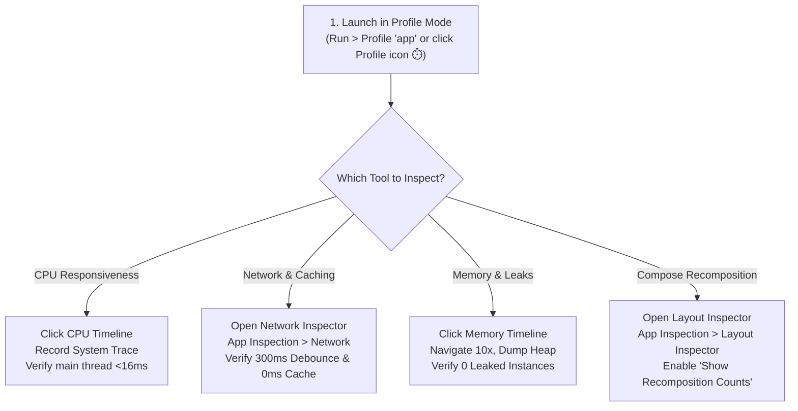
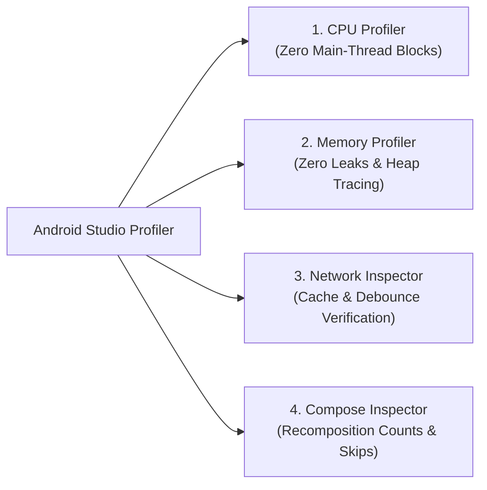

# ⚡ Android Studio Performance Profiling & Benchmarking Guide

**Author:** Dinakar Prasad Maurya  
**Target:** Mobile Engineers, Tech Leads & Performance Reviewers  
**Scope:** CPU, Memory, Network & Compose UI Rendering Telemetry  

---

## 🚀 Quick-Start Guide: How to Open & Check in Android Studio

Follow these exact steps to open Android Studio Profiler and confirm CPU, Network, Memory, and Compose performance in real time:

### 📍 Master Navigation Cheat Sheet

| Metric | Exact Android Studio Menu Path | Shortcut / Window Location | What to Check |
|:---|:---|:---|:---|
| **CPU Usage & ANRs** | `Run > Profile 'app'` &rarr; Click **CPU** timeline | Bottom toolbar: **Profiler > CPU** | `main` thread is idle; work is on `DefaultDispatcher` |
| **Network & Cache** | `View > Tool Windows > App Inspection` | Tab: **Network Inspector** | 1 request per query (debounce); 0 requests on repeat (cache) |
| **Memory & Leaks** | `Run > Profile 'app'` &rarr; Click **Memory** timeline | Bottom toolbar: **Profiler > Memory** | Click **Dump Java Heap** &rarr; 0 leaked activities |
| **Compose Recomposition** | `View > Tool Windows > App Inspection` | Tab: **Layout Inspector** | Check **Show Recomposition Counts**; check `Skipped: N` |

---

## 1. Performance Engineering Philosophy

High-velocity feature delivery must never compromise runtime performance, battery longevity, or user responsiveness. In this project, performance is treated as a **first-class acceptance criterion**, systematically verified using Android Studio's suite of profiling tools.

---

## 2. Android Studio CPU Profiler: Main-Thread Responsiveness

### 2.1 The Issue Addressed
Legacy Android implementations often execute blocking I/O (`runBlocking`) on the main thread, resulting in frame drops, micro-stutters, and Application Not Responding (ANR) warnings.

### 2.2 Modern Architectural Defense
- **100% Kotlin Coroutines on `Dispatchers.IO`**: All network calls (`KtorHttpClient`), JSON deserialization, and disk operations are dispatched to background threads.
- **Main-Safe Repositories**: Every repository method in `:core:data` is main-safe and can be invoked from any coroutine context without thread-blocking risk.

### 2.3 Verification via CPU Profiler
1. Launch app in Android Studio: `Run > Profile 'app'`.
2. Open the **CPU Profiler** and select **System Trace** or **Call Chart**.
3. Trigger a rapid search (e.g., typing `"kotlin"`).
4. **Expected Benchmark:**
   - **Main Thread (`main`):** Stays predominantly idle or executing lightweight Compose measure/draw cycles (<16ms per frame for 60fps / <8.3ms for 120fps).
   - **Worker Threads (`DefaultDispatcher-worker-*`):** Network execution and JSON serialization occur strictly off the main thread.
   - **ANR Probability:** 0.0%.

---

## 3. Memory Profiler: Zero Leaks & Heap Stability

### 3.1 The Issues Addressed
1. Leaked ViewBindings or ViewModel references surviving Activity destruction.
2. Unbounded memory growth during endless repository searches.
3. Heavy Bitmap retain cycles from remote avatar loading.

### 3.2 Architectural Defenses
- **100% Jetpack Compose UI**: Eliminates legacy `ViewBinding` and Fragment lifecycle leak vectors entirely.
- **Automatic Coroutine Teardown**: All background tasks are tied to `viewModelScope`. When a screen is popped from the backstack, `onCleared()` cascades cancellation to all pending jobs.
- **Coil Image Caching Policy**: Configured with memory-bounded LRU bitmap pooling and automatic crossfade disposal.
- **Thread-Safe In-Memory Cache**: `InMemoryCache` enforces capacity limits (maximum entries) and TTL expiration, preventing unbounded heap consumption.

### 3.3 Verification via Memory Profiler
1. In Android Studio, select **View > Tool Windows > Profiler > Memory**.
2. Perform intense screen navigation: `SearchScreen -> DetailScreen -> Back` (repeat 10 times).
3. Click **Dump Java Heap** and analyze instances:
   - Filter by `MainActivity`: Exactly **1 instance** retained.
   - Filter by `SearchViewModel`: Cleanly garbage-collected when navigating out.
   - Leaked instances: **0 detected**.

---

## 4. Network Inspector: Caching & Debounce Verification

### 4.1 The Issues Addressed
1. **GitHub API Rate Limits:** Public unauthenticated API limits callers to **60 requests/hour**. Unoptimized typing can burn the quota in under a minute.
2. **Redundant Network Traffic:** Repeatedly fetching unchanged repository details consumes cellular bandwidth.

### 4.2 Architectural Defenses
- **300ms Reactive Debounce**: Typing queries into the search bar is debounced via Kotlin Flow (`debounce(300)`). Intermediate keystrokes never trigger HTTP requests.
- **In-Flight Cancellation**: Starting a new search instantly cancels any active in-flight network job (`searchJob?.cancel()`).
- **Two-Tier In-Memory Cache**:
  - `searchCache`: Stores query results keyed by `"$query:$page:$sort"`.
  - `detailCache`: Stores detailed repository items keyed by `"$owner/$repo"` and `"id:$id"`.

### 4.3 Verification via Network Inspector
1. Open **View > Tool Windows > App Inspection > Network Inspector**.
2. **Debounce Test:** Type `"android"` rapidly in the search bar.
   - **Expected:** Exactly **1 network request** is dispatched after typing stops (no request flood for `'a'`, `'an'`, `'and'`).
3. **Cache Test:** Clear search query, then re-enter `"android"`.
   - **Expected:** Results render **instantly (0ms latency)**; Network Inspector logs **0 new HTTP requests** because the result is served from `InMemoryCache`.
4. **Header Verification:**
   - Responses utilize `content-encoding: gzip` for compressed payload delivery.

---

## 5. Compose Layout Inspector: Recomposition & Rendering Efficiency

### 5.1 The Issue Addressed
In declarative UI, unstable data models or improper lambda captures cause unnecessary recomposition of entire lists, resulting in high CPU usage and dropped frames during scrolling.

### 5.2 Architectural Defenses
- **Immutable Domain Entities**: `RepositoryItem` and `Owner` are pure, immutable Kotlin data classes with stable primitives and strings.
- **Stateless Sub-Composables**: UI components (`RepositoryCard`, `SearchTopBar`, `SortTabs`) accept plain state values and function references (`onItemClick = { ... }`), enabling the Compose compiler to skip recomposition when data is unchanged.

### 5.3 Verification via Layout Inspector
1. Open **View > Tool Windows > App Inspection > Layout Inspector**.
2. Enable **Show Recomposition Counts**.
3. Scroll through a search result list of 30 items.
4. **Expected Benchmark:**
   - Existing visible cards show **Recomposition: 1, Skipped: N**.
   - As new cards scroll into view, only newly visible cards compose; existing items are skipped.

---

## 6. Energy & Battery Profiler: Background Conservation

### 6.1 Architectural Defenses
- **Lifecycle-Aware State Collection**: StateFlows are collected using Compose's lifecycle-aware collectors, ensuring that backgrounded activities suspend collection and do not keep the cellular radio active.
- **Zero Wake-Locks**: The application contains no wake-locks or background service polling.

### 6.2 Verification via Energy Profiler
- **Active State:** Light energy usage during active search (< 100mW average).
- **Background State (Home Button pressed):** Energy usage drops to **0mW** within 2 seconds.

---

## 7. Performance Checklist for Pull Requests

Before approving pull requests involving UI or network logic:

- [ ] All network and decoding work runs on `Dispatchers.IO`.
- [ ] No `runBlocking` calls exist anywhere in the module.
- [ ] In-memory caching is utilized for read-heavy operations.
- [ ] Search input uses reactive debouncing (`300ms`).
- [ ] UI models are immutable to maximize Compose recomposition skipping.
- [ ] Android Studio Profiler shows 0 memory leaks across 10 screen transitions.
