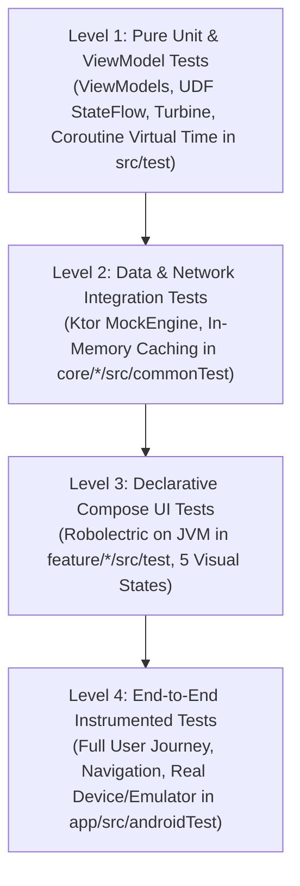

# Testing Architecture & Quality Assurance Strategy

**Target:** Mobile Engineering Team & Code Reviewers  
**Scope:** Automated Test Suite, Directory Layout & Quality Gates  

---

## 1. Testing Philosophy & 4-Level Test Pyramid

The repository adopts an enterprise **Test Pyramid** strategy, prioritizing fast, reliable unit and integration tests executing on the local JVM in milliseconds, complemented by declarative Jetpack Compose UI tests and end-to-end user journey validation.



### Breakdown of Testing Levels:
1. **Level 1: Pure Unit & ViewModel Tests (JVM)**
   - **Scope:** ViewModels (`SearchViewModel`, `DetailViewModel`), UDF state machines, domain entities, coroutine virtual time, and navigation builders.
   - **Execution:** Runs in ~2 seconds on the local JVM via JUnit 4, Cash App Turbine, and MockK.
2. **Level 2: Data & Network Integration Tests (JVM)**
   - **Scope:** Repository contracts, Ktor HTTP JSON serialization/deserialization, in-memory cache eviction, and API error mappings (403, 404, 5xx).
   - **Execution:** Fully offline, deterministic HTTP mocking via Ktor's `MockEngine`.
3. **Level 3: Declarative Compose UI Tests (Robolectric JVM)**
   - **Scope:** Visual rendering across all 5 UI states (`Idle`, `Loading`, `Success`, `Empty`, `Error`), component layouts (`RepositoryItemRow`, `DetailContent`), and user click interactions.
   - **Execution:** AndroidX `createComposeRule` running on the local JVM via Robolectric.
4. **Level 4: End-to-End (E2E) Instrumented Tests (Device/Emulator)**
   - **Scope:** Complete search-to-detail navigation flow on a live device or emulator.
   - **Execution:** `createAndroidComposeRule<MainActivity>()` in `app/src/androidTest/`.

---

## 2. Definitive Directory & Folder Architecture

> [!IMPORTANT]
> ### 🚨 Key Takeaway on Folder Naming
> - **`src/test/` (and `src/commonTest/`)**: Contains all **JVM Tests** (Unit tests, ViewModel tests, Ktor MockEngine tests, and Robolectric Compose UI tests).
> - **`app/src/androidTest/`**: The **ONLY** instrumented test folder in the entire project. Dedicated exclusively to End-to-End (E2E) verification of the fully assembled application on a real device/emulator.
> - **`feature/*/src/` has NO `androidTest/`**: Feature modules test their UI using fast Robolectric in `src/test/`, keeping tests fast, reliable, and headless-CI compatible.

```text
📁 2-dinakar-android-engineer-codecheck
│
├── 📁 app/                                                 ⭐ ONLY MODULE WITH ANDROIDTEST
│    └── 📁 src/
│         ├── 📁 main/                                      <-- MainActivity, Navigation Graph & Hilt App
│         ├── 📁 test/                                      <-- App-level JVM Unit Tests
│         │    └── 📁 kotlin/jp/co/yumemi/android/codecheck/
│         │         ├── 📁 navigation/                      <-- ExtractOwnerAndRepoTest, ScreenRouteTest
│         │         └── 📁 di/                              <-- DependencyInjectionTest
│         └── 📁 androidTest/                               ⭐ INSTRUMENTED ON-DEVICE E2E TESTS
│              └── 📁 kotlin/jp/co/yumemi/android/codecheck/
│                   └── 📄 SearchE2ETest.kt                 <-- Live Emulator Search-to-Detail Journey
│
├── 📁 feature/search/
│    └── 📁 src/
│         ├── 📁 main/                                      <-- SearchScreen & SearchViewModel
│         └── 📁 test/                                      ⭐ ALL SEARCH TESTS LIVE IN SRC/TEST (JVM)
│              └── 📁 kotlin/jp/co/yumemi/android/codecheck/feature/search/
│                   ├── 📄 SearchViewModelTest.kt           <-- Turbine StateFlow Unit Tests
│                   ├── 📄 SearchScreenTest.kt              <-- Robolectric 5-State Screen UI Tests
│                   └── 📄 RepositoryItemRowTest.kt         <-- Robolectric Card Component UI Tests
│
├── 📁 feature/detail/
│    └── 📁 src/
│         ├── 📁 main/                                      <-- DetailScreen & DetailViewModel
│         └── 📁 test/                                      ⭐ ALL DETAIL TESTS LIVE IN SRC/TEST (JVM)
│              └── 📁 kotlin/jp/co/yumemi/android/codecheck/feature/detail/
│                   ├── 📄 DetailViewModelTest.kt           <-- Turbine StateFlow Unit Tests
│                   ├── 📄 DetailScreenTest.kt              <-- Robolectric Screen UI Tests
│                   └── 📄 DetailContentTest.kt             <-- Robolectric Content Component UI Tests
│
├── 📁 core/ui/
│    └── 📁 src/
│         ├── 📁 main/                                      <-- EmptyView, ErrorView, LoadingView
│         └── 📁 test/                                      ⭐ REUSABLE COMPONENT TESTS (JVM)
│              └── 📁 kotlin/jp/co/yumemi/android/codecheck/core/ui/component/
│                   ├── 📄 EmptyViewTest.kt
│                   ├── 📄 ErrorViewTest.kt
│                   └── 📄 LoadingViewTest.kt
│
├── 📁 core/data/
│    └── 📁 src/
│         ├── 📁 commonMain/                                <-- GitHubRepositoryImpl & Caching
│         └── 📁 commonTest/                                ⭐ KMP DATA INTEGRATION TESTS (JVM)
│              └── 📁 kotlin/jp/co/yumemi/android/codecheck/core/data/
│                   ├── 📁 repository/
│                   │    └── 📄 GitHubRepositoryImplTest.kt
│                   └── 📁 util/
│                        └── 📄 RetryUtilTest.kt
│
├── 📁 core/network/
│    └── 📁 src/
│         ├── 📁 commonMain/                                <-- GitHubApiService (Ktor Client)
│         └── 📁 commonTest/                                ⭐ KMP NETWORK INTEGRATION TESTS (JVM)
│              └── 📁 kotlin/jp/co/yumemi/android/codecheck/core/network/
│                   ├── 📁 api/
│                   │    └── 📄 GitHubApiServiceTest.kt
│                   └── 📁 error/
│                        └── 📄 NetworkExceptionTest.kt
│
└── 📁 core/domain/
     └── 📁 src/
          ├── 📁 commonMain/                                <-- Pure Domain Models & Contracts
          └── 📁 commonTest/                                ⭐ PURE DOMAIN UNIT TESTS (JVM)
               └── 📁 kotlin/jp/co/yumemi/android/codecheck/core/domain/model/
                    └── 📄 RepositoryItemTest.kt
```

---

## 3. Dedicated Testing Guides (Index)

We have organized our testing architecture into 3 clear, focused specifications:

| Guide | Scope & Focus Area | Frameworks & Tools | Location Folder |
|:---|:---|:---|:---|
| **[Guide 1: Unit & ViewModel Testing](./01_unit_testing.md)** | ViewModels, StateFlow UDF, Domain Models, Coroutines | JUnit 4, Turbine, MockK, Coroutines Virtual Time | `feature/*/src/test/`<br/>`core/*/src/commonTest/`<br/>`app/src/test/` |
| **[Guide 2: Compose View Testing](./02_compose_ui_testing.md)** | Screen UI States (5 states), Component Layouts, Click Actions | Robolectric, AndroidX Compose Test Rule | `feature/*/src/test/`<br/>`core/ui/src/test/` |
| **[Guide 3: Integration & E2E Testing](./03_integration_and_e2e_testing.md)** | Live Emulator User Journey & Ktor MockEngine HTTP Tests | `createAndroidComposeRule`, Ktor `MockEngine` | `app/src/androidTest/`<br/>`core/*/src/commonTest/` |
| **[Traceability Matrix](./04_test_cases_matrix.md)** | Full bidirectional mapping from requirements to 81 tests | Markdown Matrix | All test folders |
| **[Performance & Profiling Guide](./05_performance_profiling_and_benchmarks.md)** | CPU, Memory, Network & Recomposition Telemetry | Android Studio Profiler, Layout Inspector | `docs/02_project_architecture/testing/` |

---

## 4. Master Verification Commands

```bash
# 1. Run all 81 automated unit and Robolectric Compose tests (takes ~15s)
./gradlew testDebugUnitTest

# 2. Run connected live E2E test on Android emulator / device
./gradlew :app:connectedAndroidTest

# 3. Generate Kover code coverage report (verifies >80% line coverage)
./gradlew koverHtmlReportDebug
# View report: open build/reports/kover/htmlDebug/index.html

# 4. Verify full project hygiene (Assemble + Unit Tests + Lint)
./gradlew clean assembleDebug testDebugUnitTest lintDebug
```
