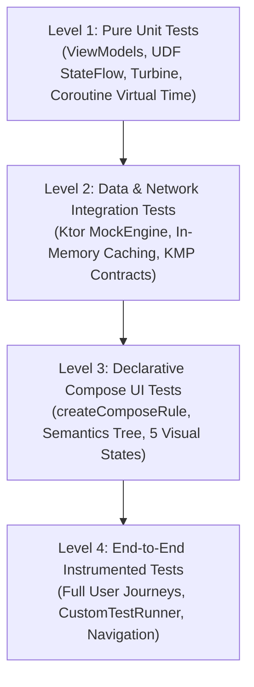

# Testing Strategy & Quality Assurance Overview

**Scope:** Continuous Construction & Automated Verification (Phase 3 Iteration)  
**Target:** Mobile Engineering Team & Quality Assurance  

---

## 1. Testing Philosophy & 4-Level Test Pyramid

Quality is built directly into features during active development (shift-left testing). The platform adopts an enterprise **Test Pyramid** strategy, prioritizing fast, reliable unit and integration tests executing on the local JVM in milliseconds, complemented by declarative Jetpack Compose UI tests and end-to-end user journey validation.



### Breakdown of Testing Levels:
1. **Level 1: Pure Unit Tests (60% of Suite)**
   - **Scope:** ViewModels (`SearchViewModel`), UDF state machines (`SearchUiState`), domain validators (`SearchQueryValidator`), and Coroutines virtual time.
   - **Execution:** Runs in ~2 seconds on the local JVM via JUnit 4 and Cash App Turbine without Android emulator overhead.
2. **Level 2: Data & Network Integration Tests (20% of Suite)**
   - **Scope:** Repository contracts, Ktor HTTP JSON serialization/deserialization, in-memory cache eviction, and API error mappings (403, 404, 5xx).
   - **Execution:** Fully offline, deterministic HTTP mocking via Ktor's `MockEngine` without third-party bytecode mocking libraries.
3. **Level 3: Compose UI Tests (15% of Suite)**
   - **Scope:** Visual rendering across all 5 UI states (`Idle`, `Loading`, `Success`, `Empty`, `Error`), click gestures, and accessibility semantics.
   - **Execution:** AndroidX `createComposeRule` validating the Compose Semantics Tree.
4. **Level 4: End-to-End (E2E) & Instrumented Tests (5% of Suite)**
   - **Scope:** Complete search-to-detail navigation flow, back-stack persistence, and mock build flavor verification.
   - **Execution:** `CustomTestRunner` configuring `HiltTestApplication` for instrumented tests.

---

## 2. Test Package Mirroring Standard (1-to-1 Architecture Layout)

> [!IMPORTANT]
> **All test classes must strictly mirror the exact package and directory structure of the corresponding production code.**

### Benefits of 1-to-1 Mirroring:
1. **Package-Private & `internal` Access:** Tests residing in the identical package access `internal` classes and state properties without exposing them publicly.
2. **Deterministic File Location:** Team members can locate any class's test file instantly without searching.
3. **IDE Two-Way Navigation:** Instant switching between production code and test file via `Cmd+Shift+T` (macOS) or `Ctrl+Shift+T` (Linux/Windows).

### Directory Mirroring Layout:
```text
shared/
├── src/commonMain/kotlin/jp/co/yumemi/android/code_check/shared/
│   └── data/repository/DefaultGitHubRepository.kt
└── src/commonTest/kotlin/jp/co/yumemi/android/code_check/shared/
    └── data/repository/DefaultGitHubRepositoryTest.kt    <-- 1-to-1 Mirror

feature/search/
├── src/main/kotlin/jp/co/yumemi/android/code_check/feature/search/
│   ├── SearchViewModel.kt
│   └── SearchScreen.kt
├── src/test/kotlin/jp/co/yumemi/android/code_check/feature/search/
│   └── SearchViewModelTest.kt                           <-- 1-to-1 JVM Unit Mirror
└── src/androidTest/kotlin/jp/co/yumemi/android/code_check/feature/search/
    └── SearchScreenTest.kt                              <-- 1-to-1 UI Test Mirror
```

---

## 3. Standard Test Naming Conventions

All test classes and methods adhere to standardized naming conventions:
- **Test Class:** `<TargetClass>Test` (e.g., `SearchViewModelTest`, `DefaultGitHubRepositoryTest`, `SearchScreenTest`)
- **Test Method:** `methodName_condition_expectedResult`
  - Example: `searchRepositories_whenApiReturns200_emitsSuccessState`
  - Example: `searchRepositories_whenRateLimitExceeded_emitsErrorState`
  - Example: `searchRepositories_whenQueryIsBlank_returnsEmptyListImmediately`

---

## 4. Testing Specifications Index

| Specification | Focus Area | Frameworks & Tools |
|:---|:---|:---|
| **[`01_unit_testing.md`](./01_unit_testing.md)** | ViewModel StateFlow, Turbine, Coroutines | JUnit 4, Turbine, `kotlinx-coroutines-test`, `MainDispatcherRule` |
| **[`02_integration_testing.md`](./02_integration_testing.md)** | Repository, Ktor MockEngine, In-Memory Caching | Ktor `MockEngine`, `kotlin.test`, Kotlinx Serialization |
| **[`03_compose_ui_testing.md`](./03_compose_ui_testing.md)** | Compose UI States, Semantics, E2E Journeys | `createComposeRule`, AndroidX Test, `CustomTestRunner` |
| **[`04_test_cases_matrix.md`](./04_test_cases_matrix.md)** | Traceability Matrix from Requirements to Tests | Full requirement-to-test mapping |
