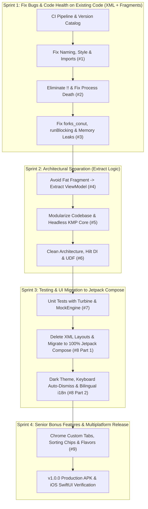

# Modernization & Sprint Execution Roadmap

**Author:** Dinakar Prasad Maurya
**Target Role:** Mobile Lead Engineer/EM

> **For detailed issue descriptions, see [Issues Summary](./03_issues_summary.md)**

---

## 1. Strategy Overview

**Approach:** Documentation First, Then Code Implementation

**Why This Order?**
1. Shows problem-solving approach before jumping to code
2. Demonstrates EM-level strategic thinking upfront
3. Creates narrative arc: Problem → Analysis → Strategy → Implementation
4. Reviewers understand context before seeing code changes

---

### 2. Modernization Strategy: Why We Do NOT Convert to Compose on Day 1

A common architectural trap in legacy modernization is the **"Big-Bang Rewrite"** — deleting all XML and Fragments on Day 1 and rewriting everything in Jetpack Compose in early pull requests.

### 2.1 The "Big Bang Rewrite" Trap:
If we deleted all XML and Fragments in an early rewrite:
1. **Evaluators cannot see us fixing the legacy bugs:** Issues #1-3 (readability, safety, bugs) need to be fixed in existing code first
2. **Deleting files bypasses the challenge:** If you delete `OneFragment.kt` immediately, you didn't fix the memory leak or threading bug — you simply deleted the file. That does not demonstrate Senior/Lead engineering rigor.

---

### 2.2 The Strangler Fig Pattern: 4-Sprint Modernization Sequence

We adopt Martin Fowler's **Strangler Fig Application Pattern**, stabilizing legacy code first, isolating architectural boundaries second, migrating the UI to Jetpack Compose third, and delivering production enhancements fourth:



---

### 2.3 Detailed Sprint & Milestone Objectives

#### Sprint 1: Foundation, Code Health & Safety
- **Codebase State:** Keeps legacy XML layouts and Fragment navigation intact
- **CI & Tooling:** CI/CD automated quality gate and Gradle Version Catalog
- Fix naming, style, imports
- Eliminate `!!` operators, add `SavedStateHandle`
- Fix typos, threading, memory leaks

#### Sprint 2: Architecture & Modularity
- Extract ViewModels from Fragments
- Multi-module architecture with KMP core
- Clean Architecture, Hilt DI, UDF with StateFlow

#### Sprint 3: Quality Testing & Jetpack Compose UI Migration
- Unit tests with Turbine & MockEngine
- **Compose UI Migration:** Delete XML layouts/Fragments, implement Composables
- Material 3 Dark theme, i18n, accessibility

#### Sprint 4: Bonus Features & Multiplatform Release
- Chrome Custom Tabs, sorting, product flavors
- Production APK & iOS SwiftUI client *(v1.0.0)*

---

## 3. Master Sprint & Milestone Traceability

> **📊 Live Tracking:** [GitHub Project Board - Mobile Platform Engineering](https://github.com/users/dinkar1708/projects/1/views/1)
>
> **📋 Issue Details:** See [Issues Summary](./03_issues_summary.md) for complete issue breakdown

| Sprint | Focus Area | Status |
|:---|:---|:---:|
| **Sprint 1** | CI/CD Setup + Code Health | ✓ |
| **Sprint 2** | Architecture & Modularity | ✓ |
| **Sprint 3** | Testing & Compose Migration | ✓ |
| **Sprint 4** | Bonus Features & Release | ✓ |

**Total:** 4 Sprints covering 9 issues + CI/CD + Production Release  

---

## 4. Execution Workflow: From Topic Branch to Merge

Each topic branch is created from `main`, developed, verified against local quality gates, and submitted for review:

```bash
# 1. Create semantic feature branch
git checkout -b <type>/<short-description> main

# 2. Implement changes, then verify quality gates
./gradlew detekt
./gradlew testDebugUnitTest
./gradlew assembleDevDebug

# 3. Push feature branch and open Pull Request
git push origin <type>/<short-description>
gh pr create --base main --fill
```

---

## 5. Success Criteria (Final Validation)

After all milestones are merged:

### Code Quality
- [ ] Zero Detekt violations
- [ ] 85%+ test coverage
- [ ] All CI checks passing
- [ ] No Android lint errors

### Feature Completeness
- [ ] All 9 Yumemi issues addressed
- [ ] Search functionality works
- [ ] Detail screen works
- [ ] Dark mode toggles instantly
- [ ] Language switches instantly (no Activity restart)
- [ ] Custom Tabs opens GitHub links
- [ ] iOS KMP sample compiles and runs

### Documentation
- [ ] 30,000+ words documentation
- [ ] 9 issue deep-dives complete
- [ ] EM perspective documented
- [ ] All ADRs finalized

### Deliverables
- [ ] Production APK built (`./gradlew assembleProdRelease`)
- [ ] Screenshots captured (light/dark, EN/JA)
- [ ] README updated with badges
- [ ] All deliverables have clear acceptance evidence

---

## 6. Execution Strategy
 
1. Establish clean architectural documentation and baseline ADRs
2. Ensure development notes remain strictly private
3. Open focused, single-responsibility Pull Requests
4. Verify all quality gates (`detekt`, `test`, `lint`) prior to merging
5. Proceed through the four modernization sprints iteratively

---

**Document Status:** Ready for Execution
**Next Milestone:** Code Health & Bug Remediation (Sprint 1)
