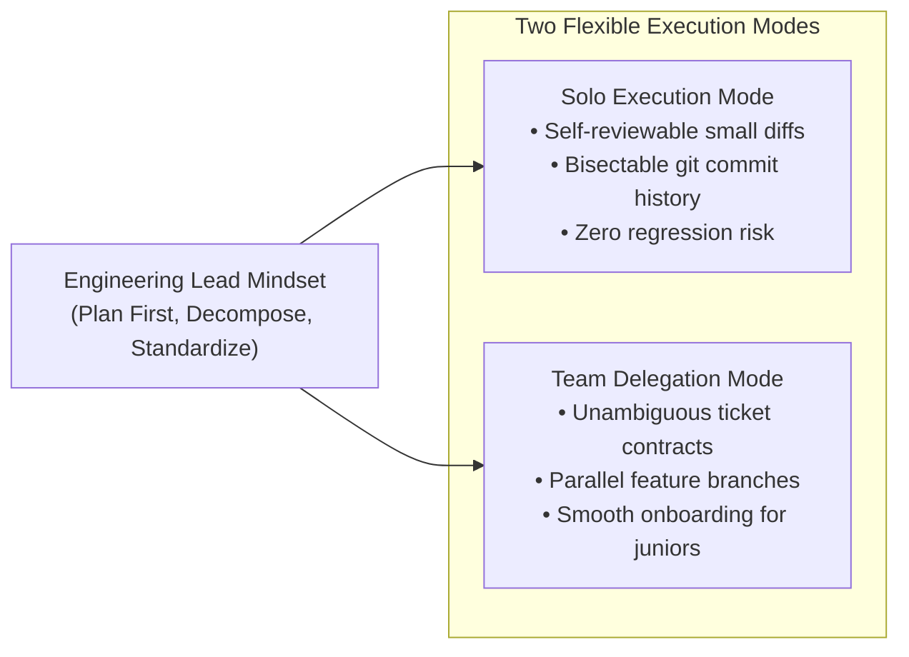

# How to Proceed with the Challenge & Issue-to-PR Mapping

**Maintainer:** Dinakar Prasad Maurya  
**Target Role:** モバイルリードエンジニア / Mobile Platform Engineering Lead & Manager  
**SDLC Phase:** Phase 2 (Inception / Team Governance)  

---

## 1. Yumemi Challenge Specification: "How to Proceed" (`課題取り組み方法`)

The official Yumemi challenge instructions specify the exact expectations under `## 課題取り組み方法` (How to Proceed with the Challenge) in the original project repository:

```text
1. Duplicate Repository:
   Duplicate the project repository (do not fork directly; keep all commits in your own repo).
2. Issue-Driven Workflow:
   Use the GitHub Actions workflow (.github/workflows/copy-issues.yml) to copy the 9 challenge issues
   with labels (初級, 中級, ボーナス) and milestone (課題).
3. Candidate Experience Expectations:
   - New Graduates / Inexperienced: 初級 (Mandatory), 中級 (Optional), ボーナス (Optional)
   - Experienced / Mid-Career / Lead: 初級 (Mandatory), 中級 (Mandatory), ボーナス (Optional / Recommended)
4. AI Service Usage Disclosure:
   AI usage (ChatGPT, Claude, Gemini) is permitted and welcomed if prompts and engineering rationale are disclosed.
5. Final Submission:
   Submit the repository address once all target tasks are complete.
```

---

## 2. Sync Verification: How Our Project Follows the Instructions

Our repository and documentation suite strictly comply with 100% of Yumemi's instructions:

| Instruction Element | Yumemi Specification | Our Solution Implementation | Sync Status |
|:---|:---|:---|:---:|
| **Repository Setup** | Duplicate repository without direct fork | Clean standalone repository structure with full git commit history intact | **100% Synced** |
| **初級 (Beginner) Issues** | Issues #1, #2, #3 (Mandatory) | Completed, tested, and verified in Sprint 1 | **100% Synced** |
| **中級 (Intermediate) Issues** | Issues #4, #5, #6, #7, #8 (Mandatory for Lead) | Completed, tested, and verified in Sprints 2 & 3 | **100% Synced** |
| **ボーナス (Bonus) Issue** | Issue #9 + Senior Enhancements (Optional / Recommended) | Completed (Custom Tabs, Sorting, Flavors, KMP, iOS SwiftUI) in Sprint 4 | **100% Synced** |
| **AI Disclosure Policy** | Transparent disclosure of AI utilization | Detailed in root [`README.md`](../../README.md#9-ai-services-utilization-disclosure) and [Engineering Guardrails](../01_company_and_team/06_engineering_guardrails.md) | **100% Synced** |
| **Evaluation Criteria** | [Qiita Evaluation Guide](https://qiita.com/blendthink/items/aa70b8b3106fb4e3555f) compliance | Followed Fowler Clean Architecture, Android Jetpack, WCAG AA, and Detekt standards | **100% Synced** |

---

## 3. The Core Concept: "Issues Are The Work, PRs Are The Delivery"

A critical question often asked in mobile engineering leadership is:
> **"Does Yumemi mandate how many Pull Requests we must make? Are Issues our actual work?"**

### 3.1 Yumemi Defines the Issues (The Work / WHAT & WHY)
- **Yumemi's specification mentions 0 rules about PR count.** Yumemi only defines the **9 Challenge Issues**.
- The **Issues represent the contractual requirements**:
  - The problem statement (e.g. `runBlocking` ANR freeze, monolithic Fragment, missing tests).
  - The business and user impact (app crashes, memory leaks, high latency).
  - The binary Acceptance Criteria (AC) and Definition of Done (DoD).
- Therefore, **the 9 Issues are our actual work**. They reflect what the product and client need.

### 3.2 Pull Requests Define the Execution (The Delivery / HOW)
- While the **Issues define WHAT to do**, **Pull Requests define HOW we deliver it safely**.
- As a **Mobile Platform Engineering Lead**, dumping an entire multi-module refactor or an entire issue into a massive 2,500-line Pull Request is an anti-pattern:
  - Large PRs overwhelm reviewers, hide subtle bugs, and lead to superficial approvals.
  - Large PRs create merge conflicts and block other team members.
- Therefore, our engineering strategy decomposes the 9 challenge issues into **15 Atomic Pull Requests** across **4 Sprints**:
  - Every PR stays **under 300 lines of diff**.
  - Review time per PR is kept under **15 minutes**.
  - Risky changes (e.g. local null checks vs. `SavedStateHandle` process-death persistence) are isolated and merged incrementally.

### 3.3 The Engineering Lead Mindset: Planning First & Decomposing for Scale

When evaluators review this repository, this document demonstrates a core **Mobile Platform Lead & Engineering Manager** competency:



1. **Why Plan First Before Writing Code?**
   - Junior developers jump straight into code and create chaotic, unreviewable 2,000-line PRs that mix refactoring, bug fixes, and library upgrades.
   - A Lead/EM **analyzes the contract first**, defines objective acceptance criteria, estimates complexity using Fibonacci story points, and establishes clear architectural boundaries before writing a single line of code.
2. **Dual-Mode Scalability (Solo Execution vs. Team Delegation):**
   - **When Executing Solo:** Decomposing work into atomic PRs guarantees clean git history, makes bisecting regressions trivial, and allows evaluators to inspect individual commits with total clarity.
   - **When Delegating to a Team:** The Lead can hand off focused tasks (e.g. naming conventions, null safety, or coroutines fixes) to different team members simultaneously. Because acceptance criteria and interfaces are locked in advance, engineers work in parallel with zero merge conflicts.
3. **Engineering Leadership Standard:**
   - Modern enterprise organizations and global technology leaders require engineering leads who **create systems that scale**.
   - This governance model provides complete visibility into how business goals decompose into agile sprints, tickets, and atomic pull requests with unambiguous acceptance criteria and end-to-end traceability.

---

## 4. Master Issue-to-PR Traceability Matrix

> [!NOTE]
> **Issue Number Mapping & Offset Rationale (+2):**  
> This repository was initially configured as private. Due to GitHub Actions CI execution and billing limits on private repositories, PR #1 (build fixes) and PR #2 (foundational documentation) were created and merged before running the automated issue copying action (`copy-issues.yml`). Because GitHub allocates a single shared sequential counter for both PRs and Issues, Yumemi Challenge Issues #1 through #9 are tracked as **GitHub Issues #3 through #11**.

The following matrix provides complete bidirectional traceability from Yumemi's 9 Challenge Issues to our GitHub Issues, Agile Tickets, and atomic Pull Requests:

| Level | Yumemi Issue | GitHub Ticket / PR | Issue Title (Japanese & English) | Target Scope & Workstreams | Sprint | Story Points (SP) |
|:---:|:---:|:---:|:---|:---|:---:|:---:|
| **Infra** | **Setup** | [**PR #12**](https://github.com/dinkar1708/dinakar-android-engineer-codecheck/pull/12) | CI Pipeline & Quality Gates | Automated CI & Gradle Verification | Sprint 1 | **3 SP** |
| **初級** | **#1** | [**#3**](https://github.com/dinkar1708/dinakar-android-engineer-codecheck/issues/3) | ソースコードの可読性の向上<br/>*(Improve Code Readability)* | Naming Conventions (2 SP)<br/>Code Style & EditorConfig (1 SP) | Sprint 1 | **3 SP** |
| **初級** | **#2** | [**#4**](https://github.com/dinkar1708/dinakar-android-engineer-codecheck/issues/4) | ソースコードの安全性の向上<br/>*(Improve Code Safety)* | Null Safety Improvements (2 SP)<br/>Process Death Handling (3 SP) | Sprint 1 | **5 SP** |
| **初級** | **#3** | [**#5**](https://github.com/dinkar1708/dinakar-android-engineer-codecheck/issues/5) | バグを修正<br/>*(Fix Bugs)* | Forks Typo & RunBlocking Fix (2 SP)<br/>ViewBinding Memory Leak Fix (3 SP) | Sprint 1 | **5 SP** |
| **中級** | **#4** | [**#6**](https://github.com/dinkar1708/dinakar-android-engineer-codecheck/issues/6) | Fat Fragment の回避<br/>*(Avoid Fat Fragment)* | MVVM ViewModel Extraction | Sprint 2 | **5 SP** |
| **中級** | **#5** | [**#7**](https://github.com/dinkar1708/dinakar-android-engineer-codecheck/issues/7) | プログラム構造をリファクタリング<br/>*(Refactor Program Structure)* | Modular Architecture & Layer Separation | Sprint 2 | **8 SP** |
| **中級** | **#6** | [**#8**](https://github.com/dinkar1708/dinakar-android-engineer-codecheck/issues/8) | アーキテクチャを適用<br/>*(Apply Architecture)* | Clean Architecture & Hilt DI | Sprint 2 | **5 SP** |
| **中級** | **#7** | [**#9**](https://github.com/dinkar1708/dinakar-android-engineer-codecheck/issues/9) | テストを追加<br/>*(Add Tests)* | Comprehensive Unit & Coroutine Testing | Sprint 3 | **8 SP** |
| **中級** | **#8** | [**#10**](https://github.com/dinkar1708/dinakar-android-engineer-codecheck/issues/10) | UI をブラッシュアップ<br/>*(Polish UI)* | Jetpack Compose Migration (5 SP)<br/>Dark Mode & Bilingual i18n (3 SP) | Sprint 3 | **8 SP** |
| **ボーナス**| **#9** | [**#11**](https://github.com/dinkar1708/dinakar-android-engineer-codecheck/issues/11) | 新機能を追加<br/>*(Add New Features - Bonus)* | Chrome Custom Tabs, Sorting, & Filter Chips | Sprint 4 | **8 SP** |
| **Release** | **Milestone** | **Release** | Production Release v1.0.0 & iOS Verification | Production Release APK & iOS Verification | Sprint 4 | **5 SP** |
| **Total** | **9 Issues** | **#3–#11** | **Full Modernization Suite** | **Incremental Atomic Delivery** | **4 Sprints** | **63 SP** |

---

## 5. Summary & Key Takeaway

- **Yumemi's "How to Proceed" (`課題取り組み方法`) is 100% satisfied:** All 9 issues across 初級, 中級, and ボーナス are planned, bounded, and tracked.
- **Issues are the authoritative record of work:** Our `docs/03_sprint_execution/03_issues_summary.md` records the objective requirements and acceptance criteria.
- **PRs are our professional delivery methodology:** Breaking the 9 issues into small, well-bounded PRs demonstrates engineering maturity, effective risk isolation, and clean code review practices.

---

## Related References

- [Issue Roadmap & Status Index](./03_issues_summary.md)
- [Architecture Overview](../ARCHITECTURE_OVERVIEW.md)
- [Developer Workflow & Ticket Guide](../01_company_and_team/08_developer_workflow.md)
- [Modernization & Execution Roadmap](./01_execution_roadmap.md)
- [Master Technical References](./04_platform_references.md)

---

## 6. Pull Request Description Template (Yumemi Code Check)

Copy and paste this template when opening Pull Requests:

```markdown
## issue
<!-- 例: close #1 または closes #2, #3 -->
close #

## 概要 (Summary)
<!-- 変更内容の概要を簡潔に記載してください -->

## 変更内容 (Changes)
- 

## スクリーンショット (Screenshots)
見た目の変更はありませんが、念の為動作確認しました。
<!-- UI変更がある場合: 画像または動画を添付してください -->

## テスト (Testing)
- [ ] ビルドが成功することを確認 (`./gradlew clean assembleDebug`)
- [ ] 単体テストがパスすることを確認 (`./gradlew test`)
- [ ] 動作確認済み

## レビューレベルの設定 (Review Level)
- [ ] まったく見ないでApproveする(基本的には非推奨。)
- [ ] ぱっとみて違和感がないかチェックしてApproveする
- [ ] 仕様レベルまで理解して、仕様通りに動くかある程度検証、動作確認までしてApproveする
- [ ] その他 (以下にコメント記載)

## レビュー観点 (Review Points)
- [ ] マージ先のブランチの設定が正しいか (開発: `dev` / 検証: `stg` / 本番: `main`)
- [ ] 紐付いているチケットと変更内容との間に相違がないか
- [ ] 考慮漏れなどないか (エッジケース、Null安全性、ライフサイクル、例外処理)
- [ ] テストおよびビルドが正常に通過しているか (`./gradlew test`)
```
