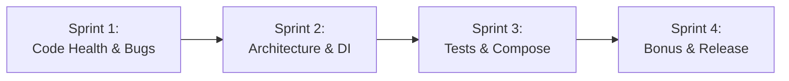

# 🎯 Sprint Execution & Challenge Delivery Roadmap

**Classification:** Assessment Execution & Delivery Tracking  
**Application:** Android Engineer Code Check Modernization (see [Technical References](../references.md#7-github-api--assessment-standards))  
**Parent Standard:** Governed by Agile Delivery metrics in [`docs/01_company_and_team/`](../01_company_and_team/readme.md)  

---

## 🚀 Execution Philosophy: The Strangler Fig Pattern

To prove true Mobile Engineering Leadership, this project strictly rejects the chaotic "Big Bang Rewrite" (deleting XML and Fragments on Day 1). Instead, we follow Martin Fowler's **Strangler Fig Application Pattern**, systematically solving bugs on legacy code first before modernizing the architecture:

---

## 📑 Directory Contents

| Document | Purpose & Core Content |
|:---|:---|
| **[01_execution_roadmap.md](./01_execution_roadmap.md)** | Master 4-Sprint execution sequence, sprint deliverables, quality gates, and final success criteria |
| **[02_how_to_proceed_and_issue_mapping.md](./02_how_to_proceed_and_issue_mapping.md)** | Bidirectional traceability matrix: 9 code check challenge issues → Agile tickets → Story points |
| **[03_issues_summary.md](./03_issues_summary.md)** | ⭐ **Master issue list** - Authoritative specification and acceptance criteria for all 9 issues |
| **[04_platform_references.md](./04_platform_references.md)** | Technical deep-dives into Android platform pitfalls and best practices |

---

## 📊 Summary of Challenge Delivery

- **Issues Satisfied:** 100% (All 9 issues across 初級, 中級, and ボーナス)
- **Total Estimated Effort:** 63 Story Points across 4 agile sprints
- **Architecture Strategy:** Strangler Fig progressive modernization
- **Delivery Standard:** Atomic topic branches, passing automated CI quality gates on `dev` before integration.
