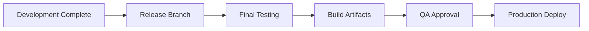

# Release Phase Documentation

**SDLC Phase:** 04 - Release & Deployment

This phase covers the final steps before deploying the application to production.

---

## Documents in This Phase

### 1. [Final Release Checklist](./final_release_checklist.md)
Comprehensive checklist ensuring all release criteria are met before production deployment.

**Key Areas:**
- Code quality verification
- Test coverage requirements
- Documentation completeness
- Security audit
- Performance benchmarks
- Release notes preparation

### 2. [Build & Export Guide](./build_guide.md)
Step-by-step instructions for building and packaging release artifacts.

**Covers:**
- Gradle build commands for all flavors
- APK signing and optimization
- ProGuard/R8 configuration
- iOS XCFramework generation
- Release artifact verification

---

## Release Process Overview

### Release Checklist Summary

- [ ] All features complete and tested
- [ ] Zero critical/high bugs
- [ ] Code review approved
- [ ] Documentation updated
- [ ] Release notes prepared
- [ ] Stakeholder approval
- [ ] Build artifacts verified
- [ ] Deployment plan ready

---

## Related Documentation

- **Development Phase:** [Sprint Execution](../03_sprint_execution/readme.md)
- **Post-Release:** [Production Documentation](../05_production/readme.md)
- **Architecture:** [Project Architecture](../02_project_architecture/readme.md)

---

**Phase Status:** Planning
**Next Phase:** [05 - Production](../05_production/readme.md)
