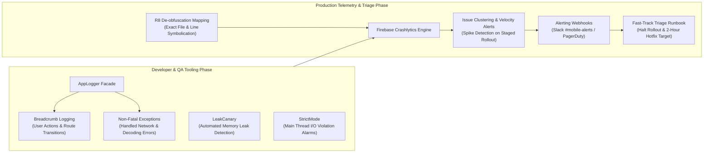
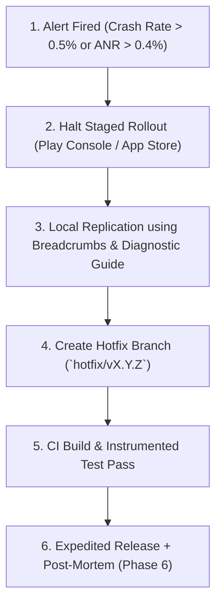

# Production Monitoring, Observability & SLAs

**Maintainer:** Dinakar Prasad Maurya  
**Scope:** Phase 5 (Production & Maintenance) of Agile SDLC  

---

## 1. Observability Philosophy

For a production mobile platform, reliability cannot be evaluated merely by "does it compile in CI". Once an app is released to production across diverse Android hardware (Samsung, Pixel, Xiaomi, Sony) and iOS devices, proactive observability and telemetry are essential.

Our production monitoring strategy is built upon the **Three Pillars of Mobile Observability**:
1. **Crash & ANR Tracking:** Crash-free session percentage, Application Not Responding (ANR) rate.
2. **Network & Performance Telemetry:** Latency (p50, p90, p99), HTTP failure rates (4xx, 5xx), rate-limit events.
3. **User Experience Metrics:** Time-to-Interactive (TTI), Compose frame drop / jank rate.

---

## 2. Service Level Objectives (SLOs) & SLAs

| Metric | Target / SLO | Critical Alert Threshold (SLA Breach) | Action Plan |
|:---|:---|:---|:---|
| **Crash-Free Sessions** | **>= 99.9%** | < 99.5% | Emergency hotfix triage within 2 hours; freeze non-critical PRs |
| **Crash-Free Users** | **>= 99.8%** | < 99.0% | Rollback staged rollout in Google Play / Apple TestFlight |
| **ANR Rate (Android)** | **< 0.10%** | > 0.40% | Profile main thread work using StrictMode / Android Studio Profiler |
| **Search API Latency (p95)** | **< 800ms** | > 2,000ms | Verify GitHub API status, optimize JSON deserialization, enable caching |
| **GitHub Rate Limit 403 Rate** | **< 0.5%** | > 2.0% | Prompt users to wait or switch to offline mock fallback |
| **Compose Frame Drop Rate** | **< 2%** | > 5% | Audit `@Composable` recomposition counts using Layout Inspector |

---

---

## 3. Crashlytics & Developer Tooling: From Local Debugging to Production Fast-Track Triage

Crash reporting and diagnostics are not merely "post-release alarms"; they serve as critical **Developer Tools** throughout the entire software development lifecycle (dev, QA, dogfooding, and live production).



### 3.1 Developer & Internal Testing Tooling: Catching Bugs Early

During local development, unit testing, and internal QA dogfooding (Tier 2 distribution), diagnostics provide granular visibility without disrupting user workflows:

1. **Crashlytics Breadcrumbs:**
   - Every significant user action (search query executed, repository card tapped, retry button clicked) and screen transition is recorded as an in-memory breadcrumb.
   - When an unforeseen exception occurs, engineers have access to the exact chronological history of events leading up to the failure, completely eliminating "unable to reproduce" guesswork.
2. **Non-Fatal Exception Reporting (`recordException`):**
   - Handled network edge cases, unexpected HTTP response schemas, and fallback cache misses are recorded as non-fatal events rather than swallowed silently:
   ```kotlin
   try {
       apiService.searchRepositories(query)
   } catch (e: SerializationException) {
       AppLogger.recordNonFatal(
           exception = e,
           attributes = mapOf("query" to query, "endpoint" to "/search/repositories")
       )
   }
   ```
3. **Structured Custom Keys:**
   - Every report automatically records contextual device and application state:
     - `flavor`: `"dev"`, `"mock"`, or `"prod"`
     - `build_type`: `"debug"` or `"release"`
     - `active_screen`: `"SearchScreen"` or `"DetailScreen"`
     - `network_state`: `"wifi"`, `"cellular"`, or `"offline"`
     - `memory_class`: Available JVM heap limit
4. **LeakCanary (Debug Builds):**
   - Runs in debug builds to automatically detect retained Activity, Fragment, or Composable memory leaks upon screen navigation.
5. **StrictMode (Development Discipline):**
   - Configured in `CodeCheckApplication` for debug variants to detect accidental disk read/write or network operations on the Android Main thread, preventing ANRs before code review.

### 3.2 Production Fast-Track Bug Triage: Rapid Root-Cause Isolation

Once an app is live across thousands of devices in production:

1. **R8 / ProGuard Symbolication:**
   - The Tier 3 CI/CD pipeline automatically uploads the ProGuard/R8 mapping file (`mapping.txt`) to Firebase Crashlytics. Obfuscated crash stack traces (`a.b.c(SourceFile:12)`) are instantly de-obfuscated into exact Kotlin files and line numbers (`SearchViewModel.kt:58`).
2. **Issue Clustering & Velocity Spikes:**
   - Crashlytics automatically groups crashes by root-cause stack signature into unique issues.
   - If an issue's velocity spikes following a staged rollout (e.g., affecting > 0.5% of sessions on Day 1 of a 10% rollout), automated webhooks alert the on-call team.
3. **Multi-Dimensional Impact Analysis:**
   - Engineers instantly filter crashes by:
     - **OS Version:** Identifying whether a crash is isolated to Android 14 (API 34) or legacy Android 8 (API 26).
     - **Device Manufacturer:** Pinpointing OEM-specific customizations (Samsung OneUI vs. Xiaomi MIUI vs. Google Pixel).
     - **User Blast Radius:** Differentiating between 1 user crashing 100 times vs. 100 unique users crashing once.
4. **Fast-Track SLA Resolution:**
   - Critical production issues trigger an expedited hotfix branch (`hotfix/v1.0.1`), targeted JVM regression tests, and immediate rollout halting on the Google Play Console and Apple App Store.

---

## 4. Production Incident Triage Runbook

When a critical production defect is detected:



1. **Step 1: Halt Rollout:** Immediately halt the percentage rollout on the Google Play Developer Console and TestFlight to protect unaffected users.
2. **Step 2: Diagnosis:** Inspect Crashlytics breadcrumbs and consult the [Diagnostic & Troubleshooting Guide](02_diagnostic_troubleshooting_guide.md) to isolate root cause.
3. **Step 3: Hotfix Branch:** Create a branch directly from the release tag (`hotfix/v1.0.1`).
4. **Step 4: Quality Gate:** Hotfix must pass automated CI checks (`./gradlew detekt testDevDebugUnitTest`).
5. **Step 5: Post-Mortem:** Conduct a blameless post-mortem as documented in [Project Retrospective & Lessons Learned](../06_retirement/02_project_retrospective_and_lessons_learned.md).

---

## References
- [Google SRE Book: Service Level Objectives](https://sre.google/sre-book/service-level-objectives/)
- [Firebase Crashlytics Best Practices](https://firebase.google.com/docs/crashlytics)
- [Android Vitals: Core Metrics](https://developer.android.com/topic/performance/vitals)
