# Production Maintenance, Patch Governance & Hotfix Standards

**Maintainer:** Dinakar Prasad Maurya  
**Target Role:** モバイルリードエンジニア / Mobile Platform Engineering Lead  
**Scope:** Phase 5 (Production & Maintenance) of Agile SDLC  

---

## 1. Purpose & Scope

Once an application is deployed to production across diverse global Android hardware and operating systems, long-term engineering success depends on disciplined post-release maintenance, rigorous hotfix governance, and proactive technical debt remediation. This standard outlines our operational policies for production triage, emergency patch workflows, and ongoing platform health.

---

## 2. Incident Severity & SLA Matrix

Production issues are classified into four severity tiers with explicit Service Level Agreements (SLAs) for triage, patch development, and deployment:

| Severity | Definition & Impact Threshold | Triage SLA | Hotfix PR SLA | Deployment Target | Governance Action |
|:---|:---|:---|:---|:---|:---|
| **P0 - Critical** | Crash loop, security exploit, or fatal defect affecting >0.5% DAU or core user flow (Search/Detail crash). | < 15 mins | < 2 hours | < 4 hours | Halt staged rollout immediately; convene war room; initiate fast-track hotfix. |
| **P1 - High** | Degraded functionality, widespread API rate-limit failure (403), or major UI lockup without total crash. | < 1 hour | < 12 hours | < 24 hours | Fast-track patch review; assess whether to halt or patch forward. |
| **P2 - Medium** | Non-critical feature defect, edge-case UI rendering issue, or minor telemetry gap. | < 1 business day | N/A | Next Sprint Release | Triage into active sprint backlog for standard sprint cycle. |
| **P3 - Low** | Cosmetic flaw, minor localization typo, or non-blocking polish item. | < 3 business days | N/A | Future Milestone | Catalog in engineering backlog. |

---

## 3. Fast-Track Hotfix Governance

```mermaid
flowchart LR
    Alert["Crashlytics Spike / P0 Alert"] --> Halt["Halt Staged Rollout"]
    Halt --> Branch["Branch hotfix/vX.Y.Z<br/>from release tag"]
    Branch --> Fix["Targeted Fix + Regression Test"]
    Fix --> DualReview["Lead + Senior Dual Review"]
    DualReview --> ExpeditedCI["Targeted CI Verification"]
    ExpeditedCI --> StagedRollout["5% -> 20% -> 100% Staged Rollout"]
    StagedRollout --> Backmerge["Dual Back-Merge to main & develop"]
```

### Hotfix Rules & Blast Radius Control
1. **Zero Scope Creep:** A production hotfix PR must contain **only** the minimal code change necessary to resolve the defect, accompanied by a reproducing test. Dependency updates, styling tweaks, or opportunistic refactoring are strictly prohibited.
2. **Mandatory Regression Test:** Every hotfix PR must include an automated unit test or integration test that reproduces the defect and asserts the fix.
3. **Dual Approval Requirement:** Hotfix PRs require explicit approvals from the Mobile Platform Lead and at least one Senior Engineer.
4. **Dual Back-Merge Protocol:** Upon merging into `main`, the hotfix commit must be merged or cherry-picked into `develop` to prevent regression in subsequent releases.

---

## 4. Staged Rollout & Rollback Criteria

To minimize blast radius during production releases and hotfixes, distribution follows a phased rollout strategy via Google Play Console:

| Rollout Stage | Target Audience | Observation Window | Halt & Rollback Triggers |
|:---|:---|:---|:---|
| **Canary (Phase 1)** | 5% user base | 6 hours | Crash-free sessions < 99.5% OR ANR rate > 0.4% |
| **Expansion (Phase 2)** | 20% user base | 12 hours | Crash velocity alert OR error rate spike > 2% |
| **Broad (Phase 3)** | 50% user base | 24 hours | Latency regression > 20% on p95 metrics |
| **Full Release (Phase 4)**| 100% user base | Ongoing | Continuous SLO monitoring |

*If any rollback threshold is breached, the staged rollout is immediately halted in Google Play Console, and the P0/P1 triage protocol is activated.*

---

## 5. Long-Term Platform Maintenance & Technical Debt

Sustainable engineering velocity requires proactive investment in platform health:

- **20% Platform Health Allocation:** 20% of engineering capacity in each sprint is permanently dedicated to tech debt remediation, dependency upgrades, and code health improvements.
- **Dependency & Security Audits:** Automated Dependabot / Renovate scanning runs weekly to identify Common Vulnerabilities and Exposures (CVEs) and outdated libraries.
- **Deprecation Lifecycle:** Deprecated Android SDK APIs or third-party libraries must be scheduled for migration within two release cycles of deprecation notice.
- **Dead Code Pruning:** Unused resources, feature flags older than 60 days, and obsolete network endpoints are purged bi-monthly.

---

## 6. Blameless Post-Mortem Standard

Within 48 hours of resolving any P0 or high-impact P1 incident, the team conducts a blameless post-mortem adhering to the following structure:

1. **Incident Summary:** High-level description of what occurred, user impact, and resolution timeline.
2. **Timeline of Events:** Chronological breakdown from defect introduction to detection, triage, patch release, and full resolution.
3. **Root Cause Analysis (5 Whys):** Deep systemic inquiry to identify procedural, architectural, or testing blind spots.
4. **Preventative Action Items:** Concrete, assignable tasks (e.g., adding missing tests, strengthening CI lint checks, refining telemetry alerts) with strict deadlines.
