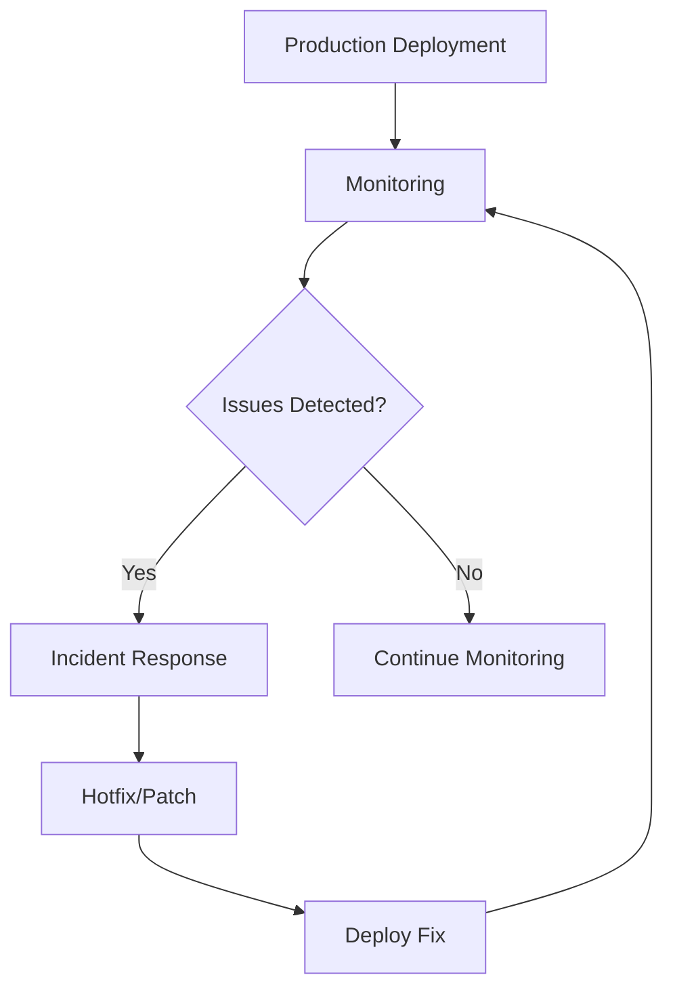

# Production Phase Documentation

**SDLC Phase:** 05 - Production Operations & Maintenance

This phase covers ongoing production operations, monitoring, and maintenance standards.

---

## Documents in This Phase

### 1. [Production Monitoring & SLA](./01_production_monitoring_and_sla.md)
Service Level Agreements and production monitoring strategies.

**Key Topics:**
- Uptime requirements and SLAs
- Performance monitoring
- Error tracking and alerting
- Analytics and metrics
- Incident response procedures

### 2. [Diagnostic & Troubleshooting Guide](./02_diagnostic_troubleshooting_guide.md)
Operational guide for diagnosing and resolving production issues.

**Covers:**
- Common issues and solutions
- Log analysis techniques
- Performance debugging
- Crash report analysis
- Network troubleshooting

### 3. [Code Review Maintenance Standards](./03_code_review_maintenance_standards.md)
Standards for maintaining code quality in production environments.

**Topics:**
- Production hotfix procedures
- Emergency deployment process
- Code review for maintenance PRs
- Technical debt management
- Deprecation strategies

---

## Production Operations Overview

### Production Health Checklist

- [ ] Monitoring dashboards configured
- [ ] Alerting rules established
- [ ] On-call rotation defined
- [ ] Incident response playbook ready
- [ ] Rollback procedures documented
- [ ] Performance baselines established
- [ ] Error budgets defined

---

## Related Documentation

- **Pre-Production:** [Release Documentation](../04_release/readme.md)
- **Post-Production:** [Retirement Documentation](../06_retirement/readme.md)
- **Company Standards:** [CI/CD Standards](../01_company_and_team/07_cicd_and_delivery_standards.md)

---

**Phase Status:** Planning
**Previous Phase:** [04 - Release](../04_release/readme.md)
**Next Phase:** [06 - Retirement](../06_retirement/readme.md)
