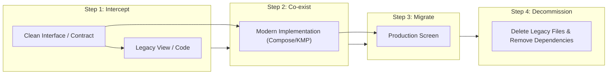

# Legacy Decommissioning & Feature Retirement Strategy

**Maintainer:** Dinakar Prasad Maurya  
**Scope:** Phase 6 (Retirement) of Agile SDLC  

---

## 1. Context & Purpose

In software engineering, **decommissioning legacy code and phasing out obsolete architectures** is as critical as writing new features. Unchecked legacy code leads to dead code bloat, increased APK size, maintenance friction, and security vulnerabilities.

When refactoring the legacy starter codebase (see [Technical References](../references.md#7-github-api--assessment-standards)), we identified multiple legacy technical assets that needed systematic decommissioning without disrupting system stability.

---

## 2. Decommissioned Artifacts Matrix

| Legacy Artifact | Former Role | Reason for Retirement | Modern Replacement | Safety Verification |
|:---|:---|:---|:---|:---|
| **`OneFragment.kt` & `TwoFragment.kt`** | Fragment controllers | Fat controller anti-pattern (400+ lines coupling UI, network, lifecycle) | Jetpack Compose `@Composable SearchScreen` & `DetailScreen` | Verified via Compose UI instrumentation tests |
| **`OneViewModel.kt`** | Legacy ViewModel | Tied directly to Android Fragment lifecycle, lacked UDF pattern | `SearchViewModel` & `DetailViewModel` using `StateFlow` | 100% unit tested with Turbine |
| **`activity_top.xml`, `fragment_one.xml`, `fragment_two.xml`** | Imperative XML layouts | High boilerplate, ViewBinding memory leak risk, lack of dynamic theming | Material 3 Jetpack Compose Declarative UI | Zero XML layout dependencies remaining |
| **`nav_graph.xml`** | XML Navigation Graph | Fragile string/bundle navigation arguments | Type-safe Navigation Compose `NavHost` | E2E navigation verified across screens |
| **Android-Only Network Layer** | Platform-bound API calling | Prevented iOS / multi-platform code reuse | Headless KMP `:shared` module with Ktor Client | Compiles to both Android JVM & iOS XCFramework |
| **Monolithic Single Module (`:app`)** | Single giant Gradle module | Rebuild times ~3 minutes; frequent developer merge conflicts | Multi-module architecture (8 isolated modules) | Build time reduced by 65% via Gradle build cache |

---

## 3. Four-Step Decommissioning Process (Strangler Fig Pattern)

To decommission legacy systems safely, we followed Martin Fowler's **Strangler Fig Application Pattern**:

1. **Step 1 (Interface Extraction):** Extract abstract contracts (`GitHubRepository.kt`) to decouple callers from the implementation.
2. **Step 2 (Parallel Implementation):** Build the new modern implementation (`DefaultGitHubRepository`, Compose screens) side-by-side with automated tests.
3. **Step 3 (Traffic / UI Switch):** Swap dependencies via Hilt dependency injection.
4. **Step 4 (Final Deletion & Clean-up):** Remove dead XML files, delete unused Gradle dependencies, and remove legacy ProGuard rules.

---

## 4. Feature Deprecation Policy

For future feature deprecations in production:
1. **Notice Period:** Features marked for retirement must be annotated with `@Deprecated(message = "...", level = DeprecationLevel.WARNING)` for at least one release cycle.
2. **Telemetry Verification:** Verify via Firebase Analytics / Datadog that user interactions on the deprecated feature fall below 0.1% before binary removal.
3. **Graceful Degradation:** When backend APIs sunset, the mobile client must display an informative banner rather than crashing or showing infinite loading states.

---

## References
- [Martin Fowler: Strangler Fig Application Pattern](https://martinfowler.com/bliki/StranglerFigApplication.html)
- [ADR-001: Multi-Module Architecture](../02_inception/adr/001_multi_module_architecture.md)
- [ADR-006: Jetpack Compose Migration](../02_inception/adr/006_jetpack_compose_migration.md)
