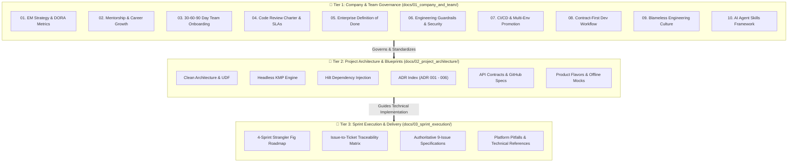

# Documentation Portal

**Project**: Android Engineer Code Check Solution  
**Author**: Dinakar Prasad Maurya  
**Strategy**: Strangler Fig progressive modernization governed by enterprise standards  

---

## 📚 Documentation Classification & Navigation

This documentation is structured into an enterprise-grade **3-Tier Organizational Model** that clearly decouples universal corporate mobile standards from project-specific technical blueprints and agile sprint delivery:

---

## 🏛️ 3-Tier Enterprise Structure

| Documentation Tier | Scope & Focus | Key Portals & Direct Links | Portability & Corporate Usage |
|:---|:---|:---|:---:|
| **🏢 Tier 1: Company & Team Governance** `docs/01_company_and_team/` | Universal engineering operating model: DORA metrics, 30-60-90 day onboarding, review SLAs, Definition of Done, AI coding policies, and branch hygiene. | • [Operating Model Portal](./01_company_and_team/readme.md) • [Engineering Leadership Strategy](./01_company_and_team/01_engineering_leadership.md) • [AI Agent Skills Framework](./01_company_and_team/10_ai_agent_skills_guide.md) • [Team Onboarding Playbook](./01_company_and_team/03_team_onboarding.md) • [CI/CD & Delivery Policy](./01_company_and_team/07_cicd_and_delivery_standards.md) | **100% Turnkey Portable** *(Ready for direct export to **Company Confluence / Notion** to govern all mobile squads)* |
| **📱 Tier 2: Project Architecture** `docs/02_project_architecture/` | Technical blueprints: Multi-module Clean Architecture, KMP headless core, 4 product flavors (`dev`, `mock`, `stg`, `prod`), ADRs 001–006, and API specifications. | • [Architecture Index](./02_project_architecture/readme.md) • [Clean Architecture & UDF](./02_project_architecture/architecture/01_clean_architecture_and_udf.md) • [ADR Decision Records](./02_project_architecture/adr/readme.md) • [API Specifications](./02_project_architecture/api_spec/readme.md) | **Project-Specific** *(Concrete technical blueprints implementing Tier 1 standards for this app)* |
| **🎯 Tier 3: Sprint Execution** `docs/03_sprint_execution/` | End-to-end agile delivery tracking mapping all 9 code check challenge issues across 4 structured sprints with Fibonacci story points (63 SP). | • [Sprint Delivery Portal](./03_sprint_execution/readme.md) • [Execution Roadmap](./03_sprint_execution/01_execution_roadmap.md) • [Issue-to-Ticket Mapping](./03_sprint_execution/02_how_to_proceed_and_issue_mapping.md) • [Authoritative Issues Summary](./03_sprint_execution/03_issues_summary.md) | **Assessment-Specific** *(Agile sprint delivery & acceptance tracking)* |

---

## 📊 Project Management & Issue Tracking

**GitHub Project Board:** [Mobile Platform Engineering - Issue Tracker](https://github.com/users/dinkar1708/projects/1/views/1)

The centralized project board serves as the **single source of truth** for:
- All 9 code challenge issues (mapped to GitHub Issues #3–#11, see [Technical References](./references.md#7-github-api--assessment-standards))
- Sprint planning and milestone tracking
- Implementation status and progress visualization
- Cross-functional task dependencies and blockers

### Documentation Migration Strategy

This documentation structure is designed to be **platform-agnostic** and can be seamlessly migrated to:
- **Confluence** (company wiki / knowledge base)
- **GitHub Projects** (enhanced with markdown views)
- **Notion** (team workspace)
- **Azure DevOps Wiki** (enterprise ALM)

**Migration Notes:**
- **Tier 1 (Company & Team):** Portable to company-wide Confluence space for all mobile teams
- **Tier 2 (Architecture):** Can be exported to project-specific Confluence space or GitHub Wiki
- **Tier 3 (Sprint Execution):** Ideal for GitHub Projects with automated issue linking

---

## ⚡ Quick Navigation Links

- **New to this repository?** Start here: **[00_START_HERE.md](./00_START_HERE.md)**
- **How to build & test locally?** See: **[GETTING_STARTED.md](./GETTING_STARTED.md)**
- **System design & data flow:** See: **[ARCHITECTURE_OVERVIEW.md](./ARCHITECTURE_OVERVIEW.md)**
- **Contributing & Git branching:** See: **[CONTRIBUTING.md](./CONTRIBUTING.md)**
- **Comprehensive technical references:** See: **[03_sprint_execution/04_platform_references.md](./03_sprint_execution/04_platform_references.md)**
- **Project Board (Issues & Milestones):** [GitHub Projects](https://github.com/users/dinkar1708/projects/1/views/1)

---

## 🎯 Modernization Delivery Philosophy

This project proves **Senior Mobile Leadership** through incremental, low-risk execution:
1. **Zero Big-Bang Rewrites:** Following Martin Fowler's Strangler Fig pattern, legacy defects and crashes are resolved first on the existing codebase before architectural transformations occur.
2. **Contract-First Parallel Engineering:** High-level domain contracts and mock engines allow UI and Data squads to build concurrently without blocking dependencies.
3. **Automated Quality Gates:** Strict CI pipelines enforce zero warnings, zero Detekt issues, and high unit test coverage before any PR merges to `dev`.

---

**Author**: Dinakar Prasad Maurya  
**Last Updated**: September 9, 2026
