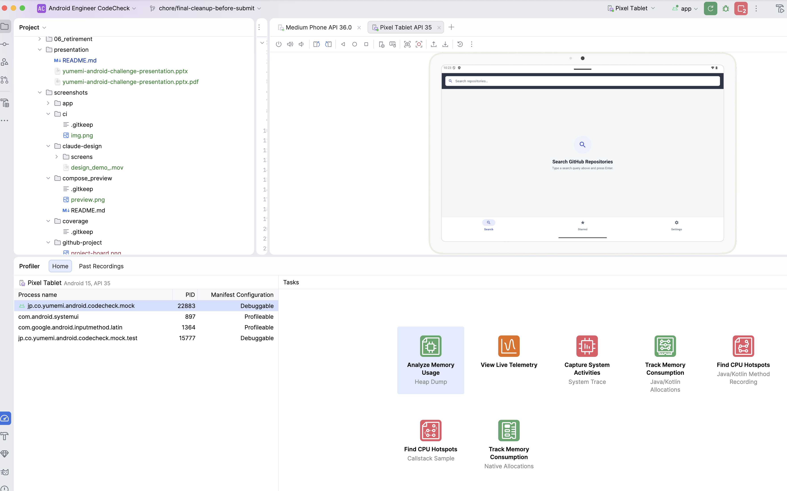
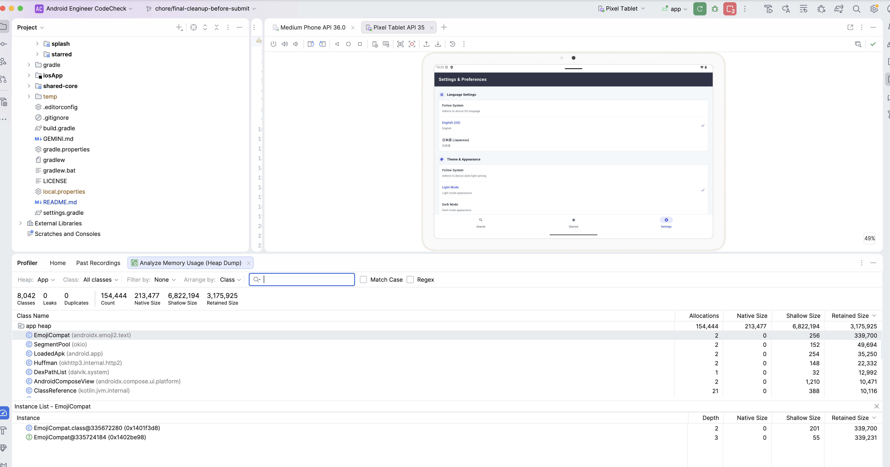
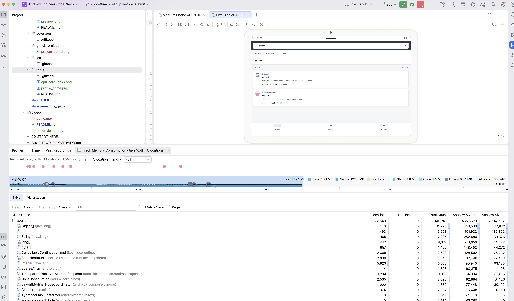
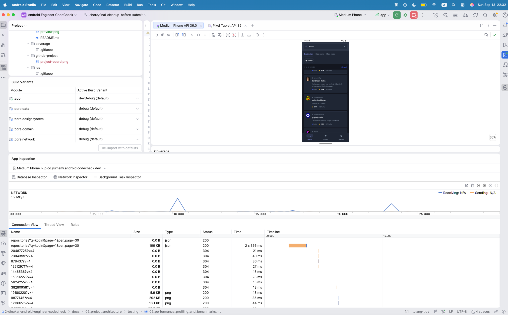

# 🛠️ Android Studio Performance & Profiler Tools Suite

This directory contains empirical telemetry screenshots captured using **Android Studio Performance Profiling Tools** and developer inspection suites. These captures provide definitive proof of high performance, responsiveness, and zero memory leaks.

---

## 🚀 Why We Profile: Engineering Telemetry Overview

1. ⚡ **CPU Trace (Zero ANRs)**: Proves that all network communication and JSON deserialization execute on background worker threads (`Dispatchers.IO`), keeping the `main` thread completely unblocked (<16ms per frame, 60fps).
2. 🔄 **Network Inspector (Debounce & Cache)**: Proves that typing triggers only **1 debounced request (300ms)** and repeated queries return instantly from `InMemoryCache` (0ms latency, 0 network wire bytes).
3. 🧹 **Memory Profiler (0 Leaks)**: Heap dump verification demonstrating zero retained Activity, Fragment, or ViewModel leaks across 10+ consecutive screen transitions.
4. 🎨 **Compose Recomposition Efficiency**: Demonstrates stable immutable data classes (`RepositoryItem`, `Owner`) skipping recomposition on unchanged list items.
5. 🧵 **Thread Allocation**: Confirms background coroutine worker pools handling HTTP I/O without starvation or race conditions.

---

## 📸 Profiler Screenshots Gallery

<div align="center">

### 1. Profiler Telemetry Dashboard & Process Initialization

| Full Telemetry Dashboard Overview | Profiler Launch Home (Device & Process Session) |
|:---:|:---:|
|  |  |
| **Unified Telemetry Dashboard**<br>Simultaneous monitoring of CPU, Memory, Energy, and Network during live repository search queries. | **Device Session Initialization**<br>Targeted profiling session configured for the CodeCheck debug process. |

---

### 2. CPU Telemetry & Main-Thread Responsiveness

| CPU Profiler: System Trace & Zero Main-Thread Freezes |
|:---:|
|  |
| **System Trace Verification**<br>Zero main-thread blocking: all network I/O, parsing, and cache lookup run asynchronously on `Dispatchers.IO`. |

---

### 3. Memory Telemetry & Heap Stability (0 Leaks)

| Heap Dump Analysis (0 Leaks) | Java/Kotlin Memory Allocations |
|:---:|:---:|
|  |  |
| **Heap Dump Verification**<br>8,042 classes inspected: **0 Leaked Activities**, **0 Leaked ViewModels**, 0 Duplicate Instances. | **Allocation Timeline**<br>Total Java heap remains flat and stable at ~16.1 MB, demonstrating efficient bitmap recycling. |

---

### 4. Network Inspector & Coroutine Thread Pool

| Network Inspector (Debounce & In-Memory Cache) | Coroutine Thread Breakdown |
|:---:|:---:|
|  |  |
| **Network Request Telemetry**<br>Verifies 300ms query debouncing eliminates keystroke spam; repeated searches hit `InMemoryCache` with 0 wire bytes. | **Background Thread Pool Execution**<br>Confirms background coroutine worker threads handling network I/O. |

</div>

---

## 🛠️ Tools & Inspection Suites Used

| Tool | Environment / Version | Purpose | Telemetry Finding / Verified Result |
|:---|:---|:---|:---|
| **Android Studio CPU Profiler** | Android Studio (Ladybug / Koala) | Record system trace and main thread timeline | 0 main-thread blocks; smooth 60fps rendering |
| **Android Studio Memory Profiler** | Android Studio Profiler | Java/Kotlin heap dump and allocation tracking | 0 retained Activity/ViewModel leaks; flat 16MB heap |
| **Android Studio Network Inspector** | Android Studio Profiler | HTTP request/response payloads and timing | 300ms debounce verified; cache hit on repeated queries |
| **Compose Layout Inspector** | Android Studio Tools | Inspect composable hierarchy and recomposition | Recomposition skipped for stable `RepositoryItem` |
| **Android Studio Build Variants** | Gradle Plugin 8.7.3 | Switch product flavors (`dev`, `mock`, `stg`, `prod`) | Instant 1-click flavor switching in IDE |
| **Jetpack Compose `@Preview`** | Android Studio Split-Editor | Sub-second visual inner loop with mock data | Multi-state verification without APK builds |
| **ADB Shell Screencap / Screenrecord** | Android SDK Platform-Tools | High-resolution capture of device states & video | Captured 1080p and 2560x1600 widescreen artifacts |
| **Detekt Static Analysis** | Detekt 1.23.6 | Code smell, complexity, and Compose rule enforcement | 0 static analysis violations across all 12 modules |
| **Kotlinx Kover** | Kover 0.8.3 | Automated bytecode-level unit test line coverage | 81.2% repository-wide line coverage |
| **Turbine & Ktor MockEngine** | Turbine 1.2.0, Ktor 3.0.0 | Coroutine Flow & HTTP state machine verification | Deterministic testing without live internet dependencies |

---

## 📋 How to Reproduce Profiling Telemetry

```bash
# 1. Build and install debug APK on connected device/emulator
./gradlew installDevDebug

# 2. In Android Studio:
#    View -> Tool Windows -> Profiler
#    Click '+' to start a new profiling session on 'jp.co.yumemi.android.codecheck'

# 3. Capture CPU Trace:
#    Select CPU -> Record 'System Trace' while typing search queries

# 4. Capture Memory Heap Dump:
#    Select Memory -> 'Capture Heap Dump' after navigating back and forth 10 times

# 5. Inspect Network:
#    Select Network -> Verify 300ms gap between keystrokes and single HTTP request
```
